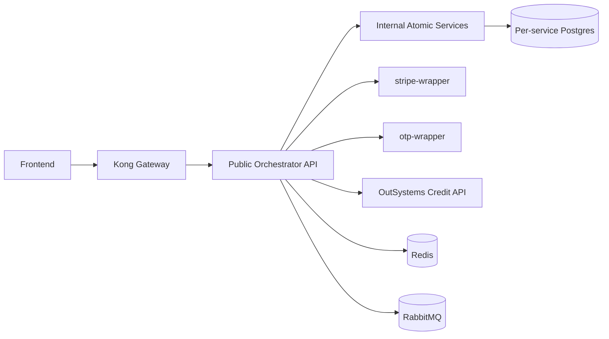

# TicketRemaster API Reference

This document consolidates the current API surface for offline viewing.

It combines:

- the public gateway-facing orchestrator API
- the internal service-to-service API used by orchestrators
- the external OutSystems credit service contract and integration notes
- links to the unified static OpenAPI document and the live Flasgger UIs

Related references:

- [README.md](README.md)
- [FRONTEND.md](FRONTEND.md)
- [TESTING.md](TESTING.md)
- [OUTSYSTEMS.md](OUTSYSTEMS.md)

## Documentation assets

- unified static OpenAPI: `openapi.unified.json`
- OutSystems Swagger: `https://personal-sdxnmlx3.outsystemscloud.com/CreditService/rest/CreditAPI/swagger.json`
- OutSystems docs UI: `https://personal-sdxnmlx3.outsystemscloud.com/CreditService/rest/CreditAPI/`

Local live Swagger UIs:

- `http://localhost:8100/apidocs` — auth-orchestrator
- `http://localhost:8101/apidocs` — event-orchestrator
- `http://localhost:8102/apidocs` — credit-orchestrator
- `http://localhost:8103/apidocs` — ticket-purchase-orchestrator
- `http://localhost:8104/apidocs` — qr-orchestrator
- `http://localhost:8105/apidocs` — marketplace-orchestrator
- `http://localhost:8107/apidocs` — transfer-orchestrator
- `http://localhost:8108/apidocs` — ticket-verification-orchestrator

## API topology



## Servers

### Browser-facing gateway

- production: `https://ticketremasterapi.hong-yi.me`
- local: `http://localhost:8000`

### Direct local orchestrator ports

- auth: `http://localhost:8100`
- event: `http://localhost:8101`
- credit: `http://localhost:8102`
- purchase: `http://localhost:8103`
- qr: `http://localhost:8104`
- marketplace: `http://localhost:8105`
- transfer: `http://localhost:8107`
- verification: `http://localhost:8108`

### External credit service

- `https://personal-sdxnmlx3.outsystemscloud.com/CreditService/rest/CreditAPI`

## Authentication

### JWT bearer token

Used by orchestrator middleware.

Header:

```http
Authorization: Bearer <jwt>
```

JWTs are issued by `POST /auth/login`.

### Kong gateway API key

Used on selected route groups at the gateway.

Header:

```http
apikey: <gateway-key>
```

Current route groups protected by Kong key-auth:

- `/credits/*`
- `/purchase/*`
- `/tickets/*`
- `/marketplace*`
- `/transfer/*`
- `/verify/*`

### OutSystems API key

Used only for backend-to-OutSystems communication.

Header:

```http
X-API-KEY: <outsystems-key>
```

## Response conventions

### Orchestrator success envelope

Most orchestrators respond with a top-level `data` object:

```json
{
  "data": {
    "key": "value"
  }
}
```

### Internal service success responses

Most internal services return raw objects or service-specific container objects:

```json
{
  "tickets": []
}
```

or:

```json
{
  "ticketId": "tkt_001",
  "status": "active"
}
```

### Error envelope

The minimum common error shape is:

```json
{
  "error": {
    "code": "VALIDATION_ERROR",
    "message": "Human readable message"
  }
}
```

Some services also add:

- `status`
- `traceId`
- `details`

## Public orchestrator API

### Auth API

Base path:

- `/auth`

Endpoints:

| Method | Path | Auth | Description |
| --- | --- | --- | --- |
| `POST` | `/auth/register` | public | create a user and initialize an OutSystems credit record |
| `POST` | `/auth/login` | public | return JWT token |
| `GET` | `/auth/me` | JWT | return current profile |

Register request:

```json
{
  "email": "buyer@example.com",
  "password": "Password123!",
  "phoneNumber": "+6591234567"
}
```

Optional registration fields:

- `role`
- `venueId`

Register response:

```json
{
  "data": {
    "userId": "usr_001",
    "email": "buyer@example.com",
    "role": "user",
    "createdAt": "2026-03-29T12:00:00+00:00"
  }
}
```

Login request:

```json
{
  "email": "buyer@example.com",
  "password": "Password123!"
}
```

Login response:

```json
{
  "data": {
    "token": "eyJhbGciOiJIUzI1NiIs...",
    "expiresAt": "2026-03-30T12:00:00+00:00",
    "user": {
      "userId": "usr_001",
      "email": "buyer@example.com",
      "role": "user"
    }
  }
}
```

Common errors:

- `VALIDATION_ERROR`
- `EMAIL_ALREADY_EXISTS`
- `AUTH_INVALID_CREDENTIALS`
- `AUTH_FORBIDDEN`
- `USER_NOT_FOUND`

### Event and venue API

Base paths:

- `/venues`
- `/events`
- `/admin/events`

Endpoints:

| Method | Path | Auth | Description |
| --- | --- | --- | --- |
| `GET` | `/venues` | public | list active venues |
| `GET` | `/events` | public | list enriched events |
| `GET` | `/events/{eventId}` | public | get enriched event details |
| `GET` | `/events/{eventId}/seats` | public | get seat map |
| `GET` | `/events/{eventId}/seats/{inventoryId}` | public | get seat detail |
| `POST` | `/admin/events` | currently public | create event and populate seat inventory |

Example `GET /events` response:

```json
{
  "data": {
    "events": [
      {
        "eventId": "evt_001",
        "venueId": "ven_001",
        "name": "Taylor Swift | The Eras Tour",
        "date": "2026-06-15T19:30:00+00:00",
        "type": "concert",
        "price": 88.0,
        "venue": {
          "venueId": "ven_001",
          "name": "Singapore Indoor Stadium",
          "address": "2 Stadium Walk"
        },
        "seatsAvailable": 420
      }
    ]
  }
}
```

Example `POST /admin/events` request:

```json
{
  "name": "Example Event",
  "type": "concert",
  "venueId": "ven_001",
  "event_date": "2026-06-15T19:30:00+00:00",
  "description": "Live concert",
  "pricing_tiers": {
    "standard": 88
  }
}
```

Current implementation notes:

- `GET /events` accepts `type`, `page`, and `limit`, but the current atomic service still returns the full event list without applying those filters
- `POST /admin/events` exists conceptually as an admin endpoint, but the current gateway and orchestrator do not enforce admin auth yet

### Credits API

Base path:

- `/credits`

Endpoints:

| Method | Path | Auth | Description |
| --- | --- | --- | --- |
| `GET` | `/credits/balance` | JWT + `apikey` | fetch OutSystems balance |
| `POST` | `/credits/topup/initiate` | JWT + `apikey` | create Stripe PaymentIntent |
| `POST` | `/credits/topup/confirm` | JWT + `apikey` | confirm top-up and patch OutSystems balance |
| `POST` | `/credits/topup/webhook` | Stripe server-to-server | process Stripe webhook |
| `GET` | `/credits/transactions` | JWT + `apikey` | list internal credit transaction ledger |

Initiate request:

```json
{
  "amount": 100
}
```

Initiate response:

```json
{
  "data": {
    "clientSecret": "cs_test_...",
    "paymentIntentId": "pi_123",
    "amount": 100
  }
}
```

Confirm request:

```json
{
  "paymentIntentId": "pi_123"
}
```

Confirm response:

```json
{
  "data": {
    "status": "confirmed",
    "new_balance": 250.0
  }
}
```

Idempotent repeat confirm response:

```json
{
  "data": {
    "status": "already_processed"
  }
}
```

Common errors:

- `VALIDATION_ERROR`
- `FORBIDDEN`
- `SERVICE_UNAVAILABLE`

### Purchase API

Base path:

- `/purchase`

Endpoints:

| Method | Path | Auth | Description |
| --- | --- | --- | --- |
| `POST` | `/purchase/hold/{inventoryId}` | JWT + `apikey` | hold a seat |
| `DELETE` | `/purchase/hold/{inventoryId}` | JWT + `apikey` | release a hold |
| `POST` | `/purchase/confirm/{inventoryId}` | JWT + `apikey` | sell seat, create ticket, deduct credits |

Hold response:

```json
{
  "data": {
    "inventoryId": "inv_001",
    "status": "held",
    "heldUntil": "2026-03-29T12:15:00+00:00",
    "holdToken": "c378f45d-4236-4d49-8d93-d5e965964ada"
  }
}
```

Confirm request:

```json
{
  "eventId": "evt_001",
  "holdToken": "c378f45d-4236-4d49-8d93-d5e965964ada"
}
```

Confirm response:

```json
{
  "data": {
    "ticketId": "tkt_001",
    "eventId": "evt_001",
    "venueId": "ven_001",
    "inventoryId": "inv_001",
    "price": 88.0,
    "status": "active",
    "createdAt": "2026-03-29T12:00:00+00:00"
  }
}
```

Purchase-specific errors:

- `PAYMENT_HOLD_EXPIRED`
- `SEAT_UNAVAILABLE`
- `INSUFFICIENT_CREDITS`

Route note:

- `ticket-purchase-orchestrator` also defines `GET /tickets` on its direct service port
- that route is not exposed by Kong, so browser clients should not rely on it

### Tickets and QR API

Base path:

- `/tickets`

Endpoints:

| Method | Path | Auth | Description |
| --- | --- | --- | --- |
| `GET` | `/tickets` | JWT + `apikey` | list user-owned tickets through `qr-orchestrator` |
| `GET` | `/tickets/{ticketId}/qr` | JWT + `apikey` | generate a fresh QR hash |

List response:

```json
{
  "data": {
    "tickets": [
      {
        "ticketId": "tkt_001",
        "status": "active",
        "price": 88.0,
        "createdAt": "2026-03-29T12:00:00+00:00",
        "event": {
          "eventId": "evt_001",
          "name": "Taylor Swift | The Eras Tour",
          "date": "2026-06-15T19:30:00+00:00"
        },
        "venue": {
          "venueId": "ven_001",
          "name": "Singapore Indoor Stadium"
        }
      }
    ]
  }
}
```

QR response:

```json
{
  "data": {
    "ticketId": "tkt_001",
    "qrHash": "a3f9d2e1b8c74f6a91e2d3b4c5f6a7b8c9d0e1f2a3b4c5d6e7f8a9b0c1d2e3f4",
    "generatedAt": "2026-03-29T12:00:00+00:00",
    "expiresAt": "2026-03-29T12:01:00+00:00",
    "event": {
      "name": "Taylor Swift | The Eras Tour",
      "date": "2026-06-15T19:30:00+00:00"
    },
    "venue": {
      "name": "Singapore Indoor Stadium",
      "address": "2 Stadium Walk"
    }
  }
}
```

### Marketplace API

Base path:

- `/marketplace`

Endpoints:

| Method | Path | Auth | Description |
| --- | --- | --- | --- |
| `GET` | `/marketplace` | `apikey` | browse listings |
| `POST` | `/marketplace/list` | JWT + `apikey` | create listing |
| `DELETE` | `/marketplace/{listingId}` | JWT + `apikey` | cancel listing |

Browse response:

```json
{
  "data": {
    "listings": [
      {
        "listingId": "lst_001",
        "ticketId": "tkt_001",
        "sellerId": "usr_002",
        "sellerName": "seller",
        "price": 88.0,
        "status": "active",
        "createdAt": "2026-03-29T12:00:00+00:00",
        "event": {
          "eventId": "evt_001",
          "name": "Taylor Swift | The Eras Tour",
          "date": "2026-06-15T19:30:00+00:00"
        }
      }
    ],
    "pagination": {}
  }
}
```

Implementation note:

- the orchestrator accepts `eventId`, `page`, and `limit`
- the current atomic service still returns all active listings and does not populate full pagination metadata

### Transfer API

Base path:

- `/transfer`

Endpoints:

| Method | Path | Auth | Description |
| --- | --- | --- | --- |
| `POST` | `/transfer/initiate` | JWT + `apikey` | initiate transfer from listing |
| `POST` | `/transfer/{transferId}/buyer-verify` | JWT + `apikey` | buyer OTP verification |
| `POST` | `/transfer/{transferId}/seller-accept` | JWT + `apikey` | seller accepts transfer |
| `POST` | `/transfer/{transferId}/seller-reject` | JWT + `apikey` | seller rejects transfer |
| `POST` | `/transfer/{transferId}/seller-verify` | JWT + `apikey` | seller OTP verification and saga execution |
| `GET` | `/transfer/pending` | JWT + `apikey` | list pending transfers for seller |
| `GET` | `/transfer/{transferId}` | JWT + `apikey` | get transfer status |
| `POST` | `/transfer/{transferId}/resend-otp` | JWT + `apikey` | resend buyer or seller OTP |
| `POST` | `/transfer/{transferId}/cancel` | JWT + `apikey` | cancel active transfer |

Initiate request:

```json
{
  "listingId": "lst_001"
}
```

Initiate response:

```json
{
  "data": {
    "transferId": "txr_001",
    "status": "pending_seller_acceptance",
    "message": "Request sent to seller. Pending acceptance."
  }
}
```

Completed response:

```json
{
  "data": {
    "transferId": "txr_001",
    "status": "completed",
    "completedAt": "2026-03-29T12:00:00+00:00",
    "ticket": {
      "ticketId": "tkt_001",
      "newOwnerId": "usr_003",
      "status": "active"
    }
  }
}
```

### Verification API

Base path:

- `/verify`

Endpoints:

| Method | Path | Auth | Description |
| --- | --- | --- | --- |
| `POST` | `/verify/scan` | staff JWT + `apikey` | validate QR and check in ticket |
| `POST` | `/verify/manual` | staff JWT + `apikey` | manually validate ticket by ID |

Scan request:

```json
{
  "qrHash": "a3f9d2e1b8c74f6a91e2d3b4c5f6a7b8c9d0e1f2a3b4c5d6e7f8a9b0c1d2e3f4"
}
```

Success response:

```json
{
  "data": {
    "result": "SUCCESS",
    "ticketId": "tkt_001",
    "scannedAt": "2026-03-29T12:00:00+00:00",
    "event": {
      "name": "Taylor Swift | The Eras Tour",
      "date": "2026-06-15T19:30:00+00:00"
    },
    "seat": {
      "seatId": "seat_001"
    },
    "owner": {
      "userId": "usr_001"
    }
  }
}
```

Verification-specific errors:

- `QR_EXPIRED`
- `QR_INVALID`
- `ALREADY_CHECKED_IN`
- `WRONG_HALL`

## Internal service-to-service API

These endpoints are not intended for browser clients. They are included here because orchestrators depend on them directly.

### User service

Base URL:

- Docker: `http://user-service:5000`
- local direct port: `http://localhost:5000`

Endpoints:

- `GET /health`
- `GET /users`
- `POST /users`
- `GET /users/{userId}`
- `PATCH /users/{userId}`
- `GET /users/by-email/{email}`

### Venue service

- `GET /health`
- `GET /venues`
- `GET /venues/{venueId}`

### Seat service

- `GET /health`
- `GET /seats/venue/{venueId}`

### Event service

- `GET /health`
- `GET /events`
- `GET /events/{eventId}`
- `POST /events`

Create event request:

```json
{
  "venueId": "ven_001",
  "name": "Example Event",
  "date": "2026-06-15T19:30:00+00:00",
  "type": "concert",
  "price": 88.0
}
```

### Seat inventory service

REST endpoints:

- `GET /health`
- `GET /inventory/event/{eventId}`
- `POST /inventory/batch`

gRPC methods used by orchestrators:

- `HoldSeat`
- `ReleaseSeat`
- `SellSeat`
- `GetSeatStatus`

### Ticket service

- `GET /health`
- `POST /tickets`
- `GET /tickets/{ticketId}`
- `GET /tickets/owner/{ownerId}`
- `GET /tickets/qr/{qrHash}`
- `PATCH /tickets/{ticketId}`

### Ticket log service

- `GET /health`
- `POST /ticket-logs`
- `GET /ticket-logs/ticket/{ticketId}`

### Marketplace service

- `GET /health`
- `POST /listings`
- `GET /listings`
- `GET /listings/{listingId}`
- `PATCH /listings/{listingId}`

### Transfer service

- `GET /health`
- `POST /transfers`
- `GET /transfers?sellerId={sellerId}&status={status}`
- `GET /transfers/{transferId}`
- `PATCH /transfers/{transferId}`

### Credit transaction service

- `GET /health`
- `POST /credit-transactions`
- `GET /credit-transactions/user/{userId}?page=1&limit=20`
- `GET /credit-transactions/reference/{referenceId}`

### Stripe wrapper

- `GET /health`
- `POST /stripe/create-payment-intent`
- `POST /stripe/retrieve-payment-intent`
- `POST /stripe/webhook`

### OTP wrapper

- `GET /health`
- `POST /otp/send`
- `POST /otp/verify`

## External OutSystems credit API

Base URL:

- `https://personal-sdxnmlx3.outsystemscloud.com/CreditService/rest/CreditAPI`

Published endpoints:

| Method | Path | Auth | Description |
| --- | --- | --- | --- |
| `POST` | `/credits` | `X-API-KEY` | create or initialize credit record |
| `GET` | `/credits/{user_id}` | `X-API-KEY` | fetch current balance |
| `PATCH` | `/credits/{user_id}` | `X-API-KEY` | replace current balance |

Published create request schema:

```json
{
  "userId": "usr_001",
  "creditBalance": 0
}
```

Published response schema:

```json
{
  "userId": "usr_001",
  "creditBalance": 120,
  "lastToppedUpAt": "2026-03-29T12:00:00.000Z"
}
```

Repository integration note:

- the repository registration flow currently calls `POST /credits` with only `userId`
- the rest of the system reads `creditBalance` and patches absolute balances with `PATCH /credits/{user_id}`
- whenever the OutSystems team republishes Swagger, verify that the repo caller assumptions still match the provider contract

## Error-handling reference

Common error codes seen across the platform:

| Code | Typical meaning |
| --- | --- |
| `VALIDATION_ERROR` | missing or malformed request data |
| `SERVICE_UNAVAILABLE` | downstream dependency unreachable or unhealthy |
| `AUTH_MISSING_TOKEN` | missing or malformed JWT header |
| `AUTH_INVALID_CREDENTIALS` | bad login credentials |
| `AUTH_FORBIDDEN` | wrong user or role for the action |
| `INSUFFICIENT_CREDITS` | balance too low for purchase or transfer |
| `PAYMENT_HOLD_EXPIRED` | held seat expired before confirmation |
| `SEAT_UNAVAILABLE` | seat already sold or not currently holdable |
| `QR_EXPIRED` | QR TTL exceeded |
| `ALREADY_CHECKED_IN` | ticket already used |
| `WRONG_HALL` | ticket belongs to another venue |

## Troubleshooting guidance

- if the browser cannot call a protected route, first verify both `Authorization` and `apikey`
- if a credit flow fails, check both `credit-orchestrator` and the external OutSystems API availability
- if a purchase confirm fails unexpectedly, check Redis availability and `seat-inventory-service` gRPC health
- if a transfer fails after OTP entry, check `transfer-orchestrator`, `otp-wrapper`, `credit-transaction-service`, and OutSystems together

For end-to-end validation and `kubectl` command examples, use [TESTING.md](TESTING.md).
