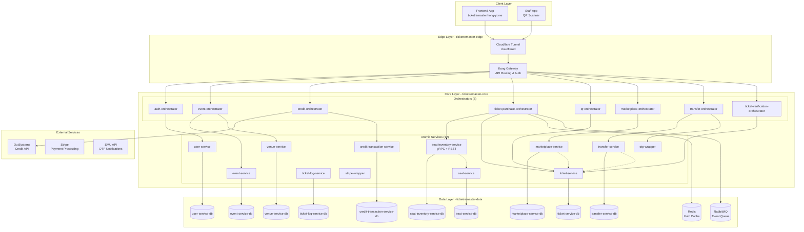

# TicketRemaster - Complete System Documentation

## Executive Summary

TicketRemaster is a production-grade microservice backend for event ticketing, supporting seat inventory management, credit-based purchases, peer-to-peer transfers, and staff verification. The system is deployed on Kubernetes with high availability (2 pods per service) and includes advanced reliability features like distributed locks, idempotency keys, rate limiting, and graceful shutdown.

## System Architecture Overview



## Architecture Layers

### 1. Edge Layer (ticketremaster-edge)

**Purpose**: Public ingress and request policy enforcement

**Components**:
- **Cloudflare Tunnel** (`cloudflared`): Establishes secure outbound connectivity to Cloudflare CDN
- **Kong Gateway** (2 replicas): API routing, authentication, rate limiting, CORS

**Responsibilities**:
- Terminate public HTTPS traffic
- Enforce CORS policies
- Apply Kong key-auth on protected routes
- Route requests to appropriate orchestrators
- Global rate limiting

**Non-responsibilities**:
- Business logic
- Data storage
- Service-to-service communication

### 2. Core Layer (ticketremaster-core)

**Purpose**: Application business logic and workflow orchestration

**Orchestrators (8)**:
- **auth-orchestrator**: User registration, login, JWT issuance
- **event-orchestrator**: Event discovery, venue information
- **credit-orchestrator**: Credit balance management, top-up coordination
- **ticket-purchase-orchestrator**: Seat holding, purchase confirmation, payment coordination
- **qr-orchestrator**: Ticket QR code generation, ticket retrieval
- **marketplace-orchestrator**: Resale listings, marketplace browsing
- **transfer-orchestrator**: Peer-to-peer ticket transfers, OTP coordination
- **ticket-verification-orchestrator**: Staff ticket validation, QR scanning

**Atomic Services (12)**:
- **user-service**: User account management
- **venue-service**: Venue information and capacity
- **seat-service**: Seat map and seating arrangements
- **event-service**: Event catalog and scheduling
- **seat-inventory-service**: Real-time seat availability (gRPC + REST)
- **ticket-service**: Ticket lifecycle management
- **ticket-log-service**: Audit trail for ticket operations
- **marketplace-service**: Listing management and search
- **transfer-service**: Transfer state machine
- **credit-transaction-service**: Credit movement logging
- **stripe-wrapper**: Stripe payment integration
- **otp-wrapper**: OTP generation and verification

### 3. Data Layer (ticketremaster-data)

**Purpose**: Persistent state management and messaging

**PostgreSQL Databases (10)**:
- Each service owns its database (database-per-service pattern)
- All running on PostgreSQL 18-alpine
- Automatic migrations on service startup

**Redis**:
- Seat hold caching for fast verification
- TTL-based automatic expiration
- Graceful fallback to gRPC/PostgreSQL

**RabbitMQ**:
- Seat hold expiry queue (TTL → DLX pattern)
- Asynchronous notification delivery
- Transfer timeout handling

## Key Features & Reliability Patterns

### 1. Distributed Locks for Concurrent Operations

**Problem**: Multiple users attempting to hold the same seat simultaneously

**Solution**:
- Redis-based distributed locking in `seat-inventory-service`
- Serializes concurrent hold requests
- Prevents double-booking
- Returns clear `409 Conflict` errors

**Implementation**:
```python
# seat-inventory-service/grpc_server.py
lock_key = f"seat_lock:{inventory_id}"
acquired = redis_client.set(lock_key, "1", nx=True, ex=30)
if not acquired:
    return HoldResponse(status="CONFLICT", message="Seat locked by another request")
```

### 2. Rate Limiting on OTP Verification

**Problem**: Brute force attacks on transfer OTP verification

**Solution**:
- Maximum 3 OTP attempts per 15 minutes per transfer
- Returns `429 Too Many Requests` when exceeded
- Frontend shows countdown timer

**Implementation**:
```python
# transfer-orchestrator/routes.py
attempts = redis_client.get(f"otp_attempts:{transfer_id}")
if attempts and int(attempts) >= 3:
    return jsonify({"error": "Rate limit exceeded"}), 429
```

### 3. Idempotency Keys for Deduplication

**Problem**: Network retries causing duplicate purchases or charges

**Solution**:
- `Idempotency-Key` header on state-changing operations
- 24-hour idempotency window
- Returns cached response for duplicate keys

**Implementation**:
```python
# ticket-purchase-orchestrator/routes.py
idempotency_key = request.headers.get('Idempotency-Key')
cached = redis_client.get(f"idempotent:{idempotency_key}")
if cached:
    return jsonify(json.loads(cached))
```

### 4. Auto-Cancel for Stuck Transfers

**Problem**: Transfers stuck in pending state indefinitely

**Solution**:
- 24-hour timeout on transfer completion
- Automatic cancellation via `transfer_timeout_queue`
- Notification to both parties

**Implementation**:
```python
# transfer-orchestrator/timeout_consumer.py
def start_transfer_timeout_consumer():
    channel.basic_consume(queue='transfer_timeout_queue', on_message_callback=handle_timeout)
```

### 5. Timeout Configuration on HTTP Calls

**Problem**: Services hanging indefinitely on downstream failures

**Solution**:
- 30-second timeout for purchase/transfer operations
- 10-second timeout for read operations
- Graceful degradation with fallbacks

**Implementation**:
```python
# service_client.py
response = requests.post(url, json=data, timeout=30)
```

### 6. Deadlock Retry Logic

**Problem**: Transient failures causing operation failures

**Solution**:
- Exponential backoff retry on transient errors
- Maximum 3 retry attempts
- Circuit breaker pattern for persistent failures

**Implementation**:
```python
# service_client.py
for attempt in range(3):
    try:
        return requests.post(url, json=data, timeout=30)
    except (ConnectionError, Timeout):
        time.sleep(2 ** attempt)  # Exponential backoff
```

### 7. Cache Invalidation Retry

**Problem**: Redis cache becoming stale

**Solution**:
- Write-through caching with retry
- Fallback to database on cache miss
- Periodic cache warming

**Implementation**:
```python
# seat-inventory-service/grpc_server.py
try:
    redis_client.setex(cache_key, 300, seat_data)
except RedisError:
    logger.warning("Redis unavailable, continuing with database only")
```

### 8. Graceful Shutdown Handling

**Problem**: Abrupt service termination causing request failures

**Solution**:
- SIGTERM/SIGINT signal handling
- 30-second graceful shutdown window
- Connection draining before termination

**Implementation**:
```python
# shared/graceful_shutdown.py
def graceful_shutdown(signum, frame, cleanup_func=None):
    logger.info("Graceful shutdown initiated")
    time.sleep(LB_DEREGISTRATION_DELAY)  # Allow load balancer to drain
    cleanup_func()  # Close DB connections, etc.
    sys.exit(0)
```

## Kubernetes Deployment

### Namespace Structure

```yaml
namespaces:
  - ticketremaster-edge    # Kong, cloudflared
  - ticketremaster-core    # Orchestrators, services
  - ticketremaster-data    # PostgreSQL, Redis, RabbitMQ
```

### High Availability Configuration

All stateless services run with **2 replicas** for zero-downtime deployments:

```yaml
# Example: user-service deployment
apiVersion: apps/v1
kind: Deployment
metadata:
  name: user-service
  namespace: ticketremaster-core
spec:
  replicas: 2  # High availability
  selector:
    matchLabels:
      app: user-service
  template:
    spec:
      containers:
      - name: user-service
        image: ticketremaster/user-service:latest
        ports:
        - containerPort: 5000
        readinessProbe:
          httpGet:
            path: /health
            port: 5000
          initialDelaySeconds: 10
          periodSeconds: 10
        livenessProbe:
          httpGet:
            path: /health
            port: 5000
          initialDelaySeconds: 20
          periodSeconds: 20
```

### Stateful Services

- **PostgreSQL**: 10 StatefulSets (one per service)
- **Redis**: Single StatefulSet with persistence
- **RabbitMQ**: Single StatefulSet with management plugin

### Resource Management

```yaml
resources:
  requests:
    memory: "256Mi"
    cpu: "250m"
  limits:
    memory: "512Mi"
    cpu: "500m"
```

## API Gateway Configuration

### Kong Routes

| Route Pattern | Orchestrator | Auth Required | Rate Limit |
|--------------|--------------|---------------|------------|
| `/auth/*` | auth-orchestrator | No (except /me) | 100/min |
| `/events/*` | event-orchestrator | No | 200/min |
| `/venues/*` | event-orchestrator | No | 200/min |
| `/credits/*` | credit-orchestrator | Yes + apikey | 50/min |
| `/purchase/*` | ticket-purchase-orchestrator | Yes + apikey | 30/min |
| `/tickets/*` | qr-orchestrator | Yes + apikey | 100/min |
| `/marketplace/*` | marketplace-orchestrator | Partial | 200/min |
| `/transfer/*` | transfer-orchestrator | Yes + apikey | 30/min |
| `/verify/*` | ticket-verification-orchestrator | Staff JWT | 50/min |

### Authentication Methods

1. **JWT Bearer Token**: For user authentication
2. **Kong API Key**: For route group protection
3. **Idempotency-Key**: For deduplication (optional header)

## Database Schema Overview

### User Service
- `users` table: userId, email, password, salt, phoneNumber, role, isFlagged, venueId, createdAt

### Venue Service
- `venues` table: venueId, name, address, capacity, coordinates, status

### Seat Service
- `seats` table: seatId, venueId, rowNumber, seatNumber, seatType, status

### Event Service
- `events` table: eventId, venueId, name, description, eventDate, status, eventType

### Seat Inventory Service
- `seat_inventory` table: inventoryId, eventId, seatId, status, price, heldUntil

### Ticket Service
- `tickets` table: ticketId, eventId, seatId, ownerId, status, price, purchaseDate

### Transfer Service
- `transfers` table: transferId, ticketId, sellerId, buyerId, status, listingId, createdAt

### Credit Transaction Service
- `credit_txns` table: txnId, userId, delta, reason, referenceId, createdAt

## Monitoring and Observability

### Health Checks

All services expose `/health` endpoint:

```json
{
  "status": "ok",
  "service": "user-service",
  "timestamp": "2026-03-29T12:00:00Z"
}
```

### Logging

- Structured JSON logging
- Correlation IDs for request tracing
- Log levels: DEBUG, INFO, WARNING, ERROR, CRITICAL

### Metrics

- Request latency (p50, p95, p99)
- Error rates by endpoint
- Database connection pool usage
- Redis cache hit/miss ratios
- RabbitMQ queue depths

## Security Considerations

### Network Security
- All internal services private (no direct external access)
- Kong as single entry point
- TLS termination at Cloudflare
- Database connections encrypted

### Application Security
- JWT tokens with expiration
- Password hashing with salt
- SQL injection prevention (ORM)
- Rate limiting on sensitive endpoints
- Input validation and sanitization

### Data Security
- Encrypted connections to databases
- API keys for service-to-service auth
- PII data minimization
- Audit logging for sensitive operations

## Deployment Guide

### Prerequisites
- Kubernetes cluster (v1.20+)
- kubectl configured
- Docker registry access
- SSL certificates for domains

### Deployment Steps

1. **Apply Namespaces**
   ```bash
   kubectl apply -f k8s/base/namespaces.yaml
   ```

2. **Create Secrets**
   ```bash
   kubectl create secret generic core-data-secrets \
     --from-literal=USER_SERVICE_DB_PASSWORD=change_me \
     --namespace=ticketremaster-core
   ```

3. **Deploy Data Layer**
   ```bash
   kubectl apply -f k8s/base/data-plane.yaml
   ```

4. **Deploy Core Layer**
   ```bash
   kubectl apply -f k8s/base/core-workloads.yaml
   ```

5. **Deploy Edge Layer**
   ```bash
   kubectl apply -f k8s/base/edge-workloads.yaml
   ```

6. **Run Seed Jobs**
   ```bash
   kubectl apply -f k8s/base/seed-jobs.yaml
   ```

### Verification

```bash
# Check all pods are running
kubectl get pods --all-namespaces

# Verify health endpoints
kubectl port-forward -n ticketremaster-core svc/user-service 5000:5000
curl http://localhost:5000/health

# Check database connectivity
kubectl exec -n ticketremaster-data user-service-db-0 -- psql -U ticketremaster -c "SELECT 1"
```

## Troubleshooting

### Common Issues

1. **Pod CrashLoopBackOff**
   - Check logs: `kubectl logs <pod-name> -n <namespace>`
   - Verify database connectivity
   - Check environment variables

2. **Database Migration Failures**
   - Check migration files exist
   - Verify database credentials
   - Check database is healthy

3. **Service Unavailable**
   - Verify Kong routes configured correctly
   - Check service endpoints exist
   - Verify network policies allow traffic

4. **High Latency**
   - Check Redis cache hit rates
   - Monitor database query performance
   - Verify resource limits not exceeded

### Useful Commands

```bash
# View pod logs
kubectl logs -f <pod-name> -n <namespace>

# Execute command in pod
kubectl exec -it <pod-name> -n <namespace> -- /bin/bash

# Check service endpoints
kubectl get endpoints -n <namespace>

# View resource usage
kubectl top pods -n <namespace>

# Scale deployment
kubectl scale deployment <deployment-name> --replicas=3 -n <namespace>
```

## Performance Benchmarks

### Local Development (Docker Desktop)
- Concurrent users: 100-500
- Average response time: 200-500ms
- Database connections: 20 per service

### Production Target (GCP)
- Concurrent users: 10,000+
- Average response time: 50-100ms
- Database connections: 100 per service
- Auto-scaling: 2-10 replicas per service

## Future Enhancements

1. **Horizontal Pod Autoscaling** based on CPU/memory metrics
2. **Managed Database Services** (Cloud SQL, ElastiCache)
3. **Distributed Tracing** with Jaeger or OpenTelemetry
4. **Service Mesh** (Istio or Linkerd) for advanced traffic management
5. **Multi-region Deployment** for disaster recovery
6. **GraphQL API** for flexible frontend queries
7. **WebSocket Support** for real-time seat availability updates

---

**Document Version**: 1.0  
**Last Updated**: 2026-03-29  
**Maintained By**: Architecture Team