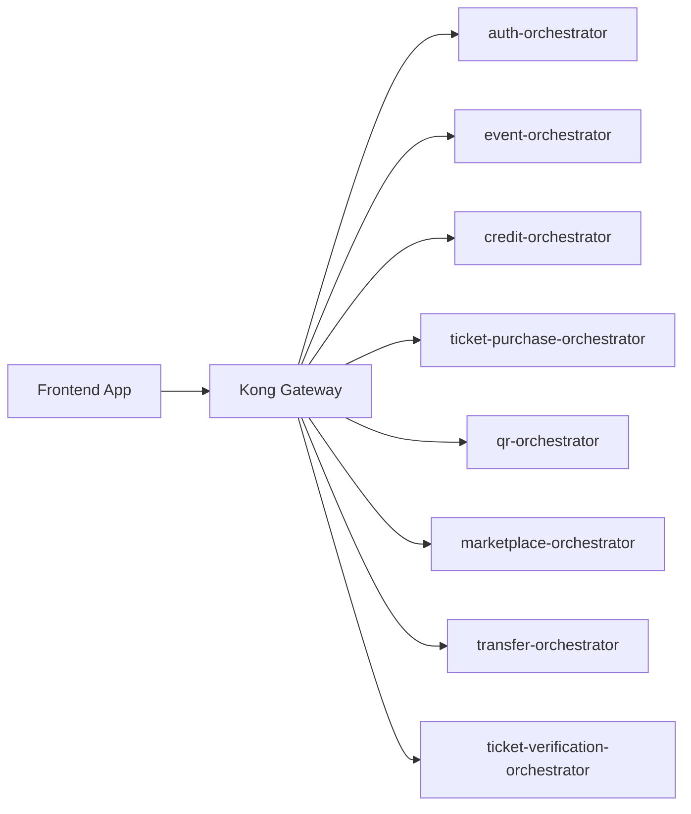

# TicketRemaster Frontend Integration Contract

## Purpose

This document is the frontend-facing source of truth for what the current backend actually exposes today.



## Base URL rules

### Production

- Frontend origin: `https://ticketremaster.hong-yi.me`
- Browser API base URL: `https://ticketremasterapi.hong-yi.me`
- Frontend should never call atomic services, pod IPs, Docker hostnames, or Kubernetes service DNS names

### Local development

- Browser API base URL: `http://localhost:8000`
- Use Kong locally as well, so the frontend exercises the same route model as production
- Direct orchestrator ports are for Swagger and debugging only, not for normal frontend integration

### Local gateway auth note

The local declarative Kong config currently defines a frontend consumer key:

- Header: `apikey`
- Local development value: `tk_front_123456789`

Do not hardcode that value into production frontend code. Treat it as a local/dev gateway detail only.

## Core browser rules

- Call orchestrators only
- Expect CORS to be enforced at Kong
- Send `Authorization: Bearer <jwt>` on authenticated routes
- Send `apikey` on route groups protected by Kong key-auth
- Do not bypass Kong to work around CORS, auth, or rate limits

## Auth and protection model

| Route group | Browser auth | Gateway API key |
|---|---|---|
| `/auth/register`, `/auth/login` | none | no |
| `/auth/me` | JWT | no |
| `/events`, `/venues`, `/events/:id`, `/events/:id/seats`, `/events/:id/seats/:inventoryId` | none | no |
| `/admin/events` | treat as admin-only | no |
| `/credits/*` | JWT | yes |
| `/purchase/*` | JWT | yes |
| `/tickets/*` | JWT | yes |
| `/marketplace` browse | none in orchestrator, but current Kong route is API-key protected | yes |
| `/marketplace/list`, `/marketplace/:listingId` delete | JWT | yes |
| `/transfer/*` | JWT | yes |
| `/verify/*` | staff JWT | yes |

## Frontend route map

### Public app pages

- `/`
- `/events`
- `/events/:eventId`
- `/login`
- `/register`

### Authenticated app pages

- `/credits/topup`
- `/tickets`
- `/tickets/:ticketId/qr`
- `/marketplace`
- `/transfer/:transferId`
- `/profile`

### Staff app pages

- QR scan flow posting to `/verify/scan`
- manual verification flow posting to `/verify/manual`

## Current orchestrator endpoints

### Auth

- `POST /auth/register`
- `POST /auth/login`
- `GET /auth/me`

### Events and venues

- `GET /venues`
- `GET /events`
- `GET /events/:eventId`
- `GET /events/:eventId/seats`
- `GET /events/:eventId/seats/:inventoryId`
- `POST /admin/events`

### Credits

- `GET /credits/balance`
- `POST /credits/topup/initiate`
- `POST /credits/topup/confirm`
- `POST /credits/topup/webhook`
- `GET /credits/transactions`

### Purchase

- `GET /tickets`
- `POST /purchase/hold/:inventoryId`
- `DELETE /purchase/hold/:inventoryId`
- `POST /purchase/confirm/:inventoryId`

The `GET /tickets` route here comes from `ticket-purchase-orchestrator` and is part of the purchase-path workflow surface. User-owned ticket listing for the main app also exists through `qr-orchestrator`.

### Marketplace

- `GET /marketplace`
- `POST /marketplace/list`
- `DELETE /marketplace/:listingId`

### Transfer

- `POST /transfer/initiate`
- `POST /transfer/:transferId/buyer-verify`
- `POST /transfer/:transferId/seller-accept`
- `POST /transfer/:transferId/seller-reject`
- `POST /transfer/:transferId/seller-verify`
- `GET /transfer/pending`
- `GET /transfer/:transferId`
- `POST /transfer/:transferId/resend-otp`
- `POST /transfer/:transferId/cancel`

### Ticket and QR

- `GET /tickets`
- `GET /tickets/:ticketId/qr`

### Verification

- `POST /verify/scan`
- `POST /verify/manual`

## Frontend integration guidance

### Top-up flow

Use the current implemented sequence:

1. `POST /credits/topup/initiate`
2. collect the returned Stripe PaymentIntent metadata
3. `POST /credits/topup/confirm` when the app needs an application-level confirmation step
4. webhook handling remains backend-driven through credit and Stripe integration paths

### Marketplace note

The current Kong config applies key-auth to the entire `/marketplace` route group, including the public browse path. Frontend integration should therefore assume `apikey` is required even for listing browse when running through the current gateway config.

### Transfer note

The transfer flow surface is richer than the original simplified contract. Frontend or staff tooling can now rely on:

- seller rejection
- pending transfer lookup
- OTP resend
- explicit cancel

## Error handling expectations

### CORS and preflight

- A failed `OPTIONS` request usually means the origin, method, or headers are not allowed by Kong
- Do not switch the frontend to direct service URLs to work around preflight failures

### Rate limiting

- `429` should be treated as gateway protection, not as a backend crash
- UI should use bounded retry behavior and clear user messaging

### Suggested user copy

| Scenario | Recommended UI copy |
|---|---|
| CORS or preflight failure | `We couldn't connect to TicketRemaster right now. Please refresh and try again.` |
| Expired auth | `Your session has expired. Please sign in again.` |
| Rate limited | `Too many requests were made in a short time. Please wait a moment and try again.` |
| Temporary backend issue | `TicketRemaster is temporarily unavailable. Please try again shortly.` |

## Local developer shortcuts

### Use Kong for browser testing

```powershell
http://localhost:8000
```

### Use Swagger for API exploration

- `http://localhost:8100/apidocs`
- `http://localhost:8101/apidocs`
- `http://localhost:8102/apidocs`
- `http://localhost:8103/apidocs`
- `http://localhost:8104/apidocs`
- `http://localhost:8105/apidocs`
- `http://localhost:8107/apidocs`
- `http://localhost:8108/apidocs`

Use [API.md](API.md) for the combined offline API view.
