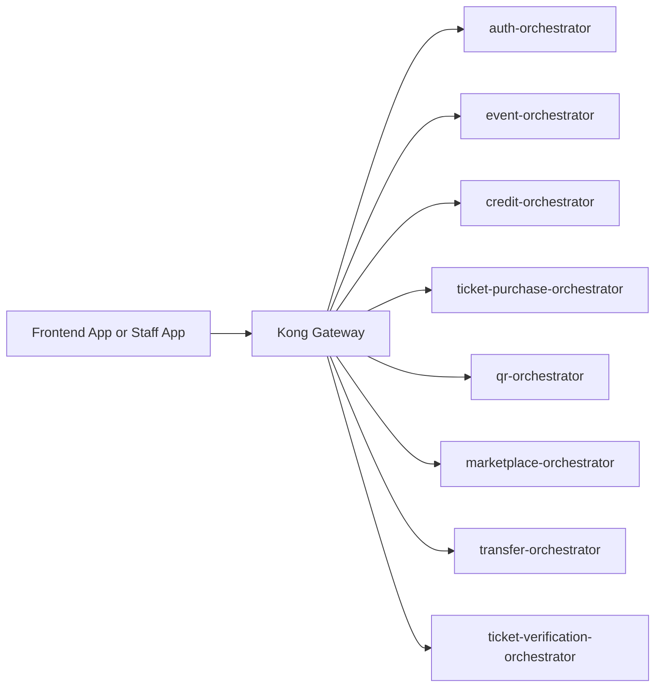

# TicketRemaster Frontend Integration Contract

This document is the frontend-facing source of truth for the API surface that is actually reachable through the current gateway configuration.

Related references:

- [README.md](README.md)
- [API.md](API.md)
- [PRD.md](PRD.md)



## Base URLs

### Production

- Frontend origin: `https://ticketremaster.hong-yi.me`
- Browser API base URL: `https://ticketremasterapi.hong-yi.me`

### Local development

- Browser API base URL: `http://localhost:8000`
- Use Kong locally as well so the frontend exercises the same route model as production
- Direct orchestrator ports such as `http://localhost:8102` are for Swagger and debugging, not for normal browser integration

### Local gateway key

The declarative Kong config currently defines a local frontend consumer key:

- header: `apikey`
- local development value: `tk_front_123456789`

Treat this as a local or controlled-environment gateway detail. Do not hardcode it into production frontend builds.

## Request rules

- call Kong only
- send `Authorization: Bearer <jwt>` on JWT-protected routes
- send `apikey: <value>` on every route group that Kong key-auth protects
- do not call internal services, Docker hostnames, or Kubernetes service DNS names from the browser

## Authentication matrix

| Route or route group | JWT required | Kong `apikey` required | Notes |
| --- | --- | --- | --- |
| `POST /auth/register` | no | no | public |
| `POST /auth/login` | no | no | public |
| `GET /auth/me` | yes | no | authenticated profile |
| `GET /venues` | no | no | public |
| `GET /events` | no | no | public |
| `GET /events/{eventId}` | no | no | public |
| `GET /events/{eventId}/seats` | no | no | public |
| `GET /events/{eventId}/seats/{inventoryId}` | no | no | public |
| `POST /admin/events` | admin JWT | no | event creation now requires an admin token in the orchestrator |
| `/credits/*` | yes except webhook | yes | webhook is backend-to-backend only |
| `/purchase/*` | yes | yes | purchase operations |
| `/tickets/*` | yes | yes | these routes are served by `qr-orchestrator` at the gateway |
| `GET /marketplace` | no | no | public browse route |
| `POST /marketplace/list` | yes | yes | listing creation |
| `DELETE /marketplace/{listingId}` | yes | yes | delist |
| `/transfer/*` | yes | yes | buyer and seller transfer flows |
| `/verify/*` | staff JWT | yes | JWT must contain `role=staff`; `venueId` is also used if present |

## Route map used by the frontend

### Public customer pages

- `/`
- `/events`
- `/events/{eventId}`
- `/login`
- `/register`

### Authenticated customer pages

- `/credits/topup`
- `/tickets`
- `/tickets/{ticketId}/qr`
- `/marketplace`
- `/transfer/{transferId}`
- `/profile`

### Staff pages

- QR scan flow posting to `POST /verify/scan`
- manual verification flow posting to `POST /verify/manual`

## Exact frontend endpoints

### Auth

| Method | Path | Request body | Success shape |
| --- | --- | --- | --- |
| `POST` | `/auth/register` | `email`, `password`, `phoneNumber`, optional `role`, optional `venueId` | `{ "data": { "userId", "email", "role", "createdAt" } }` |
| `POST` | `/auth/login` | `email`, `password` | `{ "data": { "token", "expiresAt", "user": { "userId", "email", "role" } } }` |
| `GET` | `/auth/me` | none | `{ "data": { "userId", "email", "phoneNumber", "role", "isFlagged", "createdAt" } }` |

Register example:

```json
{
  "email": "buyer@example.com",
  "password": "Password123!",
  "phoneNumber": "+6591234567"
}
```

Login response example:

```json
{
  "data": {
    "token": "eyJhbGciOiJIUzI1NiIs...",
    "expiresAt": "2026-03-29T12:00:00+00:00",
    "user": {
      "userId": "usr_001",
      "email": "buyer@example.com",
      "role": "user"
    }
  }
}
```

### Events and venues

| Method | Path | Query or body | Success shape |
| --- | --- | --- | --- |
| `GET` | `/venues` | none | raw venue-service payload, typically `{ "venues": [...] }` |
| `GET` | `/events` | optional `type`, `page`, `limit` | `{ "data": { "events": [...], "pagination": {...} } }` |
| `GET` | `/events/{eventId}` | none | `{ "data": { ...event, "venue": {...} } }` |
| `GET` | `/events/{eventId}/seats` | none | `{ "data": { "eventId", "seats": [...] } }` |
| `GET` | `/events/{eventId}/seats/{inventoryId}` | none | `{ "data": { ...seat, "event": {...}, "venue": {...} } }` |
| `POST` | `/admin/events` | event creation payload | `{ "data": { "eventId", "seatsCreated" } }` |

Event seat-map response example:

```json
{
  "data": {
    "eventId": "evt_001",
    "seats": [
      {
        "inventoryId": "inv_001",
        "seatId": "seat_001",
        "status": "available",
        "heldUntil": null,
        "rowNumber": "A",
        "seatNumber": "1",
        "price": 88.0
      }
    ]
  }
}
```

Current implementation notes:

- `GET /events` now applies `type`, `page`, and `limit` in `event-service` and returns pagination metadata
- `POST /admin/events` now requires an admin JWT at the orchestrator

### Credits

Frontend base path:

- `https://ticketremasterapi.hong-yi.me/credits`
- `http://localhost:8000/credits`

| Method | Path | Auth | Request body | Success shape |
| --- | --- | --- | --- | --- |
| `GET` | `/credits/balance` | JWT + `apikey` | none | `{ "data": { "userId", "creditBalance", ... } }` |
| `POST` | `/credits/topup/initiate` | JWT + `apikey` | `amount` | `{ "data": { "clientSecret", "paymentIntentId", "amount" } }` |
| `POST` | `/credits/topup/confirm` | JWT + `apikey` | `paymentIntentId` | `{ "data": { "status", "new_balance" } }` or `{ "data": { "status": "already_processed" } }` |
| `GET` | `/credits/transactions` | JWT + `apikey` | optional `page`, `limit` query | `{ "data": { "transactions": [...], "pagination": {...} } }` |

Top-up initiate example:

```json
{
  "amount": 100
}
```

Top-up initiate response:

```json
{
  "data": {
    "clientSecret": "cs_test_...",
    "paymentIntentId": "pi_123",
    "amount": 100
  }
}
```

Top-up confirm example:

```json
{
  "paymentIntentId": "pi_123"
}
```

Webhook note:

- `POST /credits/topup/webhook` exists, but it is intended for Stripe-to-backend delivery, not frontend calls

### Purchase

Frontend base path:

- `https://ticketremasterapi.hong-yi.me/purchase`
- `http://localhost:8000/purchase`

| Method | Path | Auth | Request body | Success shape |
| --- | --- | --- | --- | --- |
| `POST` | `/purchase/hold/{inventoryId}` | JWT + `apikey` | none | `{ "data": { "inventoryId", "status": "held", "heldUntil", "holdToken" } }` |
| `DELETE` | `/purchase/hold/{inventoryId}` | JWT + `apikey` | `holdToken` | `{ "data": { "inventoryId", "status": "available" } }` |
| `POST` | `/purchase/confirm/{inventoryId}` | JWT + `apikey` | `eventId`, `holdToken` | `{ "data": { "ticketId", "eventId", "venueId", "inventoryId", "price", "status", "createdAt" } }` |

Hold response example:

```json
{
  "data": {
    "inventoryId": "inv_001",
    "status": "held",
    "heldUntil": "2026-03-29T12:15:00+00:00",
    "holdToken": "c378f45d-4236-4d49-8d93-d5e965964ada"
  }
}
```

Confirm request example:

```json
{
  "eventId": "evt_001",
  "holdToken": "c378f45d-4236-4d49-8d93-d5e965964ada"
}
```

Important route note:

- the frontend should not call `GET /tickets` on `ticket-purchase-orchestrator`
- Kong maps `/tickets/*` to `qr-orchestrator`, so customer ticket listing should use the ticket routes documented in the next section

### Tickets and QR

Frontend base path:

- `https://ticketremasterapi.hong-yi.me/tickets`
- `http://localhost:8000/tickets`

| Method | Path | Auth | Request body | Success shape |
| --- | --- | --- | --- | --- |
| `GET` | `/tickets` | JWT + `apikey` | none | `{ "data": { "tickets": [...] } }` |
| `GET` | `/tickets/{ticketId}/qr` | JWT + `apikey` | none | `{ "data": { "ticketId", "qrHash", "generatedAt", "expiresAt", "event", "venue" } }` |

Ticket list response example:

```json
{
  "data": {
    "tickets": [
      {
        "ticketId": "tkt_001",
        "status": "active",
        "price": 88.0,
        "createdAt": "2026-03-29T12:00:00+00:00",
        "event": {
          "eventId": "evt_001",
          "name": "Taylor Swift | The Eras Tour",
          "date": "2026-06-15T19:30:00+00:00"
        },
        "venue": {
          "venueId": "ven_001",
          "name": "Singapore Indoor Stadium"
        }
      }
    ]
  }
}
```

QR response example:

```json
{
  "data": {
    "ticketId": "tkt_001",
    "qrHash": "a3f9d2e1b8c74f6a91e2d3b4c5f6a7b8c9d0e1f2a3b4c5d6e7f8a9b0c1d2e3f4",
    "generatedAt": "2026-03-29T12:00:00+00:00",
    "expiresAt": "2026-03-29T12:01:00+00:00",
    "event": {
      "name": "Taylor Swift | The Eras Tour",
      "date": "2026-06-15T19:30:00+00:00"
    },
    "venue": {
      "name": "Singapore Indoor Stadium",
      "address": "2 Stadium Walk"
    }
  }
}
```

### Marketplace

Frontend base path:

- `https://ticketremasterapi.hong-yi.me/marketplace`
- `http://localhost:8000/marketplace`

| Method | Path | Auth | Query or body | Success shape |
| --- | --- | --- | --- | --- |
| `GET` | `/marketplace` | public | optional `eventId`, `page`, `limit` | `{ "data": { "listings": [...], "pagination": {...} } }` |
| `POST` | `/marketplace/list` | JWT + `apikey` | `ticketId`, optional `price` | `{ "data": { "listingId", "ticketId", "sellerId", "price", "status", "createdAt" } }` |
| `DELETE` | `/marketplace/{listingId}` | JWT + `apikey` | none | `{ "data": { "listingId", "status": "cancelled" } }` |

Marketplace browse response example:

```json
{
  "data": {
    "listings": [
      {
        "listingId": "lst_001",
        "ticketId": "tkt_001",
        "sellerId": "usr_002",
        "sellerName": "seller",
        "price": 88.0,
        "status": "active",
        "createdAt": "2026-03-29T12:00:00+00:00",
        "event": {
          "eventId": "evt_001",
          "name": "Taylor Swift | The Eras Tour",
          "date": "2026-06-15T19:30:00+00:00"
        }
      }
    ],
    "pagination": {}
  }
}
```

Current implementation note:

- `page` and `limit` are applied in `marketplace-service`
- `eventId` filtering is applied in `marketplace-orchestrator` after ticket and event enrichment, because the listing record itself does not own `eventId`

### Transfer

Frontend base path:

- `https://ticketremasterapi.hong-yi.me/transfer`
- `http://localhost:8000/transfer`

| Method | Path | Auth | Request body | Success shape |
| --- | --- | --- | --- | --- |
| `POST` | `/transfer/initiate` | JWT + `apikey` | `listingId` | `{ "data": { "transferId", "status", "message" } }` |
| `POST` | `/transfer/{transferId}/seller-accept` | JWT + `apikey` | none | `{ "data": { "transferId", "status", "message" } }` |
| `POST` | `/transfer/{transferId}/buyer-verify` | JWT + `apikey` | `otp` | `{ "data": { "transferId", "status", "message" } }` |
| `POST` | `/transfer/{transferId}/seller-reject` | JWT + `apikey` | none | `{ "data": { "transferId", "status", "message" } }` |
| `POST` | `/transfer/{transferId}/seller-verify` | JWT + `apikey` | `otp` | `{ "data": { "transferId", "status", "completedAt", "ticket" } }` |
| `GET` | `/transfer/pending` | JWT + `apikey` | none | `{ "data": { "transfers": [...] } }` |
| `GET` | `/transfer/{transferId}` | JWT + `apikey` | none | `{ "data": { ...transfer } }` |
| `POST` | `/transfer/{transferId}/resend-otp` | JWT + `apikey` | none | `{ "data": { "message" } }` |
| `POST` | `/transfer/{transferId}/cancel` | JWT + `apikey` | none | `{ "data": { "transferId", "status" } }` |

Initiate request example:

```json
{
  "listingId": "lst_001"
}
```

Initiate response example:

```json
{
  "data": {
    "transferId": "txr_001",
    "status": "pending_seller_acceptance",
    "message": "Request sent to seller. Pending acceptance."
  }
}
```

Transfer-state guidance:

- initiate creates a transfer and notifies the seller
- seller accept sends OTP to the buyer
- buyer verify sends OTP to the seller
- seller verify executes the credit and ownership saga
- resend OTP is state-dependent and only works in the relevant pending OTP states

### Verification

Staff app base path:

- `https://ticketremasterapi.hong-yi.me/verify`
- `http://localhost:8000/verify`

| Method | Path | Auth | Request body | Success shape |
| --- | --- | --- | --- | --- |
| `POST` | `/verify/scan` | staff JWT + `apikey` | `qrHash` | `{ "data": { "result": "SUCCESS", "ticketId", "scannedAt", "event", "seat", "owner" } }` |
| `POST` | `/verify/manual` | staff JWT + `apikey` | `ticketId` | `{ "data": { "result": "SUCCESS", "ticketId", "scannedAt", "event", "seat", "owner" } }` |

Scan request example:

```json
{
  "qrHash": "a3f9d2e1b8c74f6a91e2d3b4c5f6a7b8c9d0e1f2a3b4c5d6e7f8a9b0c1d2e3f4"
}
```

## Integration guidance

### Customer top-up flow

1. call `POST /credits/topup/initiate`
2. confirm Stripe payment in the frontend using the returned `clientSecret`
3. call `POST /credits/topup/confirm` with the `paymentIntentId`
4. refresh `GET /credits/balance` and `GET /credits/transactions`

### Purchase flow

1. call `GET /events/{eventId}/seats`
2. call `POST /purchase/hold/{inventoryId}`
3. keep the returned `holdToken`
4. call `POST /purchase/confirm/{inventoryId}` with `eventId` and `holdToken`
5. refresh `GET /tickets`

### Marketplace flow

1. call `GET /marketplace`
2. call `POST /marketplace/list` to list an active ticket
3. use `POST /transfer/initiate` when the buyer starts a purchase from a listing

## Error handling expectations

Common error format:

```json
{
  "error": {
    "code": "VALIDATION_ERROR",
    "message": "Human readable message"
  }
}
```

Some services also enrich errors with:

- `status`
- `traceId`
- `details`

Frontend handling guidance:

- treat `401` as missing or expired JWT
- treat `403` as permission failure such as wrong owner or non-staff verification access
- treat `402` from purchase or transfer flows as insufficient credits
- treat `409` and `410` in purchase flows as seat-state conflicts or expired holds
- treat `429` as Kong rate limiting, not a backend crash

Suggested user copy:

| Scenario | Recommended UI copy |
| --- | --- |
| CORS or gateway connectivity failure | `We couldn't connect to TicketRemaster right now. Please refresh and try again.` |
| Expired auth | `Your session has expired. Please sign in again.` |
| Seat hold expired | `That seat is no longer reserved. Please choose a seat again.` |
| Insufficient credits | `You do not have enough credits for this action. Please top up and try again.` |
| Rate limited | `Too many requests were made in a short time. Please wait a moment and try again.` |
| Temporary backend issue | `TicketRemaster is temporarily unavailable. Please try again shortly.` |

## Developer shortcuts

### Gateway

- `http://localhost:8000`

### Swagger UIs

- `http://localhost:8100/apidocs`
- `http://localhost:8101/apidocs`
- `http://localhost:8102/apidocs`
- `http://localhost:8103/apidocs`
- `http://localhost:8104/apidocs`
- `http://localhost:8105/apidocs`
- `http://localhost:8107/apidocs`
- `http://localhost:8108/apidocs`

Use [API.md](API.md) for the combined offline reference and `openapi.unified.json` for the unified OpenAPI document.
