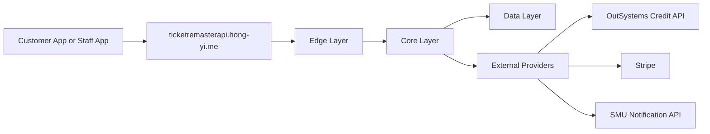
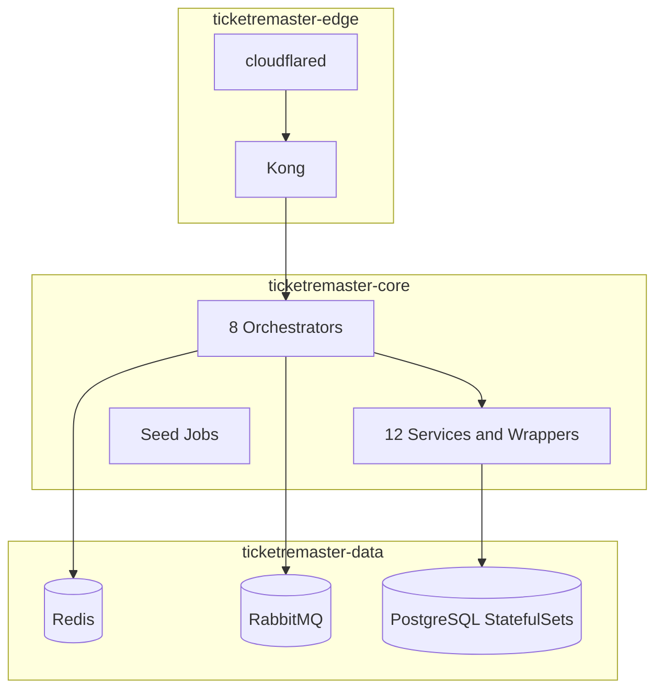

# Product Requirements Document: TicketRemaster

## Executive summary

TicketRemaster is a ticketing backend that supports:

- customer event discovery
- seat-map browsing and seat holds
- credit top-up and credit-funded checkout
- owned-ticket retrieval and QR generation
- staff ticket validation
- resale marketplace listings
- peer-to-peer transfer workflows

The codebase already implements the core backend for these journeys. It is not a blank PRD for a future platform. This document reflects what is actually present in the repository today and where the main hardening gaps still remain.

## Current product architecture

## Architectural layers

### Edge layer

**Definition**: The public ingress and request policy layer where browser traffic first enters the platform.

**Current implementation**:

- namespace: `ticketremaster-edge`
- workloads: `kong`, `cloudflared`
- source of routing truth: `api-gateway/kong.yml`

**Responsibilities**:

- expose only orchestrator-facing routes
- enforce CORS for approved local and production frontend origins
- apply global rate limiting
- apply Kong key-auth on protected route groups
- keep atomic services and data infrastructure private

**Non-responsibilities**:

- does not own business workflows
- does not store ticketing or credit data
- does not perform seat-locking or QR validation logic

### Core layer

**Definition**: The application runtime layer where business workflows execute, translating frontend requests into service-to-service calls.

**Current implementation**:

- namespace: `ticketremaster-core`
- 8 orchestrators
- 12 internal services and wrappers
- seed jobs for baseline data loading

**Responsibilities**:

- authenticate users and issue JWTs
- aggregate data across atomic services for frontend consumption
- run seat-hold, purchase, top-up, verification, marketplace, and transfer flows
- call Redis, RabbitMQ, gRPC services, Stripe, OTP, and OutSystems where required
- normalize downstream errors into consistent API responses

**Core sublayers**:

- **Orchestrator sublayer** (8 orchestrators):
  - `auth-orchestrator`
  - `event-orchestrator`
  - `credit-orchestrator`
  - `ticket-purchase-orchestrator`
  - `qr-orchestrator`
  - `marketplace-orchestrator`
  - `transfer-orchestrator`
  - `ticket-verification-orchestrator`
- **Atomic service sublayer** (12 services and wrappers):
  - `user-service`
  - `venue-service`
  - `seat-service`
  - `event-service`
  - `seat-inventory-service`
  - `ticket-service`
  - `ticket-log-service`
  - `marketplace-service`
  - `transfer-service`
  - `credit-transaction-service`
  - `stripe-wrapper`
  - `otp-wrapper`

### Data layer

**Definition**: The stateful persistence and messaging layer holding long-lived application state or asynchronous workflow state.

**Current implementation**:

- namespace: `ticketremaster-data`
- Redis StatefulSet
- RabbitMQ StatefulSet
- 10 Postgres StatefulSets, one per data-owning service

**Responsibilities**:

- persist service-owned records
- provide the Redis hold cache used by purchase confirmation
- hold RabbitMQ queues used for hold expiry and transfer notifications
- isolate stateful infrastructure from direct browser access

**Non-responsibilities**:

- does not serve frontend requests directly
- does not aggregate data for clients
- does not expose public routes

## Key implementation flows

### Event discovery

- the frontend calls `event-orchestrator` through `/venues`, `/events`, `/events/{eventId}`, and seat-map endpoints
- the orchestrator fans out to `venue-service`, `event-service`, `seat-service`, and `seat-inventory-service`
- the returned shape is enriched for UI use rather than mirroring raw service responses

### Credit top-up

- the frontend calls `credit-orchestrator`
- `credit-orchestrator` creates Stripe PaymentIntents through `stripe-wrapper`
- confirm and webhook paths retrieve Stripe metadata, patch the OutSystems balance, and log `credit-transaction-service` entries

### Seat hold and purchase

- `ticket-purchase-orchestrator` holds, releases, and sells seats through `seat-inventory-service` gRPC
- hold state is cached in Redis for faster confirm checks
- hold-expiry behavior relies on RabbitMQ messaging
- the purchase saga creates the ticket, deducts OutSystems credits, and logs a credit transaction

### Marketplace and transfer

- `marketplace-orchestrator` exposes browse, list, and delist flows
- `transfer-orchestrator` manages the multi-step buyer and seller verification flow
- OTP is delegated to `otp-wrapper`
- seller notifications are decoupled through RabbitMQ
- final ownership transfer updates transfer, marketplace, ticket, and credit state together

### QR retrieval and verification

- `qr-orchestrator` generates a fresh QR hash for each open and stores the hash on `ticket-service`
- `ticket-verification-orchestrator` validates QR TTL, seat status, ticket state, duplicate scans, and venue ownership
- check-in results are logged to `ticket-log-service`

## External systems

### OutSystems credit service

This repository treats OutSystems as the source of truth for `creditBalance`.

- API base URL: `https://personal-sdxnmlx3.outsystemscloud.com/CreditService/rest/CreditAPI`
- docs URL: `https://personal-sdxnmlx3.outsystemscloud.com/CreditService/rest/CreditAPI/`
- published Swagger: `https://personal-sdxnmlx3.outsystemscloud.com/CreditService/rest/CreditAPI/swagger.json`
- auth: `X-API-KEY`

Integration points:

- `auth-orchestrator`
  - initializes a credit record during registration
- `credit-orchestrator`
  - fetches balance
  - applies top-up balance changes
  - logs top-up history internally
- `ticket-purchase-orchestrator`
  - reads buyer balance before sale
  - patches the new balance after sale
- `transfer-orchestrator`
  - checks buyer and seller balances
  - patches both balances during the transfer saga

Current contract note:

- repository callers use `POST /credits`, `GET /credits/{user_id}`, and `PATCH /credits/{user_id}`
- the published OutSystems Swagger currently models `CreateCreditRequest` with both `userId` and `creditBalance`
- the repository registration flow currently sends only `userId`, so provider behavior should be revalidated whenever the OutSystems contract changes

### Stripe

- used only through `stripe-wrapper`
- supports create-payment-intent, retrieve-payment-intent, and webhook verification paths
- currently powers the credit top-up workflow

### SMU Notification API

- used only through `otp-wrapper`
- powers OTP send and verify steps for transfer workflows

## Frontend-facing surface

The gateway currently exposes these route groups:

- `/auth`
- `/events`
- `/venues`
- `/admin/events`
- `/credits`
- `/purchase`
- `/tickets`
- `/marketplace`
- `/transfer`
- `/verify`

Important implementation details:

- `/tickets/*` at Kong routes to `qr-orchestrator`
- `ticket-purchase-orchestrator` also defines `GET /tickets` on its own service port, but that route is not reachable through the current gateway mapping
- `/marketplace` browse is public in orchestrator code but still requires Kong `apikey`
- `/admin/events` is not currently protected by JWT or Kong key-auth even though it is conceptually an admin route

## Functional requirements reflected in code

### Identity and access

- registration creates a user and attempts OutSystems credit initialization
- login returns a JWT containing `userId`, `email`, `role`, and optionally `venueId` for staff users
- `/auth/me` returns the current user profile

### Event discovery and seat visibility

- venues and events are readable without JWT
- seat maps are enriched with seat metadata and inventory status
- event creation provisions seat inventory after event creation

### Purchase and ticket ownership

- users can hold a seat, release a hold, and confirm a purchase
- tickets are created with statuses `active`, `listed`, `used`, or `pending_transfer`
- owned tickets and QR retrieval are available through `qr-orchestrator`

### Resale marketplace and transfers

- users can list active tickets
- sellers can delist active listings
- buyers can initiate transfers from listings
- transfers support seller accept, seller reject, buyer verify, seller verify, resend OTP, pending lookups, direct lookup, and cancel

### Staff-side verification

- scan flow validates QR age and venue
- manual flow validates by ticket ID without QR
- duplicate scans are blocked and logged

## Non-functional requirements

### Performance

- Redis reduces the need to re-check held seats through gRPC on every confirm call
- gRPC keeps seat-state transitions explicit and low-latency
- gateway aggregation keeps frontend calls coarse-grained

### Security

- JWT is the primary identity mechanism inside orchestrators
- Kong key-auth protects selected route groups
- browser clients should call Kong only
- OutSystems calls require `OUTSYSTEMS_API_KEY`

### Reliability

- purchase and transfer flows use compensating logic where feasible
- RabbitMQ decouples time-based and notification-based work from synchronous request latency
- critical state remains in Postgres and OutSystems, not Redis

### Scalability

- orchestrators and most services are stateless in principle
- `seat-inventory-service` is the main concurrency-sensitive service
- current Kubernetes manifests are deployable but not yet tuned for multi-node production resilience

## Current infrastructure status

The Kubernetes base is real and organized by plane, but it is still in a hardening phase.

- many core Deployments remain single replica
- startup probes are not yet universal
- resource requests and limits are still incomplete
- PodDisruptionBudgets and HPAs are not yet part of the committed base
- RabbitMQ, Redis, and Postgres still use simple single-replica stateful patterns

## Roadmap focus

- harden gateway and admin-route protection
- align the OutSystems create-credit contract with the repository caller expectations
- improve pagination and filtering on event and marketplace browse endpoints
- continue expanding the offline API hub and unified OpenAPI surface
- move from local-cluster validation toward stronger multi-node resilience testing
