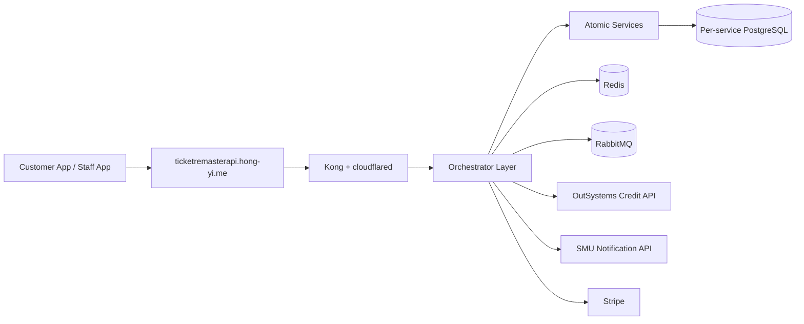
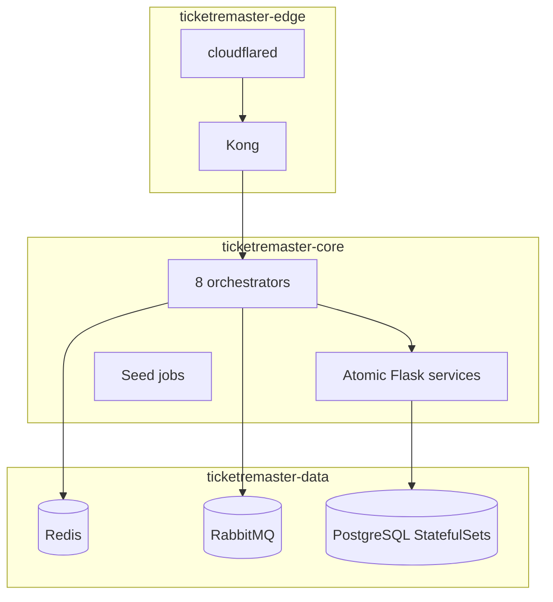

# Product Requirements Document: TicketRemaster

## Executive summary

TicketRemaster is a microservice ticketing platform that supports event discovery, seat selection, hold-and-purchase flows, ticket QR retrieval, staff-side verification, resale marketplace listings, and peer-to-peer transfer workflows. The current repository already implements the orchestrator-driven backend, Redis-assisted purchase path, RabbitMQ-driven asynchronous flows, and a functional external credit provider hosted in OutSystems.

## Architecture snapshot

## Platform model

### Edge, core, and data

- **Edge**
  - public ingress and policy layer
  - currently represented by Kong plus `cloudflared`
  - owns browser-facing routing, CORS behavior, and API-key enforcement at the gateway
- **Core**
  - application runtime layer
  - contains orchestrators, atomic Flask services, and seed jobs
  - handles business flows, sagas, gRPC seat operations, and internal REST traffic
- **Data**
  - stateful infrastructure layer
  - contains PostgreSQL StatefulSets, Redis, and RabbitMQ
  - should remain private to the cluster

## Current implementation reality

### Frontend-facing orchestrators

The repository currently exposes these orchestrator route groups through Kong:

- `/auth`
- `/events`
- `/venues`
- `/admin/events`
- `/credits`
- `/purchase`
- `/tickets`
- `/marketplace`
- `/transfer`
- `/verify`

### Core technical choices

- **HTTP orchestration**
  - orchestrators aggregate and normalize atomic-service responses
- **gRPC seat path**
  - `ticket-purchase-orchestrator` uses `seat-inventory-service` gRPC calls for `HoldSeat`, `ReleaseSeat`, `SellSeat`, and `GetSeatStatus`
- **Redis acceleration**
  - hold metadata is cached in Redis after the database commit succeeds
  - purchase confirmation checks Redis first, then falls back to gRPC when needed
- **RabbitMQ workflows**
  - seat-hold expiry uses TTL + DLX behavior
  - transfer flows use asynchronous seller notification messaging
- **External integrations**
  - Stripe is used for top-up payment flow support
  - SMU Notification API is used for OTP send/verify
  - OutSystems Credit API is the live credit source of truth

## OutSystems credit platform

The credit service is no longer a planned dependency. It is functional and already wired into the repo configuration.

- Base URL: `https://personal-sdxnmlx3.outsystemscloud.com/CreditService/rest/CreditAPI`
- Docs: `https://personal-sdxnmlx3.outsystemscloud.com/CreditService/rest/CreditAPI/`
- Raw Swagger: `https://personal-sdxnmlx3.outsystemscloud.com/CreditService/rest/CreditAPI/swagger.json`
- Current contract used by orchestrators:
  - `POST /credits`
  - `GET /credits/{user_id}`
  - `PATCH /credits/{user_id}`
- Required header: `X-API-KEY`

## Feature requirements reflected in the codebase

### Identity and access

- JWT-based auth is handled by `auth-orchestrator`
- user password hashing is handled before persistence
- staff verification flows depend on venue-aware claims

### Event discovery and seat visibility

- public read flows are routed through `event-orchestrator`
- venue, event, seat, and inventory data are aggregated there
- admin event creation currently exists through `POST /admin/events`

### Seat hold and purchase

- pessimistic locking lives in `seat-inventory-service`
- hold lifecycle is protected with gRPC plus Redis-assisted confirmation checks
- purchase orchestration coordinates credit balance, seat sale, ticket creation, and credit transaction logging

### Marketplace and transfer

- marketplace browse and list/delete flows are implemented
- transfer flow supports initiate, buyer verify, seller accept, seller reject, resend OTP, seller verify, status lookup, and cancel
- RabbitMQ supports transfer-related asynchronous messaging

### Ticket access and verification

- `qr-orchestrator` serves user ticket list and QR generation
- `ticket-verification-orchestrator` supports QR scan and manual verification paths
- duplicate-scan protection is logged to `ticket-log-service`

## Non-functional requirements

- **Scalability**
  - orchestrators are stateless and horizontally scalable in principle
  - `seat-inventory-service` is the main concurrency-sensitive workload
- **Performance**
  - Redis reduces purchase confirmation pressure on gRPC and PostgreSQL
  - gRPC keeps the seat-hold path efficient and explicit
- **Security**
  - browser traffic is intended to go through Kong only
  - secrets are environment-injected in Docker Compose and Kubernetes manifests
  - gateway policy enforces CORS and selected route-level API-key checks
- **Fault tolerance**
  - sagas use compensating actions where cross-service workflows can partially fail
  - RabbitMQ decouples expiry and notification work from synchronous request paths

## Current infrastructure status

The Kubernetes base is already committed and organized by plane, but the hardening backlog is still open:

- many core workloads are still single replica
- startup probes are not broadly rolled out yet
- requests and limits are still incomplete
- PodDisruptionBudgets and HPAs are not yet part of the committed base
- single-node Docker Desktop still limits node-level resilience testing

## Future roadmap

- **Kubernetes hardening**
  - scale critical stateless services
  - add startup probes, requests/limits, PodDisruptionBudgets, and HPAs
- **Stateful HA**
  - move RabbitMQ, Redis, and eventually Postgres toward stronger HA or managed patterns
- **API visibility**
  - continue improving the offline API hub and live Swagger access paths
- **Business journey testing**
  - expand from unit checks into repeatable Postman and cluster validation flows
