# TicketRemaster 🎫

> **IS213 Enterprise Solution Development** — A Microservices-based ticketing platform built for extreme concurrency, strict data consistency, and seamless user experiences.

Welcome to the backend repository of **TicketRemaster**! This platform orchestrates the complete lifecycle of ticket sales, P2P transfers, and venue entry scanning using a blend of highly-performant microservices, asynchronous message queues, and tight data locking mechanisms.

---

## 🏗️ System Architecture

TicketRemaster relies on the **Saga Orchestrator Pattern**. Instead of microservices calling each other in a tangled web (choreography), the **Orchestrator Service** centrally manages all complex distributed transactions.

### High-Level Architecture Flow

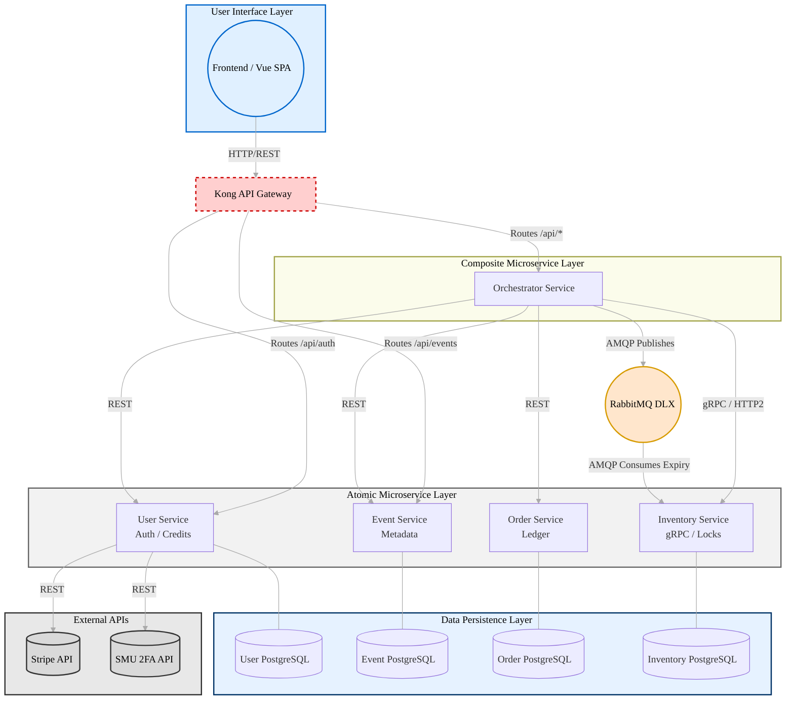

### Microservices Breakdown

| Service | Protocol | Domain Responsibility |
| --- | --- | --- |
| **API Gateway (Kong)** | HTTP | Rate limiting (50 req/min global, 5 req/min on registration), bot detection (blocks automated clients), API key auth, CORS, reverse proxying. |
| **Orchestrator Service** | REST | The "Manager" — handles cross-service flows, triggers compensations on failure, generates Encrypted QR codes. |
| **Inventory Service** | gRPC | Mission critical. Handles pessimistic locking `SELECT FOR UPDATE NOWAIT` for seats. Fast and highly concurrent. |
| **User Service** | REST | Authentication (JWT), Credit balance management, Stripe integration, and SMU OTP 2FA handshakes. |
| **Order Service** | REST | Immutable transaction ledger for purchases and P2P transfers. |
| **Event Service** | REST | Event metadata, venues, halls, pricing. |

---

## 🚀 Quick Start Guide

### 1. Prerequisites

- Docker & Docker Compose
- Python 3.11+ (if running scripts locally)

### 2. Configure Environment

Rename the example environment file and fill in your secrets (e.g., Stripe Keys, JWT secrets, DB passwords).

```bash
git clone <repo-url>
cd ticketremaster-b
cp .env.example .env
```

> **Warning ⚠️:** The `.env.example` may contain default plaintext credentials. For production, **never** commit `.env` files. Use Docker Secrets, AWS Secrets Manager, or Doppler to inject secure keys at runtime.

### 3. Run the Application

Start the entire microservices cluster:

```bash
docker-compose up --build -d
```

All backend services will now be accessible via the API Gateway at `http://localhost:8000`.
 
### 4. Database Persistence (Bind Mounts)

TicketRemaster is configured to use **Bind Mounts** for database persistence. This means your database data (events, users, tickets) is stored locally in the `docker-data/` directory within this project.

- **Visibility**: You can see the actual Postgres data files on your machine.
- **Portability**: You can commit the `docker-data/` folder to Git to share your database state with teammates (though binary files can be large).
- **Stability**: Data survives a `docker-compose down` and remains even if you prune your Docker volumes.

> [!IMPORTANT]
> To wipe the database completely, you must manually delete the `docker-data/` folder and restart the containers.

---

### 3.5 Cloudflare Tunnel (Stable Public URL for Frontend)

If your frontend is hosted on Vercel and the backend is local, use Cloudflare Tunnel to get a stable HTTPS URL.

1. Add a domain to Cloudflare and ensure DNS is active.
1. Cloudflare Zero Trust → Access → Tunnels → Create Tunnel.
1. Copy the tunnel token and set `CLOUDFLARE_TUNNEL_TOKEN` in your environment.
1. Add a Public Hostname pointing to:
   - Docker compose: `http://api-gateway:8000`
   - Local host (no Docker): `http://localhost:8000`
1. Start dev stack with the tunnel:

```bash
docker compose -f docker-compose.yml -f docker-compose.dev.yml up --build
```

1. Set frontend env: `VITE_API_BASE_URL=https://ticketremasterapi.hong-yi.me/api`

### 4. Scale for Traffic Drops (Optional)

If you expect a massive swarm of customers, you can horizontally scale the Orchestrator and Inventory (locking) services. Kong will automatically load balance traffic across all instances.

```bash
docker-compose up -d --scale orchestrator-service=3 --scale inventory-service=2
```

---

## 🚦 Core Scenarios & User Flows

TicketRemaster is designed to handle 5 major business scenarios, each with clearly defined success and failure paths with Saga compensations.

---

### Scenario 1 — Ticket Purchase

**Goal:** Secure a ticket lock instantly, give the user 5 minutes to pay, deduct credits, and confirm the seat.

#### Success Path

| Step | From → To | Action |
|---|---|---|
| 1 | Client → Orchestrator | `POST /api/reserve {seat_id, user_id, event_id}` |
| 2 | Orchestrator → Event Svc | `GET /api/events/{event_id}` — fetch seat price from pricing tiers |
| 3 | Orchestrator → Inventory | gRPC `ReserveSeat(seat_id, user_id)` — `SELECT FOR UPDATE NOWAIT`. Seat → `HELD` |
| 4 | Orchestrator → Order Svc | `POST /orders` — create `PENDING` order with `credits_charged` |
| 5 | Orchestrator → RabbitMQ | Publish TTL message to `seat.hold.queue` (5-min expiry) |
| 6 | Orchestrator → Client | `200 OK` — returns `order_id`, `held_until`, 5-min countdown |
| 7 | Client → Orchestrator | `POST /api/pay {order_id}` |
| 8 | Orchestrator → Inventory | gRPC `GetSeatOwner(seat_id)` — verify seat still `HELD` by this user |
| 9 | Orchestrator → User Svc | `POST /credits/deduct {user_id, amount}` |
| 10 | Orchestrator → Order Svc | `PATCH /orders/{order_id}/status` → `CONFIRMED` |
| 11 | Orchestrator → Inventory | gRPC `ConfirmSeat(seat_id, user_id)` — seat → `SOLD`, `owner_user_id` set |
| 12 | Orchestrator → Client | `200 OK` — purchase confirmed |

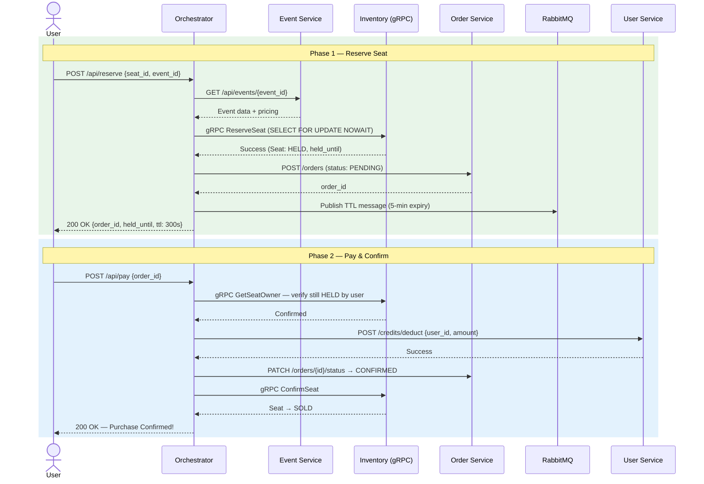

#### Failure Paths & Compensation

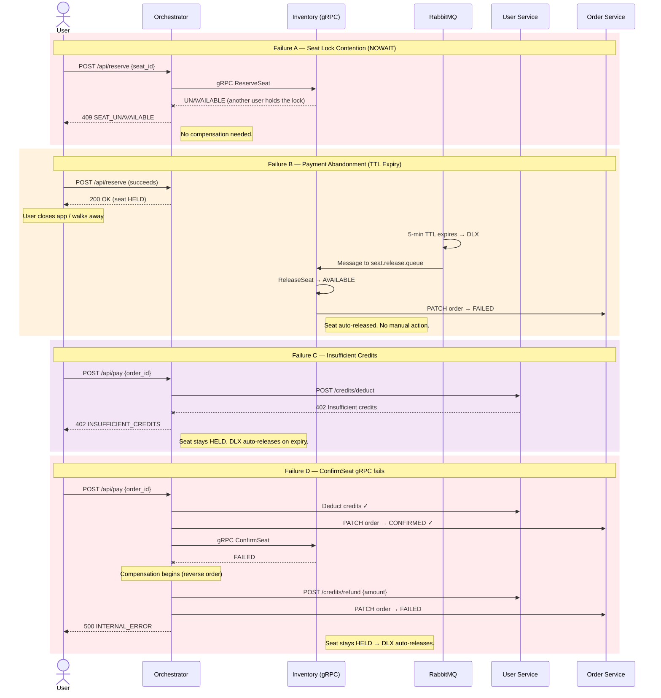

#### High-Risk User Path (Mandatory OTP)

If `user.is_flagged = true`, User Service returns `428` during credit deduction. The Orchestrator surfaces `OTP_REQUIRED` and the client must complete SMS 2FA before retrying payment.

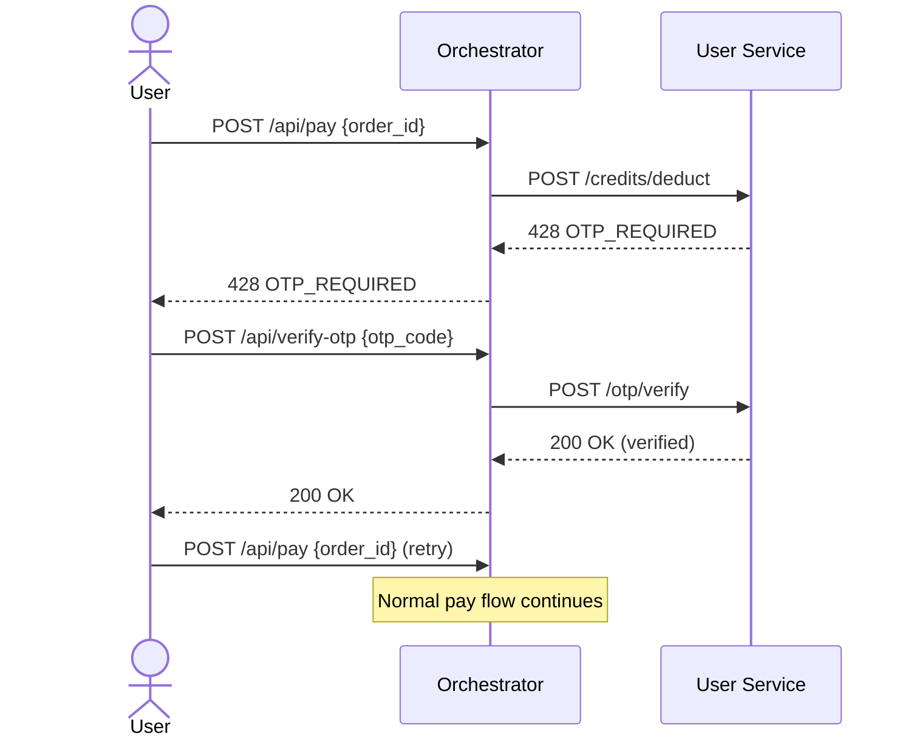

#### Compensation Matrix — Purchase

| Failure Point | What Already Succeeded | Compensating Actions |
|---|---|---|
| `ReserveSeat` gRPC fails (NOWAIT lock) | Nothing | Return `SEAT_UNAVAILABLE`. No compensation needed. |
| Order creation fails | Seat is `HELD` | Release seat via gRPC. Return error. |
| RabbitMQ TTL publish fails | Seat `HELD`, order created | Release seat via gRPC. Return error. |
| Credit deduction fails (insufficient) | Seat `HELD`, TTL published | Return `INSUFFICIENT_CREDITS`. DLX auto-releases seat. |
| Credit deduction returns 428 (flagged user) | Seat `HELD`, TTL published | Return `OTP_REQUIRED`. User retries after OTP. DLX is the safety net. |
| Order status update fails | Credits deducted | Refund credits. DLX auto-releases seat. Return error. |
| `ConfirmSeat` gRPC fails | Credits deducted, order confirmed | Refund credits. Set order → `FAILED`. DLX auto-releases seat. |

---

### Scenario 2 — Secure P2P Ticket Transfer

**Goal:** Allow users to transfer ticket ownership atomically with dual-OTP verification and credit swap.

#### Success Path

| Step | From → To | Action |
|---|---|---|
| 1 | Client → Orchestrator | `POST /api/transfer/initiate {seat_id, seller_user_id, buyer_user_id, credits_amount}` |
| 2 | Orchestrator → Inventory | gRPC `GetSeatOwner(seat_id)` — verify seller owns seat and status is `SOLD` |
| 3 | Orchestrator → Order Svc | `POST /transfers` — create transfer record (status: `PENDING_OTP`) |
| 4 | Orchestrator → User Svc | `POST /otp/send` for both seller and buyer |
| 5 | Client → Orchestrator | `POST /api/transfer/confirm {transfer_id, seller_otp, buyer_otp}` |
| 6 | Orchestrator → User Svc | Verify both OTPs via `POST /otp/verify` |
| 7 | Orchestrator → User Svc | `POST /credits/transfer {from: buyer, to: seller, amount}` |
| 8 | Orchestrator → Inventory | gRPC `UpdateOwner(seat_id, buyer_id)` |
| 9 | Orchestrator → Order Svc | `PATCH /transfers/{id}/status` → `COMPLETED` |
| 10 | Result | Buyer now owns the ticket. Old owner's QR codes are automatically invalidated (owner_id mismatch). |

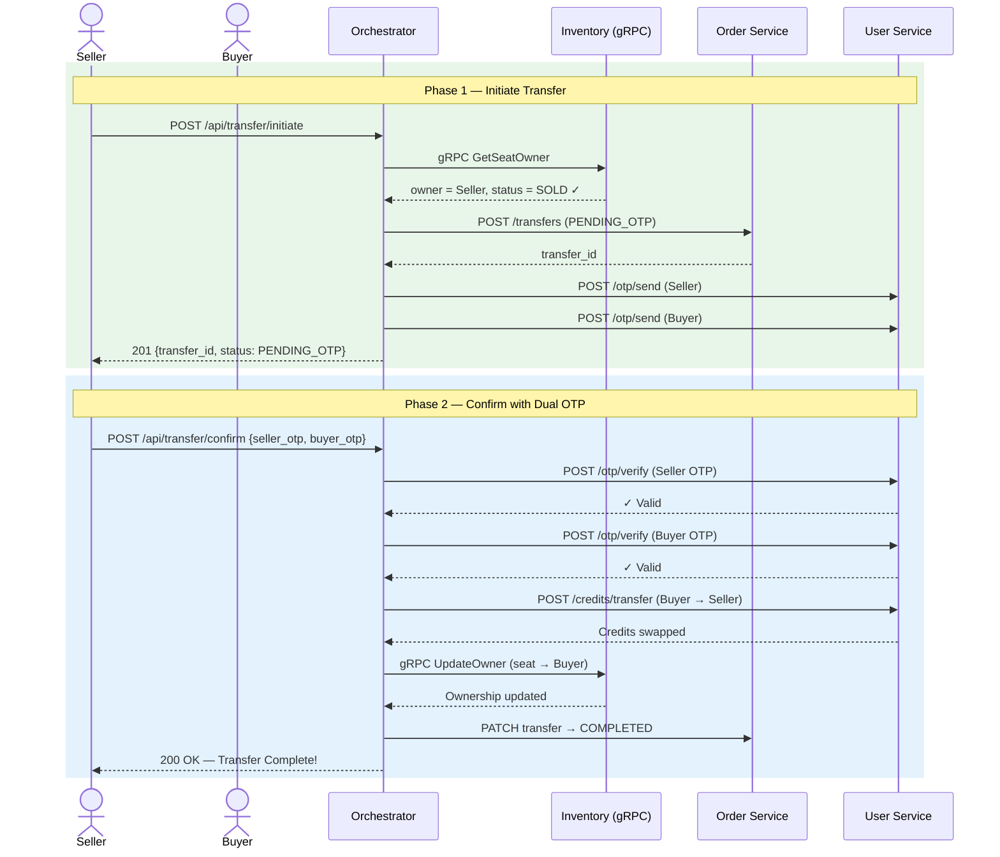

#### Failure Paths & Compensation

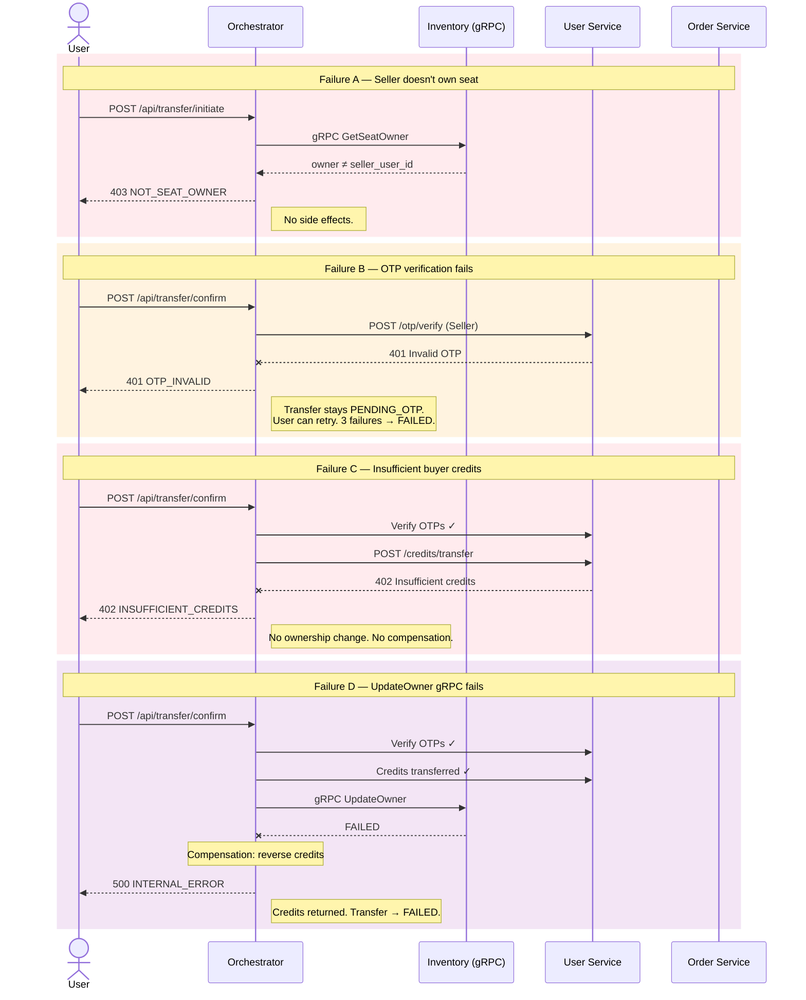

#### Dispute & Reversal

Either party can flag fraud via `POST /api/transfer/dispute`. An admin can then reverse the transfer:

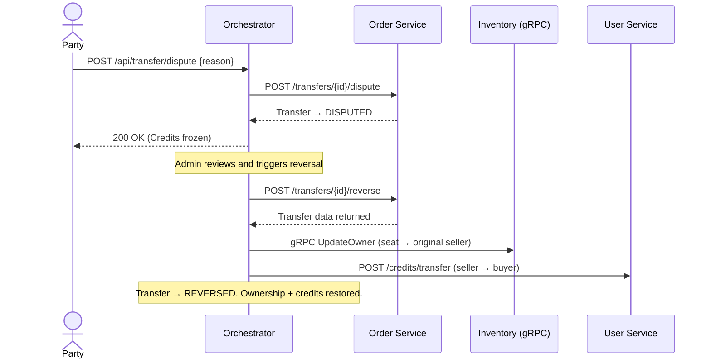

#### Compensation Matrix — Transfer

| Failure Point | What Already Succeeded | Compensating Actions |
|---|---|---|
| Ownership validation fails | Nothing | Return error. No side effects. |
| Transfer record creation fails | Validation passed | Return error. No side effects. |
| OTP send fails | Transfer created | Set transfer → `FAILED`. No side effects to undo. |
| OTP verification fails (either party) | Transfer in `PENDING_OTP` | Allow retries. After 3 failures → `FAILED`. |
| Credit transfer fails | Both OTPs verified | Set transfer → `FAILED`. No ownership change. |
| `UpdateOwner` gRPC fails | Credits transferred | Reverse credit transfer. Set transfer → `FAILED`. |
| Status update fails | Credits + ownership changed | Log critical error. System is consistent. Mark for manual audit. |

---

### Scenario 3 — Staff QR Verification

**Goal:** Verify encrypted QR ticket payloads at the venue gate using AES-256-GCM with a 60-second TTL.

#### Success Path

| Step | From → To | Action |
|---|---|---|
| 1 | Staff App → Orchestrator | `POST /api/verify {qr_payload, hall_id, staff_id}` |
| 2 | Orchestrator | Decrypt QR with AES-256-GCM → extract `seat_id`, `owner_id`, `created_at` |
| 3 | Orchestrator | Validate TTL: `NOW - created_at <= 60 seconds` |
| 4 | Orchestrator → Inventory | gRPC `VerifyTicket(seat_id)` → returns `status`, `owner_user_id`, `event_id` |
| 5 | Orchestrator | Verify `owner_id` from QR matches `owner_user_id` from Inventory |
| 6 | Orchestrator → Event Svc | `GET /api/events/{event_id}` → verify `hall_id` matches |
| 7 | Orchestrator → Inventory | gRPC `MarkCheckedIn(seat_id)` → seat status → `CHECKED_IN` |
| 8 | Orchestrator → Staff App | `200 OK` — result: `SUCCESS` |

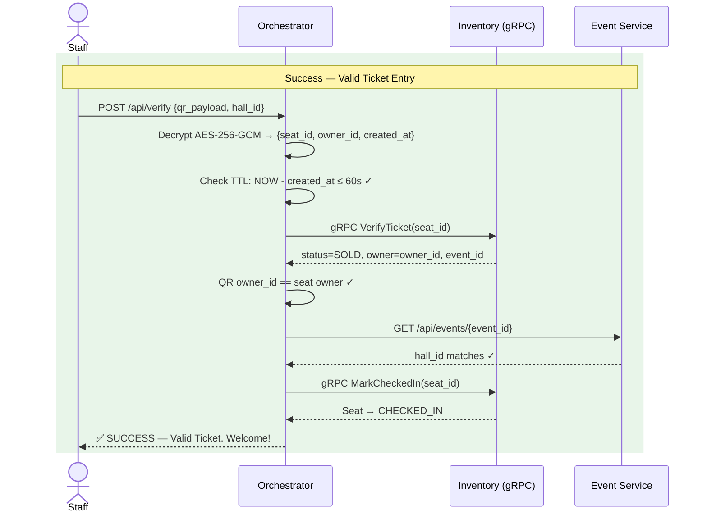

#### Failure Paths

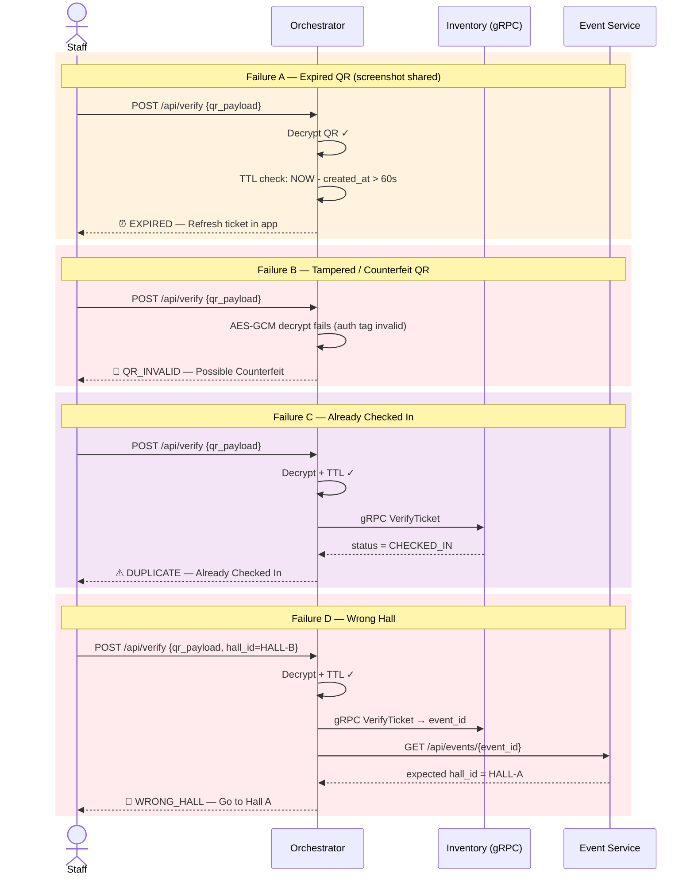

#### All Verification Results

| Case | Result | Logic |
|---|---|---|
| Valid entry | `SUCCESS` | seat `SOLD` + QR `owner_id` matches `seat.owner_user_id` + correct hall + within TTL → `CHECKED_IN` |
| Expired QR | `EXPIRED` | `NOW - created_at > 60s` → screenshot / forwarded QR |
| Tampered QR | `QR_INVALID` | AES-GCM decryption fails — auth tag mismatch |
| Already scanned | `DUPLICATE` | seat status is `CHECKED_IN` |
| Unpaid seat | `UNPAID` | seat status is `HELD` → incomplete purchase |
| Ticket not found | `NOT_FOUND` | `seat_id` doesn't exist → possible counterfeit |
| Wrong hall | `WRONG_HALL` | QR scan `hall_id` ≠ event's `hall_id` |
| Owner mismatch | `NOT_SEAT_OWNER` | QR `owner_id` ≠ `seat.owner_user_id` → ticket was transferred |

---

### Scenario 4 — Marketplace Resale

**Goal:** Allow ticket holders to list tickets for resale, with escrow-based credit settlement and seller approval.

#### Success Path

| Step | From → To | Action |
|---|---|---|
| 1 | Seller → Orchestrator | `POST /api/marketplace/list {seat_id, asking_price}` |
| 2 | Orchestrator → Inventory | gRPC `GetSeatOwner` — verify seller owns seat and status is `SOLD` |
| 3 | Orchestrator → Order Svc | `POST /marketplace/listings` — create listing |
| 4 | Orchestrator → Inventory | gRPC `ListSeat(seat_id, seller_id)` — seat status → `LISTED` |
| 5 | Buyer → Orchestrator | `POST /api/marketplace/buy {listing_id}` |
| 6 | Orchestrator → User Svc | `POST /credits/escrow/hold` — hold buyer's credits in escrow |
| 7 | Orchestrator → Inventory | gRPC `ReserveSeat` — seat → `HELD` for buyer |
| 8 | Orchestrator → User Svc | `POST /otp/send` — notify seller for approval |
| 9 | Seller → Orchestrator | `POST /api/marketplace/approve {listing_id, seller_otp}` |
| 10 | Orchestrator → User Svc | Verify seller OTP |
| 11 | Orchestrator → Inventory | gRPC `ConfirmSeat(seat_id, buyer_id)` — ownership transferred |
| 12 | Orchestrator → User Svc | `POST /credits/escrow/release` — release escrow to seller |
| 13 | Orchestrator → Order Svc | `PATCH /marketplace/listings/{id}/status` → `COMPLETED` |

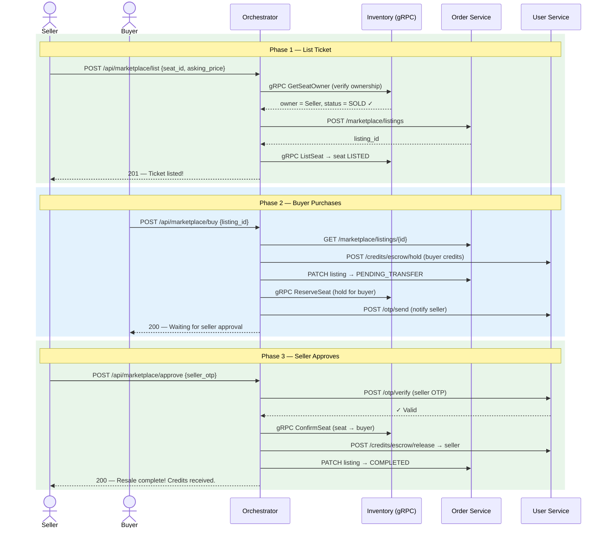

#### Failure Paths

| Failure Point | Handling |
|---|---|
| Seller doesn't own seat | `403 NOT_SEAT_OWNER` — blocked at listing. |
| Seat not in `SOLD` state | `400 INVALID_SEAT_STATUS` — can't list `HELD` or `CHECKED_IN` seats. |
| `ListSeat` gRPC fails | Compensate: cancel listing in Order Service → `CANCELLED`. |
| Buyer buys own listing | `400 INVALID_PURCHASE` — self-buy blocked. |
| Buyer insufficient credits | Escrow hold fails → return error. No side effects. |
| Seller OTP invalid | `401 OTP_INVALID` — seller can retry. |
| `ConfirmSeat` fails after escrow | Critical: escrow held but ownership failed. Logged for admin audit. |
| Escrow release fails after ownership change | Critical: ownership transferred but seller not paid. Logged for admin resolution. |

---

### Scenario 5 — Admin Event Management

**Goal:** Create events with provisioned seats and monitor sales via a dashboard.

#### Event Creation Flow

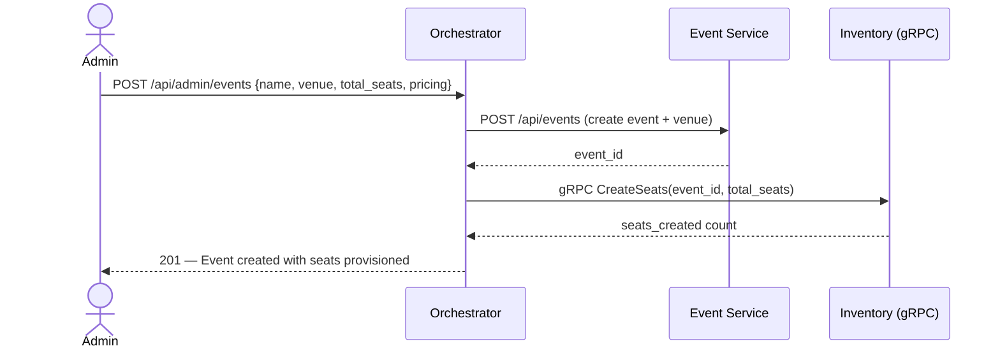

#### Admin Dashboard (Aggregation)

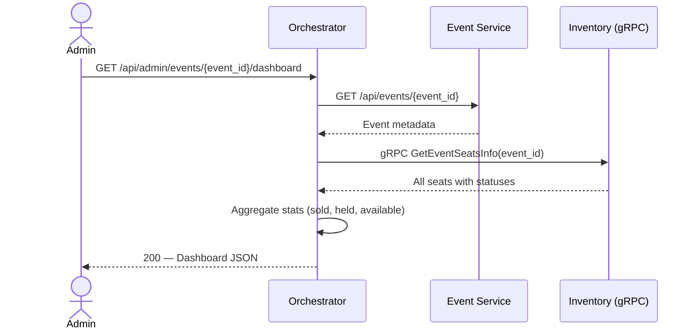

---

## 🗄️ Database Schema & Administration

### What gets saved when a User/Admin Registers?

When an account is created, a record is inserted into the `users` table within the **User Service Database**. This handles both customers and admins (differentiated by the `is_admin` boolean).

Here is a row-by-row breakdown of the `users` table schema:

| Column Name | Data Type | Description |
| --- | --- | --- |
| `user_id` | `UUID` | (Primary Key) Unique identifier for the user. Generated automatically. |
| `email` | `VARCHAR(255)` | User's email address (Unique). Used for login. |
| `phone` | `VARCHAR(20)` | User's mobile number. Used for SMS OTP validation. |
| `password_hash` | `TEXT` | Bcrypt hashed password. Plaintext passwords are **never** stored. |
| `credit_balance` | `NUMERIC(10, 2)` | The user's platform credits (e.g., $1000.00). Defaults to 0.00. |
| `two_fa_secret` | `TEXT` | (Optional) Future-proof column for Time-based One-Time Passwords (TOTP). |
| `is_flagged` | `BOOLEAN` | If `true`, the user drops into a high-risk bucket and requires OTPs for purchases. |
| `is_admin` | `BOOLEAN` | If `true`, the user has admin rights (e.g., event creation, dashboard access). |
| `is_verified` | `BOOLEAN` | Sets to `true` once the user passes their initial SMS Registration OTP. |
| `created_at` | `TIMESTAMP` | Auto-generated timestamp of account creation. |
| `updated_at` | `TIMESTAMP` | Auto-generated timestamp of last profile update. |

### How to Inspect / View Database Content

TicketRemaster uses Dockerized PostgreSQL databases. As an admin or developer, you can inspect the actual saved content using two methods:

#### Method 1: Connecting via a Database Client (Recommended)

You can use a visual database tool like [DBeaver](https://dbeaver.io/), [pgAdmin](https://www.pgadmin.org/), or DataGrip. Connect to the local ports exposed by Docker:

- **Users DB:** `localhost:5434` (User: `user_svc_user` / DB: `users_db`)
- **Events DB:** `localhost:5436` (User: `event_svc_user` / DB: `events_db`)
- **Orders DB:** `localhost:5435` (User: `order_svc_user` / DB: `orders_db`)
- **Seats/Inventory DB:** `localhost:5433` (User: `inventory_user` / DB: `seats_db`)

*(Passwords are dictated by the `.env` file you configured).*
 
#### Method 2: Inspecting Local Files

Since the databases use bind mounts, you can also see the PostgreSQL internal directory structure at `./docker-data/db/<service_name>/`.

---

#### Method 3: Command Line (psql)

You can directly execute SQL queries inside the running Docker container:

```bash
# Exec into the users-db container and open psql
docker exec -it ticketremaster-b-users-db-1 psql -U user_svc_user -d users_db

# Once inside the psql prompt, query the users:
SELECT * FROM users;

# Type \q and press Enter to exit
```

---

## 📚 Further Documentation

For frontend bindings, endpoint structure, and specific configurations, please refer to the documents below:

| Document | Description |
| --- | --- |
| [FRONTEND.md](FRONTEND.md) | Complete guide for Frontend teams (Vue 3, endpoints, API Gateway routes). |
| [API.md](API.md) | Extensive endpoint dictionary showing JSON inputs and error codes. |
| [INSTRUCTIONS.md](INSTRUCTIONS.md) | Deep-dive into database schema architectures and RabbitMQ configs. |
| [CONTRIBUTING.md](CONTRIBUTING.md) | Git workflow and pull request guidelines. |

---

*TicketRemaster Backend Repository — Built for Scale, Optimized for Speed.*
