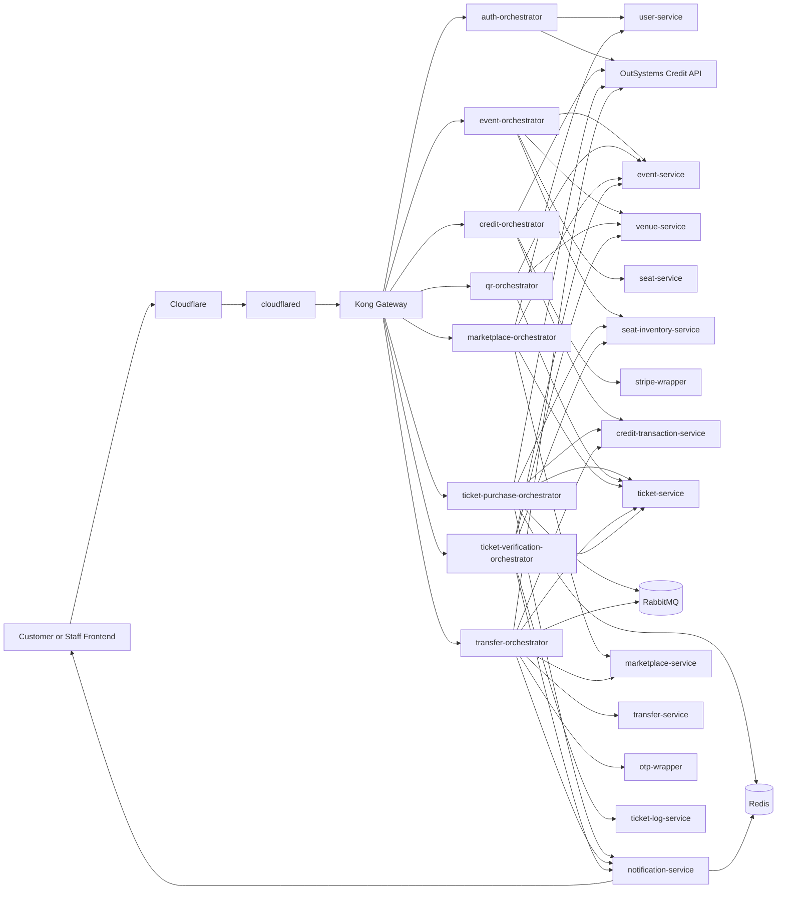
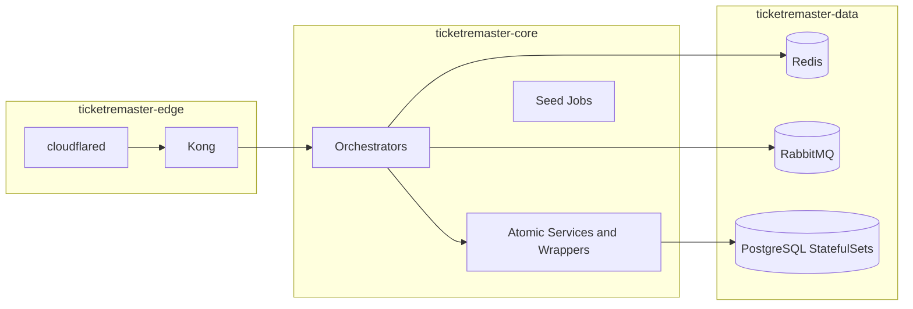

# TicketRemaster Backend

TicketRemaster is a Flask-based microservice backend for event discovery, seat inventory, credit top-ups, ticket purchase, QR retrieval, ticket verification, resale marketplace, and peer-to-peer transfer workflows.

The current repository contains:

- 8 browser-facing orchestrators
- 12 internal atomic services and wrappers
- 1 notification service for real-time WebSocket updates
- 10 isolated PostgreSQL databases
- Redis-backed hold-cache reads for purchase confirmation
- RabbitMQ queues for hold expiry and seller-notification workflows
- a committed Kubernetes base under `k8s/base`
- maintained backend scenario sequence diagrams under `diagrams/`
- an external OutSystems credit system of record at `https://personal-sdxnmlx3.outsystemscloud.com/CreditService/rest/CreditAPI`

## Quick Start

**Option A — Public URL (no Minikube needed):**
The backend is live at `https://ticketremasterapi.hong-yi.me`. Set `VITE_API_BASE_URL` to that URL and start the frontend.

**Option B — Run locally with Minikube:**
See [LOCAL_DEV_SETUP.md](LOCAL_DEV_SETUP.md) for the full setup guide. After `minikube start`, run:
```powershell
.\scripts\start_k8s.ps1
```
This applies manifests, waits for pods, runs migrations, starts port-forward, and runs gateway tests.

## System architecture


<details>
<summary>Mermaid source</summary>



</details>

## Architecture layers

TicketRemaster is intentionally split into three architectural layers that also map directly onto the Kubernetes namespaces in `k8s/base`.

| Layer | Namespace | Core components | Responsibilities |
| --- | --- | --- | --- |
| **Edge layer** | `ticketremaster-edge` | `cloudflared`, `kong`, gateway config | **Definition**: The public ingress and request policy layer where browser traffic first enters the platform. **Responsibilities**: Terminates public ingress, exposes the browser-facing API surface, applies CORS, rate limiting, and Kong key-auth, and isolates internal services from direct public traffic. **Non-responsibilities**: Does not own business workflows, store ticketing or credit data, or perform seat-locking or QR validation logic. |
| **Core layer** | `ticketremaster-core` | 8 orchestrators, 12 Flask services/wrappers, seed jobs | **Definition**: The application runtime layer where business workflows execute, translating frontend requests into service-to-service calls. **Responsibilities**: Owns business flows, orchestration, JWT validation, gRPC calls, REST fan-out, Stripe and OTP integration, and all calls to the OutSystems credit service. **Sublayers**: Orchestrator sublayer (8 orchestrators for browser-facing aggregation) and atomic-service sublayer (12 services owning bounded contexts and databases). |
| **Data layer** | `ticketremaster-data` | Redis, RabbitMQ, PostgreSQL StatefulSets | **Definition**: The stateful persistence and messaging layer holding long-lived application state or asynchronous workflow state. **Responsibilities**: Owns durable state, hold-cache state, asynchronous message queues, and per-service persistence boundaries. **Non-responsibilities**: Does not serve frontend requests directly, aggregate data for clients, or expose public routes. |

### Edge layer

The edge layer is the only public entry path. It contains:

- Kong declarative routing from `api-gateway/kong.yml`
- global CORS policy for local frontend origins and production frontend origins
- route-level key-auth on `/credits`, `/purchase`, `/tickets`, `POST /marketplace/list`, `DELETE /marketplace/{listingId}`, `/transfer`, and `/verify`
- global rate limiting and stricter registration throttling on `/auth/register`
- `cloudflared` for private tunnel exposure into the cluster

### Core layer

The core layer contains all application logic. It is split into two sublayers:

**Orchestrator sublayer** (8 orchestrators):
- Normalize and aggregate data for frontend consumers
- Enforce JWT or staff access rules
- Coordinate multi-step flows such as purchase, top-up, verification, and transfer

**Atomic service sublayer** (12 services and wrappers):
- Own a single bounded context and database schema
- Expose narrowly scoped HTTP endpoints
- Remain behind the gateway and are called from orchestrators or jobs

Important core-level integrations:

- `ticket-purchase-orchestrator` uses `seat-inventory-service` gRPC for `HoldSeat`, `ReleaseSeat`, `SellSeat`, and `GetSeatStatus`
- `credit-orchestrator`, `ticket-purchase-orchestrator`, `transfer-orchestrator`, and `auth-orchestrator` call OutSystems through `call_credit_service()` and inject `X-API-KEY`
- `credit-orchestrator` uses `stripe-wrapper` for PaymentIntent creation, retrieval, and webhook verification
- `transfer-orchestrator` uses `otp-wrapper` and RabbitMQ for buyer and seller verification steps

### Data layer

The data layer exists to keep stateful components private and separate from the public API surface.

- PostgreSQL is isolated per service, not shared across domains
- Redis is used as a non-authoritative hold cache to accelerate purchase confirmation
- RabbitMQ carries delayed hold-expiry and seller-notification messages
- stateful components currently run as single replicas in the committed manifests, so the plane is deployable but not yet highly available

### Async Messaging (RabbitMQ)

RabbitMQ decouples time-based and notification-based work from synchronous request latency. Three queues power the async workflows:

**Seat Hold TTL Queue** (`seat_hold_ttl_queue`)
- Messages have a 5-minute TTL; when a purchase starts, a hold message is published
- If the purchase completes, the message is acknowledged and removed
- If the TTL expires, the message routes to the dead-letter exchange → `seat_hold_expired_queue` for cleanup
- Frontend impact: users have 5 minutes to complete payment after a hold is placed

**Seller Notification Queue** (`seller_notification_queue`)
- When a buyer initiates a P2P transfer, a notification is published asynchronously
- The seller receives a push/email/SMS notification decoupled from the buyer's request
- Frontend impact: after initiating a transfer, the buyer sees "waiting for seller" and should poll for status changes

**Idempotency**: All message consumers must handle duplicate deliveries. Each message includes a `referenceId` for deduplication.

**Configuration**:
| Variable | Description | Default |
|---|---|---|
| `RABBITMQ_URL` | RabbitMQ connection URL | `amqp://rabbitmq:5672/` |
| `SEAT_HOLD_TTL_SECONDS` | Seat hold TTL in seconds | `300` |
| `NOTIFICATION_RETRY_ATTEMPTS` | Max notification retries | `3` |

**Monitoring**: Watch queue depth, consumer lag, and dead-letter queue activity via RabbitMQ management UI at `http://localhost:15672`.

See [TESTING.md](TESTING.md) for RabbitMQ verification steps.

## Real-time Notifications (WebSocket)

The `notification-service` provides real-time updates to connected clients via WebSocket (Socket.IO). It complements RabbitMQ by pushing immediate updates to the frontend without polling.

**Key Features:**
- WebSocket connections via Socket.IO
- Redis Pub/Sub for cross-service event broadcasting
- HTTP API for services to broadcast events
- Automatic reconnection and message queuing

**Event Types:**
- `seat_update` — Seat status changes (held, sold, released)
- `ticket_update` — Ticket status changes (purchased, transferred, used)
- `transfer_update` — Transfer state changes (initiated, accepted, declined)
- `purchase_update` — Purchase completion or cancellation
- `user_update` — User profile or flag status changes
- `event_update` — Event creation, update, or cancellation

**Service Integration:**
Services broadcast events via HTTP POST to `/notifications/broadcast`:

```python
import requests

requests.post('http://notification-service:8109/notifications/broadcast', json={
    'type': 'seat_update',
    'payload': {'eventId': 'evt_123', 'seatId': 'seat_456', 'status': 'sold'},
    'traceId': 'trace_abc'
})
```

See [services/notification-service/NOTIFICATIONS.md](services/notification-service/NOTIFICATIONS.md) for detailed documentation.



<details>
<summary>Mermaid source</summary>



</details>

## Runtime surfaces

### Production-style surfaces

- Frontend origin: `https://ticketremaster.hong-yi.me`
- Public API hostname: `https://ticketremasterapi.hong-yi.me`
- Allowed frontend origins also include `https://ticketremaster.vercel.app`
- Browser and staff clients should call Kong only, never service DNS names or direct orchestrator pods

### Local development surfaces

- Kong gateway: `http://localhost:8000` (requires port-forward: `kubectl port-forward -n ticketremaster-edge svc/kong-proxy 8000:80`)
- RabbitMQ management: `http://localhost:15672` (requires port-forward: `kubectl port-forward -n ticketremaster-data svc/rabbitmq 15672:15672`)
- OutSystems Credit API docs: `https://personal-sdxnmlx3.outsystemscloud.com/CreditService/rest/CreditAPI/`

## Current browser-facing routes

All routes go through Kong at `http://localhost:8000` (local) or `https://ticketremasterapi.hong-yi.me` (public). No `/api` prefix needed.

| Route | Method(s) | Backing orchestrator | Auth |
| --- | --- | --- | --- |
| `/auth/register` | POST | auth-orchestrator | public (rate limited: 5/min) |
| `/auth/login` | POST | auth-orchestrator | public (rate limited: 10/min) |
| `/auth/verify-registration` | POST | auth-orchestrator | public |
| `/auth/me` | GET | auth-orchestrator | JWT |
| `/auth/logout` | POST | auth-orchestrator | JWT |
| `/events` | GET | event-orchestrator | public |
| `/events/{eventId}` | GET | event-orchestrator | public |
| `/events/{eventId}/seats` | GET | event-orchestrator | public |
| `/events/{eventId}/seats/{inventoryId}` | GET | event-orchestrator | public |
| `/venues` | GET | event-orchestrator | public |
| `/admin/events` | POST | event-orchestrator | admin JWT |
| `/admin/events/{eventId}/dashboard` | GET | event-orchestrator | admin JWT |
| `/credits/balance` | GET | credit-orchestrator | JWT + apikey |
| `/credits/topup/initiate` | POST | credit-orchestrator | JWT + apikey |
| `/credits/topup/confirm` | POST | credit-orchestrator | JWT + apikey |
| `/credits/transactions` | GET | credit-orchestrator | JWT + apikey |
| `/purchase/hold/{inventoryId}` | POST | ticket-purchase-orchestrator | JWT + apikey |
| `/purchase/hold/{inventoryId}` | DELETE | ticket-purchase-orchestrator | JWT + apikey |
| `/purchase/confirm/{inventoryId}` | POST | ticket-purchase-orchestrator | JWT + apikey |
| `/tickets` | GET | qr-orchestrator | JWT + apikey |
| `/tickets/{ticketId}/qr` | GET | qr-orchestrator | JWT + apikey |
| `/marketplace` | GET | marketplace-orchestrator | public |
| `/marketplace/list` | POST | marketplace-orchestrator | JWT + apikey |
| `/marketplace/{listingId}` | DELETE | marketplace-orchestrator | JWT + apikey |
| `/transfer/initiate` | POST | transfer-orchestrator | JWT + apikey |
| `/transfer/pending` | GET | transfer-orchestrator | JWT + apikey |
| `/transfer/{transferId}` | GET | transfer-orchestrator | JWT + apikey |
| `/transfer/{transferId}/seller-accept` | POST | transfer-orchestrator | JWT + apikey |
| `/transfer/{transferId}/seller-reject` | POST | transfer-orchestrator | JWT + apikey |
| `/transfer/{transferId}/buyer-verify` | POST | transfer-orchestrator | JWT + apikey (rate limited: 3/15min) |
| `/transfer/{transferId}/seller-verify` | POST | transfer-orchestrator | JWT + apikey (rate limited: 3/15min) |
| `/transfer/{transferId}/resend-otp` | POST | transfer-orchestrator | JWT + apikey |
| `/transfer/{transferId}/cancel` | POST | transfer-orchestrator | JWT + apikey |
| `/verify/scan` | POST | ticket-verification-orchestrator | staff JWT + apikey |
| `/verify/manual` | POST | ticket-verification-orchestrator | staff JWT + apikey |
| `/webhooks/stripe` | POST | user-service (via Kong) | Stripe signature |

## Local setup

See [LOCAL_DEV_SETUP.md](LOCAL_DEV_SETUP.md) for the complete guide including Minikube setup, image loading, known issues, and Cloudflare tunnel configuration.

**TL;DR for Minikube:**
```powershell
minikube config set memory 12288
minikube config set cpus 4
minikube start
# Load images on first run (see LOCAL_DEV_SETUP.md)
.\scripts\start_k8s.ps1
```

## API documentation

- [API.md](API.md) — offline unified API reference
- `openapi.unified.json` — combined OpenAPI document
- OutSystems Swagger: `https://personal-sdxnmlx3.outsystemscloud.com/CreditService/rest/CreditAPI/swagger.json`

Run the gateway test suite to validate all routes:
```powershell
# Public URL
newman run postman/TicketRemaster.gateway.postman_collection.json -e postman/TicketRemaster.gateway-public.postman_environment.json --reporters cli

# Localhost (requires port-forward)
newman run postman/TicketRemaster.gateway.postman_collection.json -e postman/TicketRemaster.gateway-localhost.postman_environment.json --reporters cli
```

## Quick operational checks

```powershell
kubectl get pods -n ticketremaster-edge
kubectl get pods -n ticketremaster-core
kubectl get pods -n ticketremaster-data
kubectl logs deployment/kong -n ticketremaster-edge --tail=50
kubectl logs deployment/auth-orchestrator -n ticketremaster-core --tail=50
kubectl port-forward -n ticketremaster-edge svc/kong-proxy 8000:80
kubectl port-forward -n ticketremaster-data svc/rabbitmq 15672:15672
```

Run gateway tests:
```powershell
newman run postman/TicketRemaster.gateway.postman_collection.json -e postman/TicketRemaster.gateway-public.postman_environment.json --reporters cli
```

## Documentation hub

### Core documentation

- [README.md](README.md) — this file, system overview and quickstart
- [API.md](API.md) — unified API reference, auth model, and examples
- [FRONTEND.md](FRONTEND.md) — frontend integration contract, all routes, request rules
- [LOCAL_DEV_SETUP.md](LOCAL_DEV_SETUP.md) — Minikube setup, known issues, Cloudflare tunnel guide
- [TESTING.md](TESTING.md) — Postman, OutSystems, and Kubernetes testing guide
- [PRD.md](PRD.md) — product and architecture summary

### Integration guides

- [OUTSYSTEMS.md](OUTSYSTEMS.md) — OutSystems Credit Service integration contract
- [INSTRUCTION.md](INSTRUCTION.md) — implementation notes and deployment guidance

### Collections and environments

- [postman/README.md](postman/README.md)
- [postman/TicketRemaster.gateway.postman_collection.json](postman/TicketRemaster.gateway.postman_collection.json) — **current** gateway collection (Kong + OutSystems)
- [postman/TicketRemaster.gateway-localhost.postman_environment.json](postman/TicketRemaster.gateway-localhost.postman_environment.json)
- [postman/TicketRemaster.gateway-public.postman_environment.json](postman/TicketRemaster.gateway-public.postman_environment.json)

### Supporting docs

- [services/README.md](services/README.md)
- [orchestrators/README.md](orchestrators/README.md)
