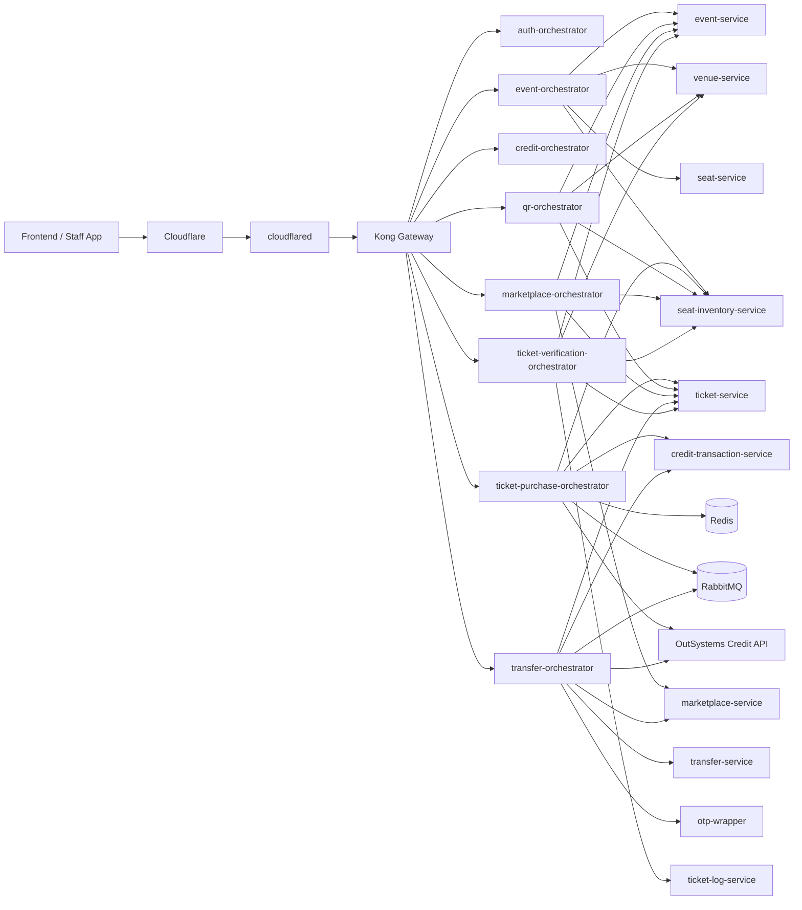
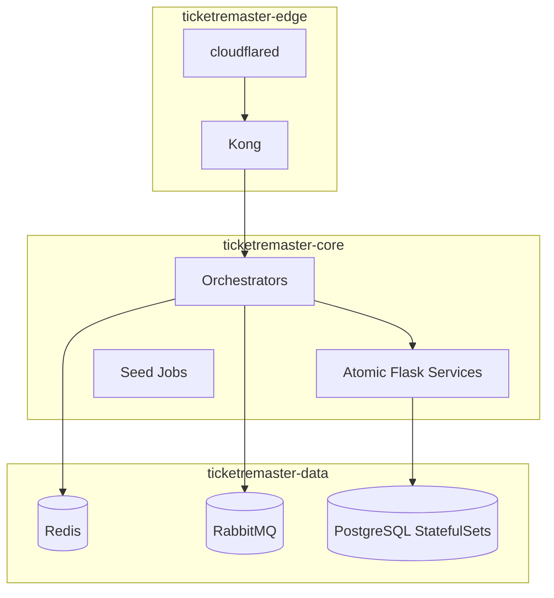

# TicketRemaster Backend

## What this repo is

TicketRemaster is a Flask-based microservice platform for ticketing, seat holding, QR validation, resale marketplace, P2P transfer, and credit-driven checkout. The codebase currently includes:

- 8 frontend-facing orchestrators with Swagger UI enabled through Flasgger
- domain-specific atomic services backed by isolated PostgreSQL databases
- Redis-backed purchase-path acceleration for seat-hold confirmation
- RabbitMQ-based TTL and asynchronous workflow handling
- a committed Kubernetes base under `k8s/base`
- an external OutSystems Credit API at `https://personal-sdxnmlx3.outsystemscloud.com/CreditService/rest/CreditAPI`

## Architecture



## Kubernetes planes

The committed Kubernetes base is organized into three namespaces:

- `ticketremaster-edge`
  - owns public ingress and edge policy
  - currently runs Kong and `cloudflared`
  - should be the only public entry path for browser traffic
- `ticketremaster-core`
  - runs Flask services, orchestrators, and seed jobs
  - contains the application runtime layer and service-to-service HTTP/gRPC traffic
- `ticketremaster-data`
  - runs Redis, RabbitMQ, and PostgreSQL StatefulSets
  - keeps stateful infrastructure private inside the cluster



## Runtime surfaces

### Production-style public API

- Frontend origin: `https://ticketremaster.hong-yi.me`
- Public API hostname: `https://ticketremasterapi.hong-yi.me`
- Browser traffic should go only through Kong-exposed orchestrator routes

### Local development surfaces

- Kong gateway: `http://localhost:8000`
- Kong admin: `http://localhost:8001`
- RabbitMQ management: `http://localhost:15672`
- Redis: `redis://localhost:6379/0`
- OutSystems Credit API docs: `https://personal-sdxnmlx3.outsystemscloud.com/CreditService/rest/CreditAPI/`

### Current browser-facing route groups

- `/auth` → `auth-orchestrator`
- `/events`, `/venues`, `/admin/events` → `event-orchestrator`
- `/credits` → `credit-orchestrator`
- `/purchase` → `ticket-purchase-orchestrator`
- `/tickets` → `qr-orchestrator`
- `/marketplace` → `marketplace-orchestrator`
- `/transfer` → `transfer-orchestrator`
- `/verify` → `ticket-verification-orchestrator`

## Local setup

1. Copy environment values:

```powershell
Copy-Item .env.example .env
```

2. Start the stack:

```powershell
docker compose up -d --build
```

3. Run service migrations:

```powershell
docker compose run --rm user-service python -m flask --app app.py db upgrade -d migrations
docker compose run --rm venue-service python -m flask --app app.py db upgrade -d migrations
docker compose run --rm seat-service python -m flask --app app.py db upgrade -d migrations
docker compose run --rm event-service python -m flask --app app.py db upgrade -d migrations
docker compose run --rm seat-inventory-service python -m flask --app app.py db upgrade -d migrations
docker compose run --rm ticket-service python -m flask --app app.py db upgrade -d migrations
docker compose run --rm ticket-log-service python -m flask --app app.py db upgrade -d migrations
docker compose run --rm marketplace-service python -m flask --app app.py db upgrade -d migrations
docker compose run --rm transfer-service python -m flask --app app.py db upgrade -d migrations
docker compose run --rm credit-transaction-service python -m flask --app app.py db upgrade -d migrations
```

4. Seed the shared baseline:

```powershell
docker compose run --rm user-service python user_seed.py
docker compose run --rm venue-service python seed_venues.py
docker compose run --rm seat-service python seed_seats.py
docker compose run --rm event-service python seed_events.py
docker compose run --rm seat-inventory-service python seed_seat_inventory.py
```

## API and Swagger

The repo already exposes Swagger UI for all orchestrators. Use [API.md](API.md) as the combined offline API hub.

Common local Swagger UI entry points:

- `http://localhost:8100/apidocs` — auth-orchestrator
- `http://localhost:8101/apidocs` — event-orchestrator
- `http://localhost:8102/apidocs` — credit-orchestrator
- `http://localhost:8103/apidocs` — ticket-purchase-orchestrator
- `http://localhost:8104/apidocs` — qr-orchestrator
- `http://localhost:8105/apidocs` — marketplace-orchestrator
- `http://localhost:8107/apidocs` — transfer-orchestrator
- `http://localhost:8108/apidocs` — ticket-verification-orchestrator
- `https://personal-sdxnmlx3.outsystemscloud.com/CreditService/rest/CreditAPI/` — OutSystems Credit API docs
- `https://personal-sdxnmlx3.outsystemscloud.com/CreditService/rest/CreditAPI/swagger.json` — OutSystems raw Swagger document

## Testing and status commands

### Docker Compose checks

```powershell
docker compose ps
docker compose logs --tail=200 ticket-purchase-orchestrator
docker compose logs --tail=200 transfer-orchestrator
docker compose exec rabbitmq rabbitmq-diagnostics -q ping
docker compose exec redis redis-cli ping
```

### Kubernetes checks

```powershell
kubectl kustomize .\k8s\base
kubectl apply -k .\k8s\base
kubectl get namespaces
kubectl get pods -n ticketremaster-edge
kubectl get pods -n ticketremaster-core
kubectl get pods -n ticketremaster-data
kubectl get svc -n ticketremaster-edge
kubectl get svc -n ticketremaster-core
kubectl get svc -n ticketremaster-data
kubectl get jobs -n ticketremaster-core
kubectl rollout status deployment/kong -n ticketremaster-edge
kubectl rollout status deployment/ticket-purchase-orchestrator -n ticketremaster-core
kubectl rollout status statefulset/rabbitmq -n ticketremaster-data
kubectl rollout status statefulset/redis -n ticketremaster-data
kubectl logs deployment/kong -n ticketremaster-edge --tail=200
kubectl logs deployment/ticket-purchase-orchestrator -n ticketremaster-core --tail=200
kubectl logs statefulset/rabbitmq -n ticketremaster-data --tail=200
kubectl port-forward -n ticketremaster-edge svc/kong-proxy 8000:80
kubectl port-forward -n ticketremaster-data svc/rabbitmq 15672:15672
```

For deeper testing flows, use [TESTING.md](TESTING.md).

## Current Kubernetes status

The base manifests are real and deployable, but the robustness backlog is still active:

- many core Deployments are still single replica
- startup probes are not yet broadly in place
- resource requests and limits still need wider rollout
- PodDisruptionBudgets and HPAs are follow-on work
- single-node Docker Desktop still limits true HA testing

The current hardening plan lives in [CHANGES.md](CHANGES.md).

## Documentation hub

### Project-level docs

- [API.md](API.md) — combined offline API hub and live Swagger entry points
- [TESTING.md](TESTING.md) — Docker, Postman, external integration, and Kubernetes validation guide
- [PRD.md](PRD.md) — product and architecture summary
- [FRONTEND.md](FRONTEND.md) — frontend integration contract and gateway route guidance
- [INSTRUCTION.md](INSTRUCTION.md) — implementation notes and current Kubernetes guidance
- [TASK.md](TASK.md) — build checklist and implementation history
- [CHANGES.md](CHANGES.md) — Kubernetes robustness execution plan
- [OUTSYSTEMS.md](OUTSYSTEMS.md) — OutSystems integration notes

### Collections and environments

- [postman/README.md](postman/README.md)
- [postman/TicketRemaster.postman_collection.json](postman/TicketRemaster.postman_collection.json)
- [postman/TicketRemaster.local.postman_environment.json](postman/TicketRemaster.local.postman_environment.json)

### Supporting docs

- [services/README.md](services/README.md)
- [orchestrators/README.md](orchestrators/README.md)
- [shared/README.md](shared/README.md)
- [shared/grpc/README.md](shared/grpc/README.md)
- [templates/README.md](templates/README.md)
