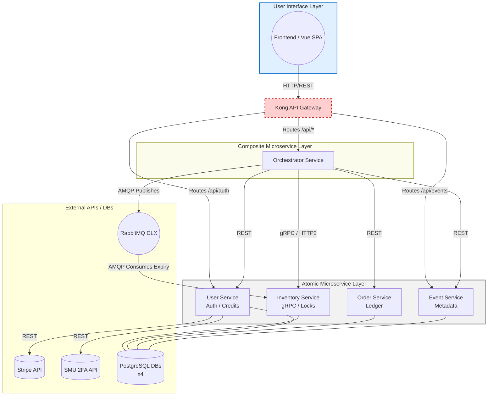
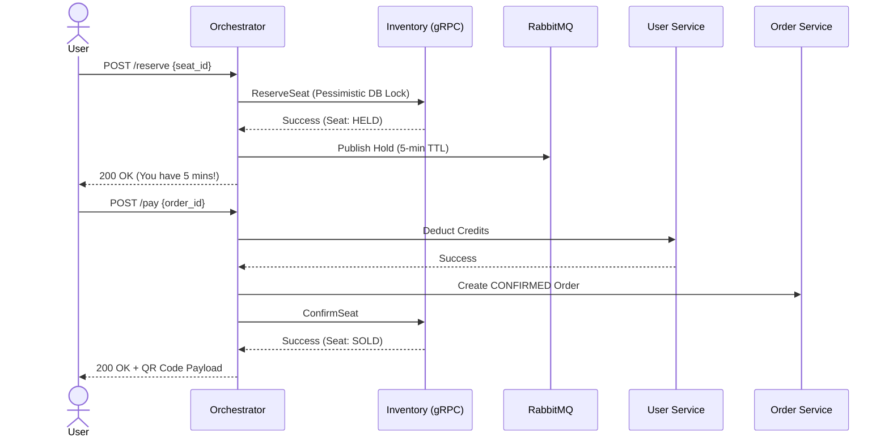
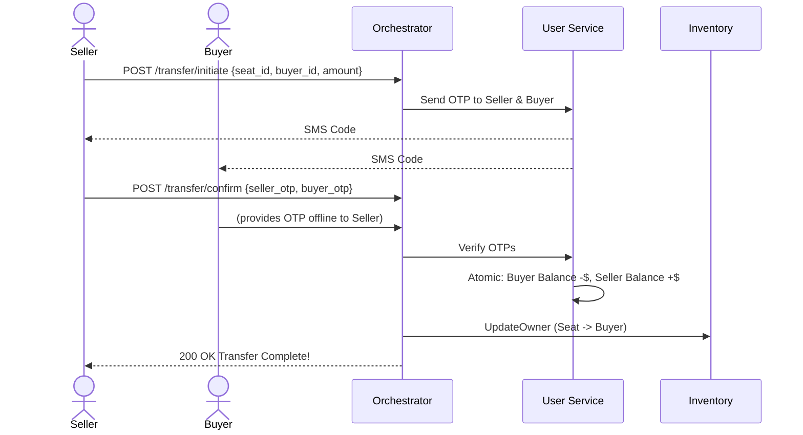
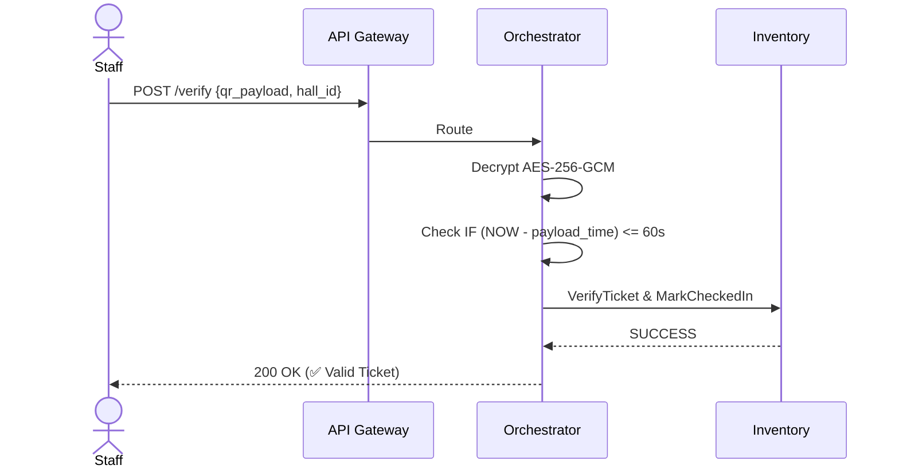

# TicketRemaster 🎫

> **IS213 Enterprise Solution Development** — A Microservices-based ticketing platform built for extreme concurrency, strict data consistency, and seamless user experiences.

Welcome to the backend repository of **TicketRemaster**! This platform orchestrates the complete lifecycle of ticket sales, P2P transfers, and venue entry scanning using a blend of highly-performant microservices, asynchronous message queues, and tight data locking mechanisms.

---

## 🏗️ System Architecture

TicketRemaster relies on the **Saga Orchestrator Pattern**. Instead of microservices calling each other in a tangled web (choreography), the **Orchestrator Service** centrally manages all complex distributed transactions.

### High-Level Architecture Flow



### Microservices Breakdown

| Service | Protocol | Domain Responsibility |
|---|---|---|
| **API Gateway (Nginx)** | HTTP | Load balancing, rate limiting (100r/m), CORS for `ticketremaster.hong-yi.me`, reverse proxying. |
| **Orchestrator Service** | REST | The "Manager" — handles cross-service flows, triggers compensations on failure, generates Encrypted QR codes. |
| **Inventory Service** | gRPC | Mission critical. Handles pessimistic locking `SELECT FOR UPDATE NOWAIT` for seats. Fast and highly concurrent. |
| **User Service** | REST | Authentication (JWT), Credit balance management, Stripe integration, and SMU OTP 2FA handshakes. |
| **Order Service** | REST | Immutable transaction ledger for purchases and P2P transfers. |
| **Event Service** | REST | Event metadata, venues, halls, pricing. |

---

## 🚀 Quick Start Guide

### 1. Prerequisites

- Docker & Docker Compose
- Python 3.11+ (if running scripts locally)

### 2. Configure Environment

Rename the example environment file and fill in your secrets (e.g., Stripe Keys, JWT secrets, DB passwords).

```bash
git clone <repo-url>
cd ticketremaster-b
cp .env.example .env
```

> **Warning ⚠️:** The `.env.example` may contain default plaintext credentials. For production, **never** commit `.env` files. Use Docker Secrets, AWS Secrets Manager, or Doppler to inject secure keys at runtime.

### 3. Run the Application

Start the entire microservices cluster:

```bash
docker-compose up --build -d
```

All backend services will now be accessible via the API Gateway at `http://localhost:8000`.

### 3.5 Cloudflare Tunnel (Stable Public URL for Frontend)

If your frontend is hosted on Vercel and the backend is local, use Cloudflare Tunnel to get a stable HTTPS URL.

1. Add a domain to Cloudflare and ensure DNS is active.
2. Cloudflare Zero Trust → Access → Tunnels → Create Tunnel.
3. Copy the tunnel token and set `CLOUDFLARE_TUNNEL_TOKEN` in your environment.
4. Add a Public Hostname pointing to:
   - Docker compose: `http://api-gateway:8000`
   - Local host (no Docker): `http://localhost:8000`
5. Start dev stack with the tunnel:

```bash
docker compose -f docker-compose.yml -f docker-compose.dev.yml up --build
```

6. Set frontend env: `VITE_API_BASE_URL=https://ticketremasterapi.hong-yi.me/api`

### 4. Scale for Traffic Drops (Optional)

If you expect a massive swarm of customers, you can horizontally scale the Orchestrator and Inventory (locking) services. Nginx will automatically Load Balance traffic across all instances.

```bash
docker-compose up -d --scale orchestrator-service=3 --scale inventory-service=2
```

---

## 🚦 Core Scenarios & User Flows

TicketRemaster is designed to handle 3 major business scenarios smoothly, overcoming race conditions and distributed failures.

### 1. Ticket Purchase Flow

**Goal:** Secure a ticket lock instantly, give the user 5 minutes to pay, deduct credits, and generate an encrypted QR code.



#### Edge Cases Handled

- **Lock Contention:** If two users click "Reserve" at the exact same millisecond, the DB `NOWAIT` lock grants the seat to only one user instantly. The other receives a `409 SEAT_UNAVAILABLE`.
- **Payment Abandonment:** If the user closes the app and doesn't pay, the message sitting in RabbitMQ expires after 5 minutes and drops into a **Dead Letter Exchange (DLX)**. The Inventory consumer picks it up and resets the seat to `AVAILABLE` automatically.
- **High-Risk Users & Fraud:** If `user.is_flagged = true`, Orchestrator interrupts the `/pay` flow with a `428 OTP_REQUIRED` code. The user must complete an SMU 2FA SMS check before the purchase continues.

---

### 2. Secure P2P Ticket Transfer

**Goal:** Allow users to sell tickets to one another securely, transferring ownership and credits atomically.



#### Edge Cases Handled

- **Self-Transfer:** Prevented instantly (`400 SELF_TRANSFER`).
- **Mid-Transfer Sales:** A Unique Partial Index in the Database prevents starting a transfer if one is already `PENDING_OTP`.
- **OTP Failure/Expiry:** If either OTP is wrong or expires, the transfer is suspended. 3 wrong attempts sets the transfer state to `FAILED`.
- **Disputes:** If fraud occurs, support can trigger `/transfer/dispute` to freeze credits, and `/transfer/reverse` to return the ticket to the seller and money to the buyer.

---

### 3. Staff QR Verification

**Goal:** Verify encrypted QR ticket payloads at the venue gate in under 200ms without revealing plaintext ticket IDs.



#### Edge Cases Handled

- **Screenshot Sharing / Replay Attacks:** The frontend regenerates the QR code every 50 seconds. The backend enforces a strict **60-second TTL**. If a QR is scanned after 60 seconds (like a screenshot sent to a friend), it throws an `EXPIRED` rejection.
- **Counterfeiting / QR Tampering:** The payload is encrypted with `AES-256-GCM` using a secret backend key. Modifying the QR invalidates the cryptographic tag instantly.
- **Wrong Gates:** The QR payload embeds the expected `hall_id`. Scanning at the wrong gate throws a `WRONG_HALL` rejection.
- **Duplicate Scans:** Re-scanning a checked-in ticket returns a `DUPLICATE` alert instantly.

---

## 🗄️ Database Schema & Administration

### What gets saved when a User/Admin Registers?

When an account is created, a record is inserted into the `users` table within the **User Service Database**. This handles both customers and admins (differentiated by the `is_admin` boolean).

Here is a row-by-row breakdown of the `users` table schema:

| Column Name | Data Type | Description |
|-------------|-----------|-------------|
| `user_id` | `UUID` | (Primary Key) Unique identifier for the user. Generated automatically. |
| `email` | `VARCHAR(255)` | User's email address (Unique). Used for login. |
| `phone` | `VARCHAR(20)` | User's mobile number. Used for SMS OTP validation. |
| `password_hash` | `TEXT` | Bcrypt hashed password. Plaintext passwords are **never** stored. |
| `credit_balance` | `NUMERIC(10, 2)`| The user's platform credits (e.g., $1000.00). Defaults to 0.00. |
| `two_fa_secret` | `TEXT` | (Optional) Future-proof column for Time-based One-Time Passwords (TOTP). |
| `is_flagged` | `BOOLEAN` | If `true`, the user drops into a high-risk bucket and requires OTPs for purchases. |
| `is_admin` | `BOOLEAN` | If `true`, the user has admin rights (e.g., event creation, dashboard access). |
| `is_verified` | `BOOLEAN` | Sets to `true` once the user passes their initial SMS Registration OTP. |
| `created_at` | `TIMESTAMP` | Auto-generated timestamp of account creation. |
| `updated_at` | `TIMESTAMP` | Auto-generated timestamp of last profile update. |

### How to Inspect / View Database Content

TicketRemaster uses Dockerized PostgreSQL databases. As an admin or developer, you can inspect the actual saved content using two methods:

#### Method 1: Connecting via a Database Client (Recommended)

You can use a visual database tool like [DBeaver](https://dbeaver.io/), [pgAdmin](https://www.pgadmin.org/), or DataGrip. Connect to the local ports exposed by Docker:

- **Users DB:** `localhost:5434` (User: `user_svc_user` / DB: `users_db`)
- **Events DB:** `localhost:5436` (User: `event_svc_user` / DB: `events_db`)
- **Orders DB:** `localhost:5435` (User: `order_svc_user` / DB: `orders_db`)
- **Seats/Inventory DB:** `localhost:5433` (User: `inventory_user` / DB: `seats_db`)

*(Passwords are dictated by the `.env` file you configured).*

#### Method 2: Command Line (psql)

You can directly execute SQL queries inside the running Docker container:

```bash
# Exec into the users-db container and open psql
docker exec -it ticketremaster-b-users-db-1 psql -U user_svc_user -d users_db

# Once inside the psql prompt, query the users:
SELECT * FROM users;

# Type \q and press Enter to exit
```

---

## 📚 Further Documentation

For frontend bindings, endpoint structure, and specific configurations, please refer to the documents below:

| Document | Description |
|---|---|
| [FRONTEND.md](FRONTEND.md) | Complete guide for Frontend teams (Vue 3, endpoints, API Gateway routes). |
| [API.md](API.md) | Extensive endpoint dictionary showing JSON inputs and error codes. |
| [INSTRUCTIONS.md](INSTRUCTIONS.md) | Deep-dive into database schema architectures and RabbitMQ configs. |
| [CONTRIBUTING.md](CONTRIBUTING.md) | Git workflow and pull request guidelines. |

---

*TicketRemaster Backend Repository — Built for Scale, Optimized for Speed.*
