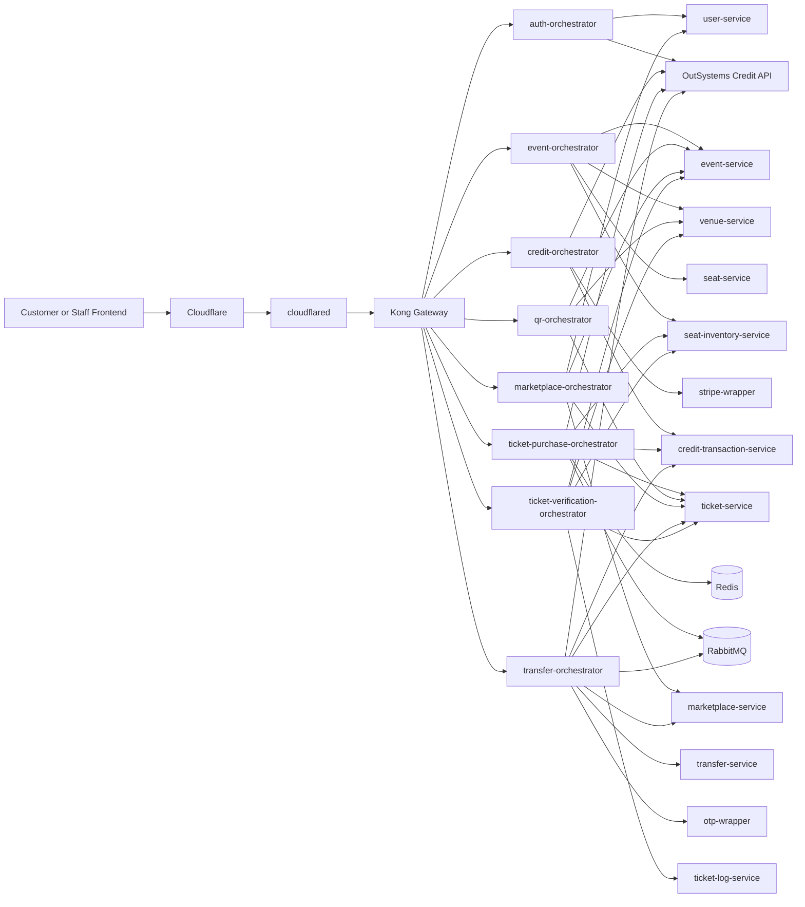
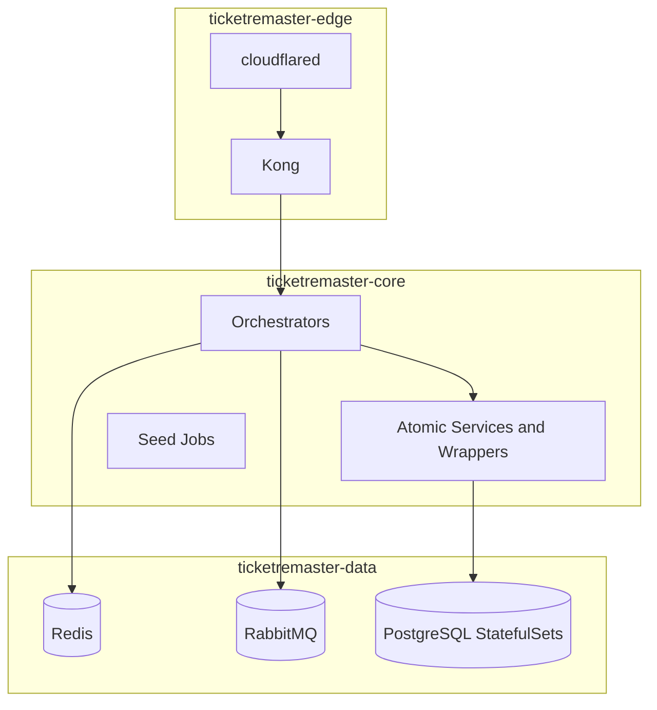

# TicketRemaster Backend

TicketRemaster is a Flask-based microservice backend for event discovery, seat inventory, credit top-ups, ticket purchase, QR retrieval, ticket verification, resale marketplace, and peer-to-peer transfer workflows.

The current repository contains:

- 8 browser-facing orchestrators
- 12 internal atomic services and wrappers
- 10 isolated PostgreSQL databases
- Redis-backed hold-cache reads for purchase confirmation
- RabbitMQ queues for hold expiry and seller-notification workflows
- a committed Kubernetes base under `k8s/base`
- an external OutSystems credit system of record at `https://personal-sdxnmlx3.outsystemscloud.com/CreditService/rest/CreditAPI`

## System architecture



## Architecture layers

TicketRemaster is intentionally split into three architectural layers that also map directly onto the Kubernetes namespaces in `k8s/base`.

| Layer | Namespace | Core components | Responsibilities |
| --- | --- | --- | --- |
| **Edge layer** | `ticketremaster-edge` | `cloudflared`, `kong`, gateway config | **Definition**: The public ingress and request policy layer where browser traffic first enters the platform. **Responsibilities**: Terminates public ingress, exposes the browser-facing API surface, applies CORS, rate limiting, and Kong key-auth, and isolates internal services from direct public traffic. **Non-responsibilities**: Does not own business workflows, store ticketing or credit data, or perform seat-locking or QR validation logic. |
| **Core layer** | `ticketremaster-core` | 8 orchestrators, 12 Flask services/wrappers, seed jobs | **Definition**: The application runtime layer where business workflows execute, translating frontend requests into service-to-service calls. **Responsibilities**: Owns business flows, orchestration, JWT validation, gRPC calls, REST fan-out, Stripe and OTP integration, and all calls to the OutSystems credit service. **Sublayers**: Orchestrator sublayer (8 orchestrators for browser-facing aggregation) and atomic-service sublayer (12 services owning bounded contexts and databases). |
| **Data layer** | `ticketremaster-data` | Redis, RabbitMQ, PostgreSQL StatefulSets | **Definition**: The stateful persistence and messaging layer holding long-lived application state or asynchronous workflow state. **Responsibilities**: Owns durable state, hold-cache state, asynchronous message queues, and per-service persistence boundaries. **Non-responsibilities**: Does not serve frontend requests directly, aggregate data for clients, or expose public routes. |

### Edge layer

The edge layer is the only public entry path. It contains:

- Kong declarative routing from `api-gateway/kong.yml`
- global CORS policy for local frontend origins and production frontend origins
- route-level key-auth on `/credits`, `/purchase`, `/tickets`, `POST /marketplace/list`, `DELETE /marketplace/{listingId}`, `/transfer`, and `/verify`
- global rate limiting and stricter registration throttling on `/auth/register`
- `cloudflared` for private tunnel exposure into the cluster

### Core layer

The core layer contains all application logic. It is split into two sublayers:

**Orchestrator sublayer** (8 orchestrators):
- Normalize and aggregate data for frontend consumers
- Enforce JWT or staff access rules
- Coordinate multi-step flows such as purchase, top-up, verification, and transfer

**Atomic service sublayer** (12 services and wrappers):
- Own a single bounded context and database schema
- Expose narrowly scoped HTTP endpoints
- Remain behind the gateway and are called from orchestrators or jobs

Important core-level integrations:

- `ticket-purchase-orchestrator` uses `seat-inventory-service` gRPC for `HoldSeat`, `ReleaseSeat`, `SellSeat`, and `GetSeatStatus`
- `credit-orchestrator`, `ticket-purchase-orchestrator`, `transfer-orchestrator`, and `auth-orchestrator` call OutSystems through `call_credit_service()` and inject `X-API-KEY`
- `credit-orchestrator` uses `stripe-wrapper` for PaymentIntent creation, retrieval, and webhook verification
- `transfer-orchestrator` uses `otp-wrapper` and RabbitMQ for buyer and seller verification steps

### Data layer

The data layer exists to keep stateful components private and separate from the public API surface.

- PostgreSQL is isolated per service, not shared across domains
- Redis is used as a non-authoritative hold cache to accelerate purchase confirmation
- RabbitMQ carries delayed hold-expiry and seller-notification messages
- stateful components currently run as single replicas in the committed manifests, so the plane is deployable but not yet highly available



## Runtime surfaces

### Production-style surfaces

- Frontend origin: `https://ticketremaster.hong-yi.me`
- Public API hostname: `https://ticketremasterapi.hong-yi.me`
- Allowed frontend origins also include `https://ticketremaster.vercel.app`
- Browser and staff clients should call Kong only, never service DNS names or direct orchestrator pods

### Local development surfaces

- Kong gateway: `http://localhost:8000`
- Kong admin: `http://localhost:8001`
- RabbitMQ management: `http://localhost:15672`
- Redis: `redis://localhost:6379/0`
- Orchestrator Swagger UIs: `http://localhost:8100` through `http://localhost:8108`
- OutSystems Credit API docs: `https://personal-sdxnmlx3.outsystemscloud.com/CreditService/rest/CreditAPI/`

## Current browser-facing routes

These are the route groups actually exposed through Kong today.

| Public route group | Backing service | Current auth requirements |
| --- | --- | --- |
| `/auth/*` | `auth-orchestrator` | public for register/login, JWT for `/auth/me` |
| `/events/*`, `/venues/*` | `event-orchestrator` | public |
| `/admin/events` | `event-orchestrator` | admin JWT required in the orchestrator |
| `/credits/*` | `credit-orchestrator` | Kong `apikey` plus JWT, except webhook which is server-to-server |
| `/purchase/*` | `ticket-purchase-orchestrator` | Kong `apikey` plus JWT |
| `/tickets/*` | `qr-orchestrator` | Kong `apikey` plus JWT |
| `GET /marketplace` | `marketplace-orchestrator` | public |
| `POST /marketplace/list` | `marketplace-orchestrator` | Kong `apikey` plus JWT |
| `DELETE /marketplace/{listingId}` | `marketplace-orchestrator` | Kong `apikey` plus JWT |
| `/transfer/*` | `transfer-orchestrator` | Kong `apikey` plus JWT |
| `/verify/*` | `ticket-verification-orchestrator` | Kong `apikey` plus staff JWT |

Important route note:

- `ticket-purchase-orchestrator` defines `GET /tickets` on its direct service port, but Kong does not expose that path from the purchase route group
- the frontend should use `GET /tickets` from `qr-orchestrator`, because `/tickets/*` at the gateway points there

## Local setup

1. Copy environment values.

```powershell
Copy-Item .env.example .env
```

2. Start the stack.

```powershell
docker compose up -d --build
```

3. Run migrations.

```powershell
docker compose run --rm user-service python -m flask --app app.py db upgrade -d migrations
docker compose run --rm venue-service python -m flask --app app.py db upgrade -d migrations
docker compose run --rm seat-service python -m flask --app app.py db upgrade -d migrations
docker compose run --rm event-service python -m flask --app app.py db upgrade -d migrations
docker compose run --rm seat-inventory-service python -m flask --app app.py db upgrade -d migrations
docker compose run --rm ticket-service python -m flask --app app.py db upgrade -d migrations
docker compose run --rm ticket-log-service python -m flask --app app.py db upgrade -d migrations
docker compose run --rm marketplace-service python -m flask --app app.py db upgrade -d migrations
docker compose run --rm transfer-service python -m flask --app app.py db upgrade -d migrations
docker compose run --rm credit-transaction-service python -m flask --app app.py db upgrade -d migrations
```

4. Seed the baseline data used by local Postman flows.

```powershell
docker compose run --rm user-service python user_seed.py
docker compose run --rm venue-service python seed_venues.py
docker compose run --rm seat-service python seed_seats.py
docker compose run --rm event-service python seed_events.py
docker compose run --rm seat-inventory-service python seed_seat_inventory.py
```

## API documentation

Use the following assets together:

- [API.md](API.md) for the offline unified API reference
- `openapi.unified.json` for the combined OpenAPI document
- orchestrator-local Flasgger UIs for live inspection during development
- the published OutSystems Swagger at `https://personal-sdxnmlx3.outsystemscloud.com/CreditService/rest/CreditAPI/swagger.json`

Local Swagger UI entry points:

- `http://localhost:8100/apidocs` — auth-orchestrator
- `http://localhost:8101/apidocs` — event-orchestrator
- `http://localhost:8102/apidocs` — credit-orchestrator
- `http://localhost:8103/apidocs` — ticket-purchase-orchestrator
- `http://localhost:8104/apidocs` — qr-orchestrator
- `http://localhost:8105/apidocs` — marketplace-orchestrator
- `http://localhost:8107/apidocs` — transfer-orchestrator
- `http://localhost:8108/apidocs` — ticket-verification-orchestrator

## Quick operational checks

### Docker Compose

```powershell
docker compose ps
docker compose logs --tail=200 ticket-purchase-orchestrator
docker compose logs --tail=200 transfer-orchestrator
docker compose exec rabbitmq rabbitmq-diagnostics -q ping
docker compose exec redis redis-cli ping
```

### Kubernetes

```powershell
kubectl kustomize .\k8s\base
kubectl apply -k .\k8s\base
kubectl get pods -n ticketremaster-edge
kubectl get pods -n ticketremaster-core
kubectl get pods -n ticketremaster-data
kubectl logs deployment/kong -n ticketremaster-edge --tail=200
kubectl logs deployment/ticket-purchase-orchestrator -n ticketremaster-core --tail=200
kubectl port-forward -n ticketremaster-edge svc/kong-proxy 8000:80
kubectl port-forward -n ticketremaster-data svc/rabbitmq 15672:15672
```

For a fuller validation and troubleshooting flow, use [TESTING.md](TESTING.md).

## Documentation hub

### Project-level docs

- [API.md](API.md) — unified API reference, auth model, examples, and OpenAPI links
- [FRONTEND.md](FRONTEND.md) — exact frontend integration contract and gateway route guidance
- [PRD.md](PRD.md) — product and architecture summary aligned to the current implementation
- [TESTING.md](TESTING.md) — Docker, Postman, OutSystems, and Kubernetes testing guide
- [OUTSYSTEMS.md](OUTSYSTEMS.md) — OutSystems-specific implementation notes
- [INSTRUCTION.md](INSTRUCTION.md) — implementation notes and deployment guidance
- [CHANGES.md](CHANGES.md) — current infrastructure hardening backlog
- [TASK.md](TASK.md) — implementation checklist and history

### Collections and environments

- [postman/README.md](postman/README.md)
- [postman/TicketRemaster.postman_collection.json](postman/TicketRemaster.postman_collection.json)
- [postman/TicketRemaster.local.postman_environment.json](postman/TicketRemaster.local.postman_environment.json)

### Supporting docs

- [services/README.md](services/README.md)
- [orchestrators/README.md](orchestrators/README.md)
- [shared/README.md](shared/README.md)
- [shared/grpc/README.md](shared/grpc/README.md)
- [templates/README.md](templates/README.md)
