# Ticket Remaster - Complete System Documentation

## Infrastructure Components
- **Cloudflare**: DDoS protection, CDN, WAF
- **Kong API Gateway**: Rate limiting, authentication, routing
- **Kubernetes (K8s)**: Container orchestration
- **Redis**: Caching, session management, distributed locks, circuit breaker
- **PostgreSQL**: Primary database
- **RabbitMQ**: Message queue with Dead Letter Exchange (DLX)
- **gRPC**: High-performance service communication with channel pooling
- **OutSystems**: Credit balance management
- **Stripe**: Payment processing for credit top-ups
- **OTP Wrapper**: SMS/2FA verification service

---

## Part 1: Core Scenario Flows

### Scene 1: Ticket Purchase Flow

#### Happy Path — User Successfully Purchases a Ticket

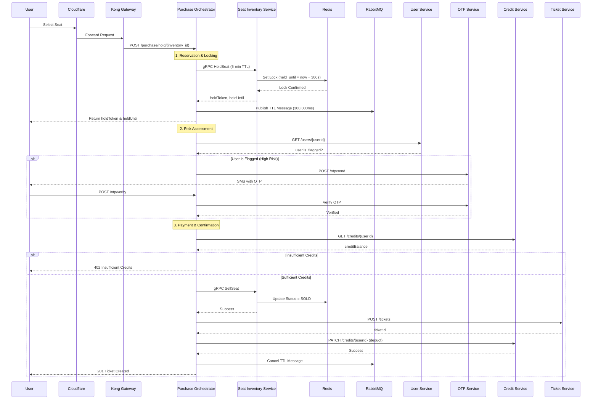

#### Unhappy Path 1 — Reservation Expires (No Payment)

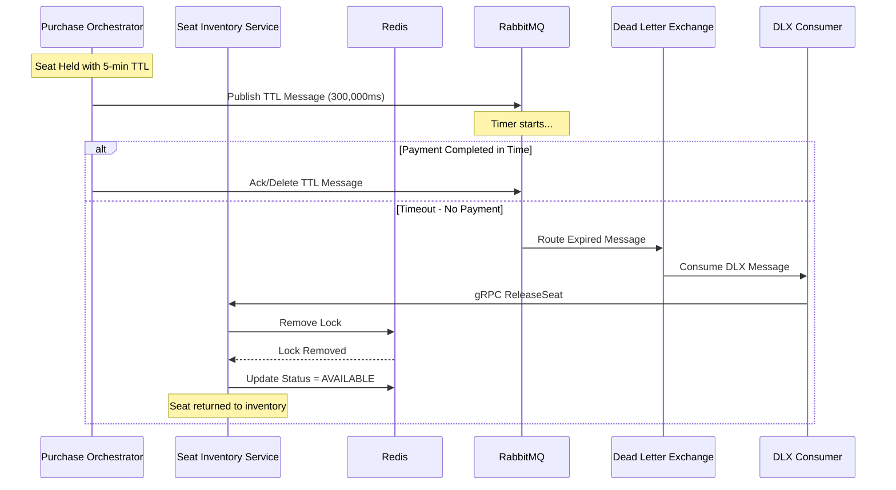

#### Unhappy Path 2 — Hold Expired During Confirmation

```mermaid
sequenceDiagram
    participant U as User
    participant PO as Purchase Orchestrator
    participant R as Redis
    participant SI as Seat Inventory Service

    U->>PO: POST /purchase/confirm/{inventory_id}
    
    Note over PO: Check Hold State
    PO->>R: GET hold:{inventory_id}
    alt Redis Cache Hit
        R-->>PO: Cached hold data
    else Redis Cache Miss / Circuit Breaker Open
        PO->>SI: gRPC GetSeatStatus
        SI-->>PO: seat status
    end
    
    Note over PO: Validate Hold
    if status != "held" OR now > heldUntil
        PO-->>U: 410 Hold Expired
        Note over U: Must re-select seat
    else if holdToken mismatch
        PO-->>U: 409 Seat Unavailable
    else
        PO->>SI: gRPC SellSeat
        Note over PO: Continue with payment...
    end
```

#### Unhappy Path 3 — Credit Deduction Failure (Saga Compensation)

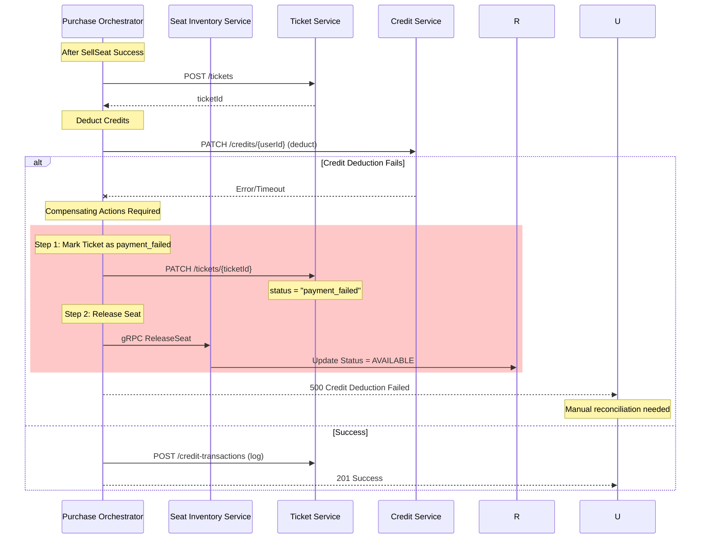

### Scene 2: Secure Peer-to-Peer Ticket Transfer

#### Happy Path — Successful Transfer (User A → User B)

```mermaid
sequenceDiagram
    participant B as Buyer
    participant K as Kong Gateway
    participant TO as Transfer Orchestrator
    participant MS as Marketplace Service
    participant TS as Transfer Service
    participant US as User Service
    participant OTP as OTP Service
    participant RMQ as RabbitMQ
    participant SC as Seller Consumer
    participant CS as Credit Service
    participant TK as Ticket Service

    Note over B: Phase 1: Initiation
    B->>K: POST /transfer/initiate (listingId)
    K->>TO: Forward Request
    TO->>MS: GET /listings/{listingId}
    MS-->>TO: listing (sellerId, price, status=active)
    
    Note over TO: Pre-checks
    if listing.status != "active"
        TO-->>B: 400 Listing Not Active
    else if buyerId == sellerId
        TO-->>B: 403 Cannot Buy Own Listing
    else
        TO->>CS: GET /credits/{buyerId}
        CS-->>TO: buyerBalance
        if buyerBalance < price
            TO-->>B: 402 Insufficient Credits
        else
            TO->>TS: POST /transfers
            TS-->>TO: transferId, status=pending_seller_acceptance
            TO->>RMQ: Publish seller_notification_queue
            TO-->>B: 201 Transfer Created
        end
    end
    
    Note over B: Phase 2: Seller Acceptance
    RMQ->>SC: Consume seller_notification
    SC->>US: Notify Seller (push/email)
    Seller->>TO: POST /transfer/{id}/seller-accept
    TO->>US: GET /users/{buyerId}
    TO->>OTP: POST /otp/send (buyer phone)
    OTP-->>B: SMS with OTP
    TO->>TS: PATCH /transfers/{id} (status=pending_buyer_otp)
    TO-->>Seller: 200 Accepted
    
    Note over B: Phase 3: Buyer OTP Verification
    B->>TO: POST /transfer/{id}/buyer-verify (otp)
    TO->>OTP: POST /otp/verify (buyer sid, otp)
    OTP-->>TO: verified=true
    TO->>US: GET /users/{sellerId}
    TO->>OTP: POST /otp/send (seller phone)
    OTP-->>Seller: SMS with OTP
    TO->>TS: PATCH /transfers/{id} (status=pending_seller_otp)
    TO-->>B: 200 Buyer Verified
    
    Note over B: Phase 4: Seller OTP Verification & Saga
    Seller->>TO: POST /transfer/{id}/seller-verify (otp)
    TO->>OTP: POST /otp/verify (seller sid, otp)
    OTP-->>TO: verified=true
    
    rect rgb(200, 255, 200)
        Note over TO: Execute Atomic Saga
        TO->>CS: PATCH /credits/{buyerId} (deduct)
        TO->>CS: PATCH /credits/{sellerId} (credit)
        TO->>CS: POST /credit-transactions (buyer: p2p_sent)
        TO->>CS: POST /credit-transactions (seller: p2p_received)
        TO->>TK: PATCH /tickets/{ticketId} (owner=buyer)
        TO->>MS: PATCH /listings/{listingId} (status=completed)
        TO->>TS: PATCH /transfers/{id} (status=completed)
    end
    
    TO-->>Seller: 200 Transfer Complete
    TO-->>B: 200 Transfer Complete
```

#### Unhappy Path 1 — Insufficient Credits (Upfront Rejection)

```mermaid
sequenceDiagram
    participant B as Buyer
    participant TO as Transfer Orchestrator
    participant MS as Marketplace Service
    participant CS as Credit Service

    B->>TO: POST /transfer/initiate (listingId)
    TO->>MS: GET /listings/{listingId}
    MS-->>TO: listing (price, sellerId)
    TO->>CS: GET /credits/{buyerId}
    CS-->>TO: buyerBalance
    
    if buyerBalance < price
        TO-->>B: 402 Insufficient Credits
        Note over B: Transfer rejected BEFORE OTP
        Note over TO: No unnecessary friction
    else
        Note over TO: Continue with transfer...
    end
```

#### Unhappy Path 2 — OTP Verification Failure

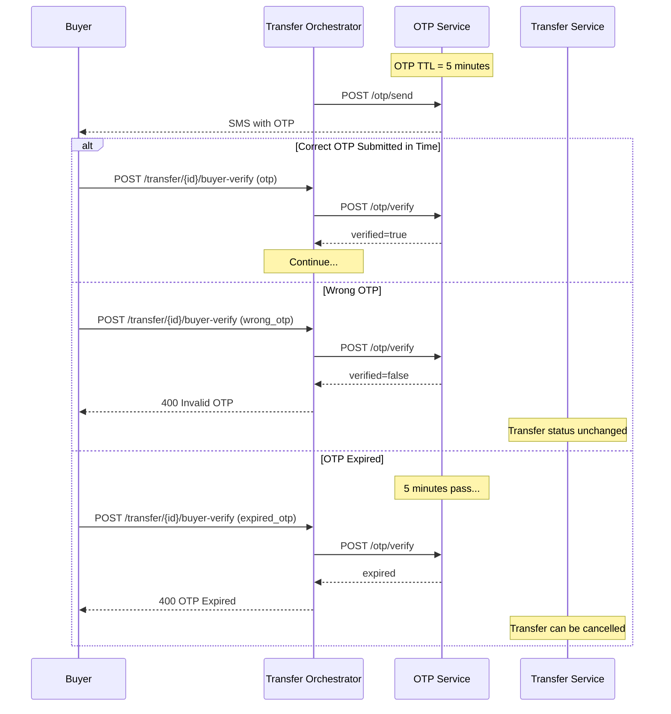

#### Unhappy Path 3 — Saga Failure & Compensation

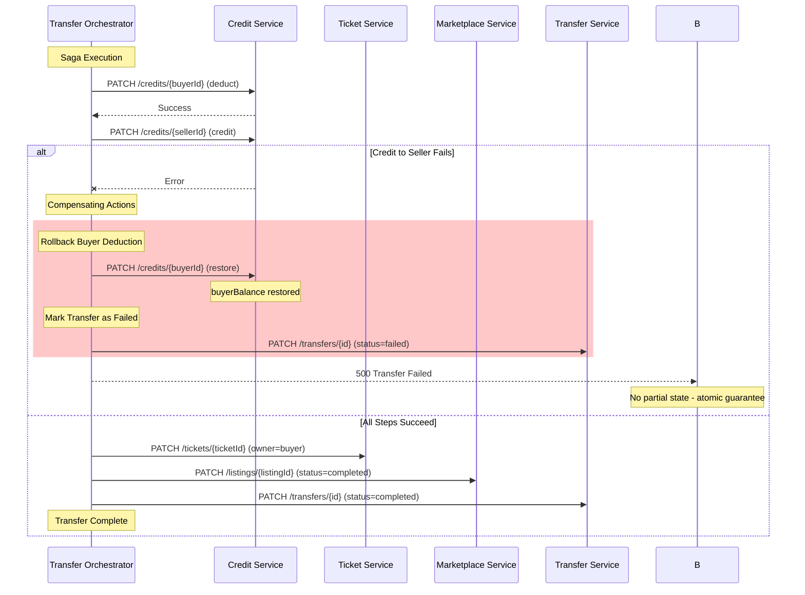

### Scene 3: Ticket Verification (QR Scan)

#### Happy Path — Ticket Verification Approved

```mermaid
sequenceDiagram
    participant Staff as Staff Mobile
    participant CF as Cloudflare
    participant K as Kong Gateway
    participant VO as Verification Orchestrator
    participant R as Redis
    participant TS as Ticket Service
    participant SI as Seat Inventory Service
    participant ES as Event Service
    participant VS as Venue Service
    participant TL as Ticket Log Service

    Staff->>CF: Scan QR Code
    CF->>K: POST /verify/scan (qrHash)
    K->>VO: Forward Request
    
    Note over VO: Staff venueId from JWT only
    
    Note over VO: Step 1: Look up ticket by QR hash
    VO->>TS: GET /tickets/qr/{qrHash}
    TS-->>VO: ticket (ticketId, ownerId, eventId, venueId, status, qrTimestamp)
    
    Note over VO: Step 2: QR TTL Check (60 seconds)
    if now - qrTimestamp > 60s
        VO->>TL: POST /ticket-logs (status=expired)
        VO-->>Staff: 400 QR Expired
    else
        Note over VO: Step 3: Validate Event
        VO->>ES: GET /events/{eventId}
        ES-->>VO: event (name, date, venueId)
        
        Note over VO: Step 4: Seat Status = SOLD
        VO->>SI: GET /inventory/event/{eventId}
        SI-->>VO: seat (inventoryId, status)
        if seat.status != "sold"
            VO->>TL: POST /ticket-logs (status=invalid)
            VO-->>Staff: 400 Seat Not Sold
        else
            Note over VO: Step 5: Ticket Status = Active
            if ticket.status != "active"
                VO->>TL: POST /ticket-logs (status=invalid)
                VO-->>Staff: 400 Ticket Not Active
            else
                Note over VO: Step 6: Duplicate Scan Check
                VO->>TL: GET /ticket-logs/ticket/{ticketId}
                TL-->>VO: logs
                if any log.status == "checked_in"
                    VO->>TL: POST /ticket-logs (status=duplicate)
                    VO-->>Staff: 409 Already Checked In
                else
                    Note over VO: Step 7: Venue Match Check
                    if staff.venueId != ticket.venueId
                        VO->>VS: GET /venues/{ticket.venueId}
                        VS-->>VO: correctVenue
                        VO->>TL: POST /ticket-logs (status=wrong_venue)
                        VO-->>Staff: 400 Wrong Hall (with correctVenue)
                    else
                        rect rgb(200, 255, 200)
                            Note over VO: Step 8: All Checks Passed
                            VO->>TS: PATCH /tickets/{ticketId} (status=used)
                            VO->>TL: POST /ticket-logs (status=checked_in)
                        end
                        VO-->>Staff: 200 Success
                    end
                end
            end
        end
    end
```

#### Unhappy Path 1 — Distributed Lock Prevents Concurrent Scan

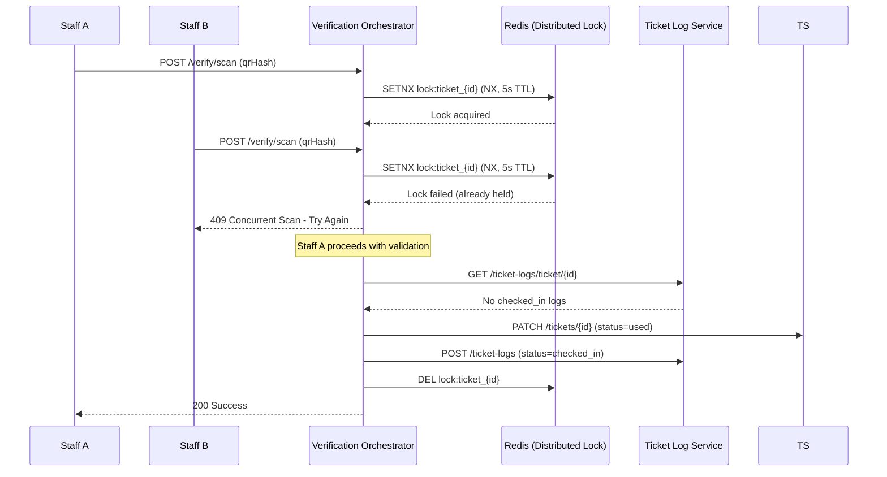

#### Unhappy Path 2 — Rate Limiting on OTP Verification

```mermaid
sequenceDiagram
    participant U as User
    participant TO as Transfer Orchestrator
    participant R as Redis (Rate Limiter)
    participant OTP as OTP Service

    U->>TO: POST /transfer/{id}/buyer-verify (otp)
    TO->>R: GET rate:otp:{phoneNumber}
    R-->>TO: attempts = 3
    
    if attempts >= 5
        R-->>TO: Locked (TTL = 15 min)
        TO-->>U: 429 Too Many Attempts - Try Again Later
    else
        TO->>OTP: POST /otp/verify (sid, otp)
        OTP-->>TO: verified=false
        
        TO->>R: INCR rate:otp:{phoneNumber}
        TO->>R: EXPIRE rate:otp:{phoneNumber} 900 (15 min)
        
        if attempts + 1 >= 5
            TO->>R: EXPIRE rate:otp:{phoneNumber} 900 (lock for 15 min)
            TO-->>U: 429 Account Locked - Contact Support
        else
            TO-->>U: 400 Invalid OTP (attempts: {attempts+1}/5)
        end
    end
```

---

## Part 2: Edge Case Solutions (Implemented)

### 1. Distributed Locks for Concurrent Operations

**Problem**: Two staff members scan same QR code within milliseconds, both pass duplicate check before either writes log.

**Solution**: Redis-based distributed locks using `SETNX` with TTL.


**Implementation Details**:
- Use Redis `SETNX` with TTL for distributed locking
- Lock key: `lock:ticket_{ticketId}`
- TTL: 5 seconds (prevents deadlock if service crashes)
- Return 409 Conflict if lock not acquired
- Client should retry with exponential backoff

---

### 2. Rate Limiting on OTP Verification

**Problem**: No rate limiting allows attackers to try all 1,000,000 combinations of 6-digit OTP codes.

**Solution**: Redis-based rate limiter with account lockout.

```mermaid
sequenceDiagram
    participant U as User
    participant TO as Transfer Orchestrator
    participant R as Redis (Rate Limiter)
    participant OTP as OTP Service

    U->>TO: POST /transfer/{id}/buyer-verify (otp)
    TO->>R: GET rate:otp:{phoneNumber}
    R-->>TO: attempts = 3
    
    if attempts >= 5
        R-->>TO: Locked (TTL = 15 min)
        TO-->>U: 429 Too Many Attempts - Try Again Later
    else
        TO->>OTP: POST /otp/verify (sid, otp)
        OTP-->>TO: verified=false
        
        TO->>R: INCR rate:otp:{phoneNumber}
        TO->>R: EXPIRE rate:otp:{phoneNumber} 900 (15 min)
        
        if attempts + 1 >= 5
            TO->>R: EXPIRE rate:otp:{phoneNumber} 900 (lock for 15 min)
            TO-->>U: 429 Account Locked - Contact Support
        else
            TO-->>U: 400 Invalid OTP (attempts: {attempts+1}/5)
        end
    end
```

**Rate Limiting Rules**:
- **Per phone number**: 5 attempts per 15 minutes
- **Per IP address**: 10 attempts per 15 minutes (additional layer)
- **Exponential backoff**: After 3 failures, require 30-second wait
- **Account lockout**: After 5 failures, lock for 15 minutes
- **Reset on success**: Clear counter when OTP verified

---

### 3. Timeout Configuration on HTTP Calls

**Problem**: No timeout on HTTP calls causes requests to hang when services are slow or unresponsive.

**Solution**: Configurable timeouts with circuit breaker pattern.

```mermaid
sequenceDiagram
    participant Client as Client App
    participant PO as Purchase Orchestrator
    participant CB as Circuit Breaker
    participant CS as Credit Service

    Client->>PO: POST /purchase/confirm/{id}
    PO->>CB: GET /credits/{userId}
    
    rect rgb(200, 255, 200)
        Note over CB: Timeout Configuration
        CB->>CS: HTTP GET (timeout=5s, connect_timeout=2s)
    end
    
    alt Response within timeout
        CS-->>CB: 200 OK (balance: $100)
        CB-->>PO: Credit data
        PO->>Note over PO: Continue with purchase
    else Timeout (5s exceeded)
        CB--xPO: Timeout Error
        PO->>CB: Record failure
        CB->>CB: Increment failure counter
        alt Failures >= threshold (3)
            CB->>CB: Open circuit (30s recovery)
            PO-->>Client: 503 Service Unavailable
        else Failures < threshold
            PO-->>Client: 504 Gateway Timeout
        end
    else Service Error (5xx)
        CS--xCB: 500 Internal Server Error
        CB-->>PO: Service Error
        PO->>CB: Record failure
        PO-->>Client: 503 Service Unavailable
    end
```

**Timeout Configuration**:
```python
TIMEOUT_CONFIG = {
    'connect_timeout': 2,      # TCP connection timeout
    'read_timeout': 5,         # Response read timeout
    'total_timeout': 10,       # Total request timeout
    'retries': 2,              # Retry count (with backoff)
}
```

---

### 4. Idempotency Keys for Deduplication

**Problem**: RabbitMQ retries and network issues cause duplicate operations (e.g., seat released twice).

**Solution**: Redis-based idempotency cache with operation result storage.

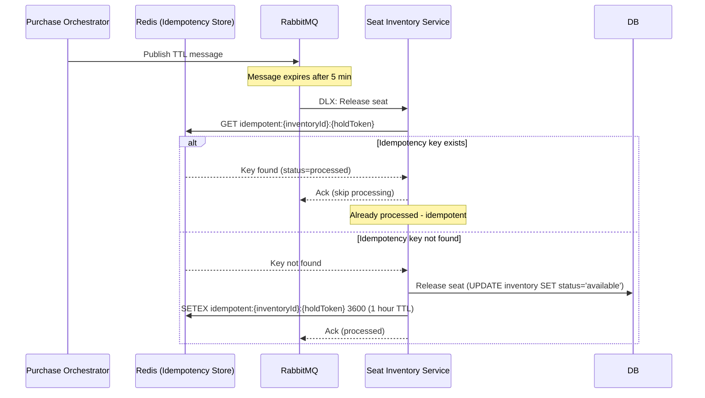

**Idempotency Key Strategy**:
- **Key format**: `idempotent:{resource_id}:{operation_id}:{timestamp}`
- **TTL**: 1 hour (longer than any retry window)
- **Storage**: Redis (fast, atomic operations)
- **Value**: Operation result or "processed" marker

---

### 5. Auto-Cancel for Stuck Transfers

**Problem**: Seller never accepts transfer → transfer stuck in `pending_seller_acceptance` indefinitely, blocking listing.

**Solution**: RabbitMQ delayed message with 24-hour TTL to auto-cancel transfers.

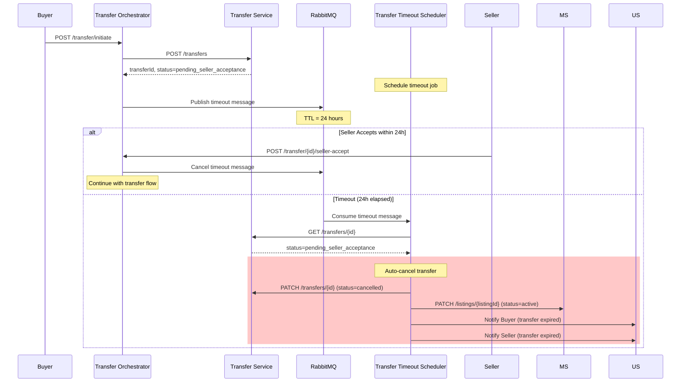

**Timeout Configuration**:
- **Transfer acceptance timeout**: 24 hours
- **OTP verification timeout**: 10 minutes
- **Payment confirmation timeout**: 5 minutes (seat hold)

---

### 6. Deadlock Retry Logic

**Problem**: Two users try to hold the same seat simultaneously → database deadlock → transaction rolled back.

**Solution**: Exponential backoff retry with jitter for deadlock errors.

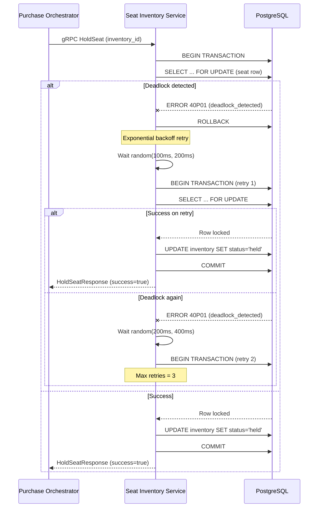

**Retry Strategy**:
- **Max retries**: 3 attempts
- **Backoff**: Exponential with jitter (randomness)
  - Attempt 1: wait 100-200ms
  - Attempt 2: wait 200-400ms
  - Attempt 3: wait 400-800ms
- **Logging**: Log deadlock occurrences for monitoring
- **Metrics**: Track deadlock rate per seat/event

---

### 7. Cache Invalidation Retry

**Problem**: When selling or releasing a seat, Redis cache delete fails → stale cache entry remains → inconsistent state.

**Solution**: Retry with exponential backoff and DLQ fallback.

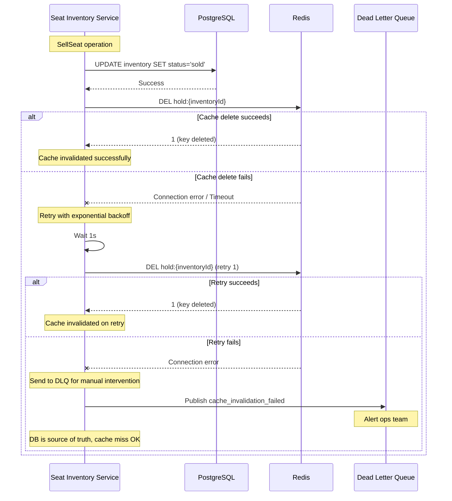

**Retry Strategy**:
- **Immediate retry**: 1 second delay
- **Max retries**: 3 attempts
- **Fallback**: If all retries fail, send to DLQ
- **Monitoring**: Alert on DLQ messages

---

### 8. Graceful Shutdown Handling

**Problem**: Kubernetes evicts pods without graceful shutdown → in-flight requests terminated, transactions not rolled back.

**Solution**: Signal handling with proper cleanup sequence.

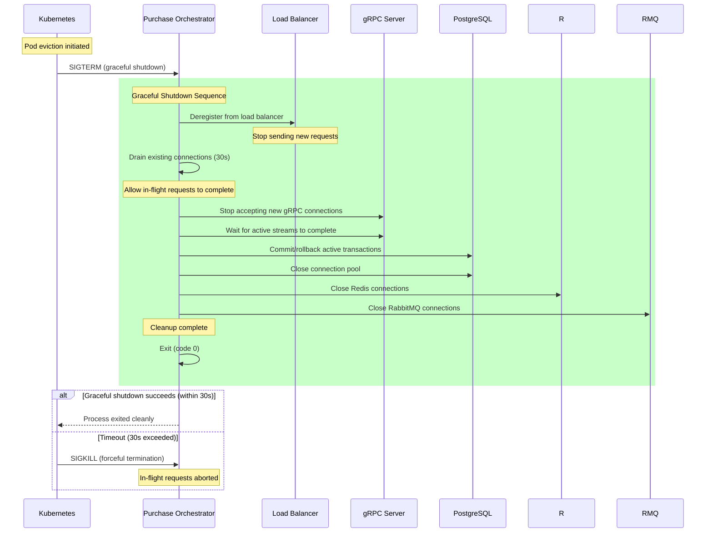

**Shutdown Sequence**:
1. **Receive SIGTERM**: Kubernetes sends termination signal
2. **Deregister from LB**: Remove from load balancer (stop new traffic)
3. **Drain connections**: Wait for in-flight requests (max 30s)
4. **Close servers**: Stop accepting new connections
5. **Cleanup resources**: Close DB, Redis, RabbitMQ connections
6. **Exit cleanly**: Process exits with code 0

**Kubernetes Configuration**:
```yaml
spec:
  terminationGracePeriodSeconds: 30
  lifecycle:
    preStop:
      exec:
        command: ["/bin/sh", "-c", "sleep 5"]
```

---

## Implementation Status

### ✅ All Edge Cases Implemented

| Edge Case | Status | Implementation |
|-----------|--------|----------------|
| Distributed Locks | ✅ Completed | `ticket-verification-orchestrator/routes.py` |
| Rate Limiting | ✅ Completed | `otp-wrapper/routes.py` |
| Timeout Configuration | ✅ Completed | `service_client.py` (circuit breaker) |
| Idempotency Keys | ✅ Completed | `seat-inventory-service/grpc_server.py` |
| Auto-Cancel Transfers | ✅ Completed | `transfer-orchestrator/routes.py` + `timeout_consumer.py` |
| Deadlock Retry | ✅ Completed | `seat-inventory-service/grpc_server.py` |
| Cache Invalidation Retry | ✅ Completed | `seat-inventory-service/grpc_server.py` |
| Graceful Shutdown | ✅ Completed | `shared/graceful_shutdown.py` + orchestrator app.py |

---

## Architecture Diagram

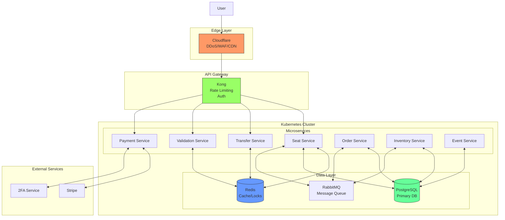

---

## Key Architecture Decisions

1. **Cloudflare First**: All traffic passes through Cloudflare for DDoS protection and WAF
2. **Kong Gateway**: Centralized API management, rate limiting, and authentication
3. **Redis for Performance**: Distributed locks, session management, caching
4. **Kubernetes Orchestration**: Scalable microservices deployment
5. **gRPC for Internal Comms**: High-performance service-to-service communication
6. **RabbitMQ DLX**: Automatic cleanup of expired reservations
7. **Atomic Operations**: Database transactions ensure data consistency
8. **Parallel Validation**: QR verification runs multiple checks simultaneously
