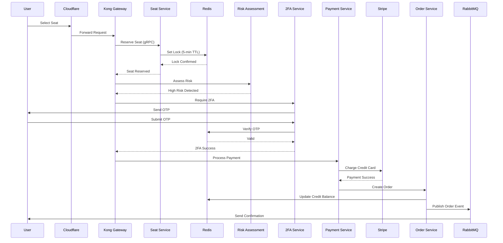
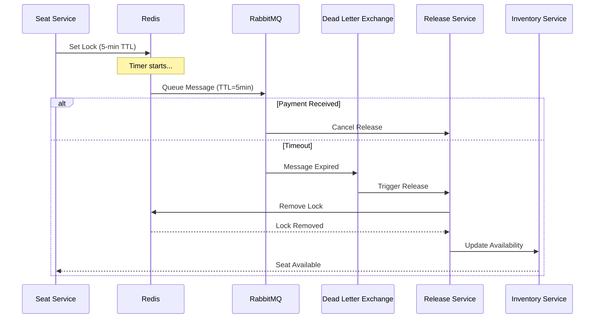
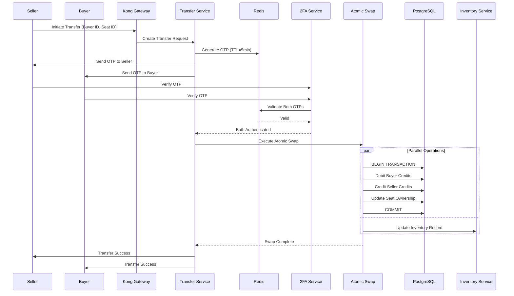
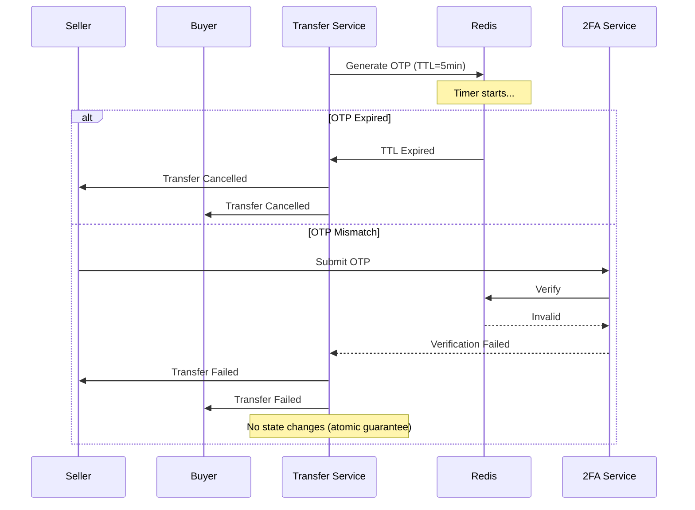
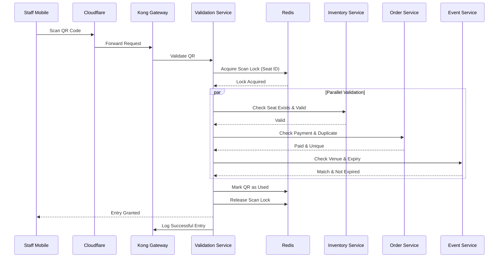
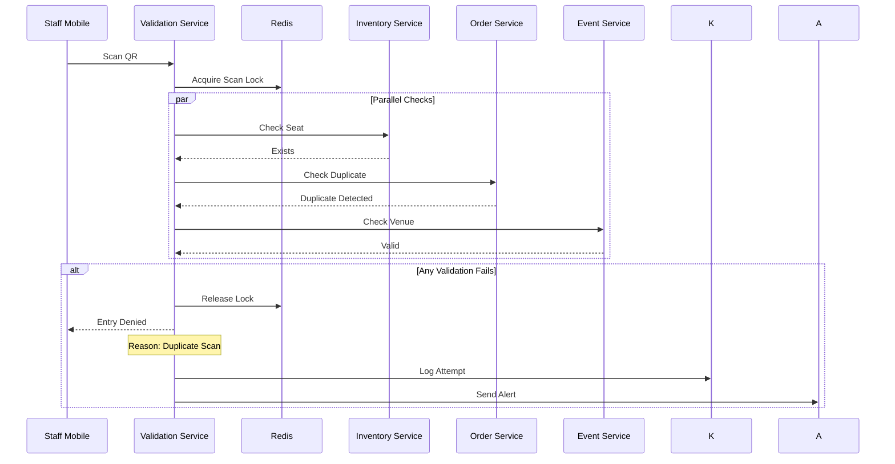
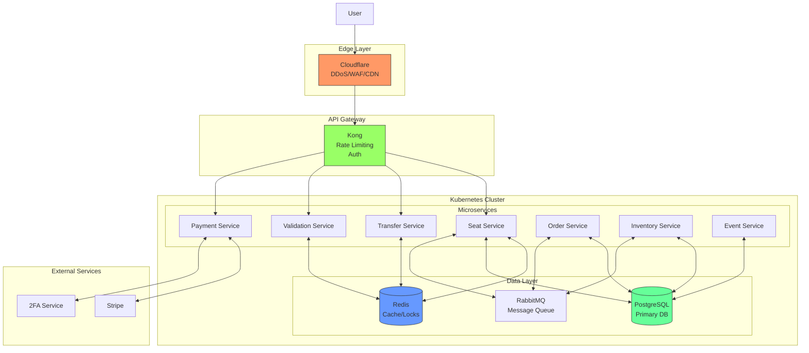

# System Architecture Diagrams - Modern Infrastructure

## Infrastructure Components
- **Cloudflare**: DDoS protection, CDN, WAF
- **Kong API Gateway**: Rate limiting, authentication, routing
- **Kubernetes (K8s)**: Container orchestration
- **Redis**: Caching, session management, distributed locks
- **PostgreSQL**: Primary database
- **RabbitMQ**: Message queue with DLX
- **gRPC**: High-performance service communication
- **Stripe**: Payment processing

---

## 1. Ticket Purchase Flow

### Happy Path

### Unhappy Path (Reservation Expiry)

---

## 2. Secure Peer-to-Peer Ticket Transfer

### Happy Path

### Unhappy Path (OTP Failure)

---

## 3. Ticket Verification (QR Scan)

### Happy Path

### Unhappy Path (Validation Failures)

---

## Infrastructure Flow Diagram

---

## Key Architecture Decisions

1. **Cloudflare First**: All traffic passes through Cloudflare for DDoS protection and WAF
2. **Kong Gateway**: Centralized API management, rate limiting, and authentication
3. **Redis for Performance**: Distributed locks, session management, caching
4. **Kubernetes Orchestration**: Scalable microservices deployment
5. **gRPC for Internal Comms**: High-performance service-to-service communication
6. **RabbitMQ DLX**: Automatic cleanup of expired reservations
7. **Atomic Operations**: Database transactions ensure data consistency
8. **Parallel Validation**: QR verification runs multiple checks simultaneously
