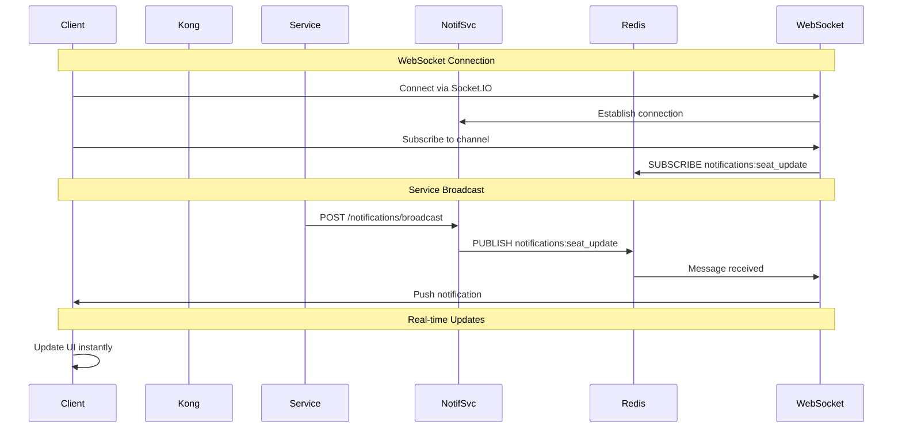
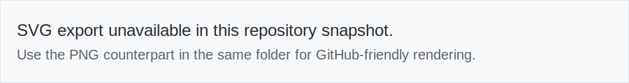
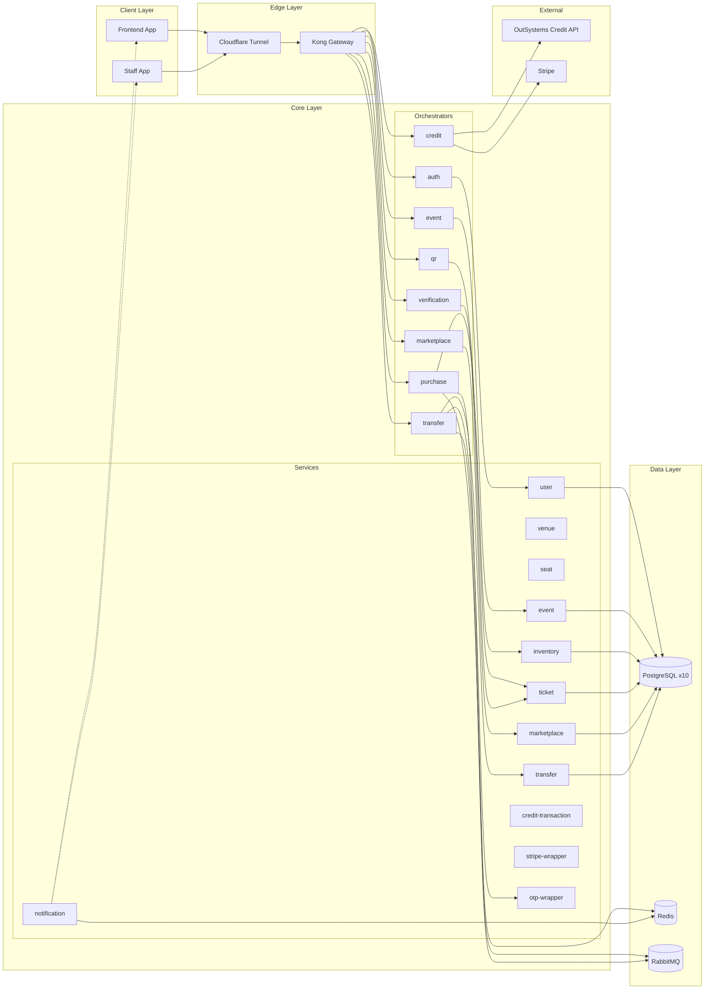

# TicketRemaster Architecture Diagrams

This directory contains architecture diagrams for key system workflows.

## Quick Start

1. Use the exported SVG diagrams in this folder for docs and 16:9 slides.
2. Update the paired `.mmd` source when architecture changes.
3. Re-export SVG assets and keep links in this README in sync.

## Diagram Index

| # | Diagram | Description |
|---|---------|-------------|
| 01 | [Ticket Purchase - Happy Path](01_ticket_purchase_happy_path.png) | Complete purchase flow from seat selection to confirmation |
| 02 | [Purchase Reservation Expires](02_ticket_purchase_reservation_expires.png) | What happens when a seat hold times out |
| 03 | [P2P Transfer - Happy Path](03_p2p_transfer_happy_path.png) | Ticket transfer between users with OTP verification |
| 04 | [QR Verification - Happy Path](04_qr_verification_happy_path.png) | Staff scanning tickets at event entry |
| 05 | [Distributed Lock - Concurrent Scan](05_distributed_lock_concurrent_scan.png) | Handling concurrent ticket verification attempts |
| 06 | [Rate Limiting - OTP Verification](06_rate_limiting_otp_verification.png) | Preventing OTP brute force attacks |
| 07 | [Idempotency Keys - Deduplication](07_idempotency_keys_deduplication.png) | Preventing duplicate purchases |
| 08 | [Auto Cancel - Stuck Transfers](08_auto_cancel_stuck_transfers.png) | Cleaning up expired transfer requests |
| 09 | [Deadlock Retry Logic](09_deadlock_retry_logic.png) | Handling database deadlocks gracefully |
| 10 | [Cache Invalidation - Retry](10_cache_invalidation_retry.png) | Redis cache management with retries |
| 11 | [Graceful Shutdown](11_graceful_shutdown_handling.png) | Service shutdown with connection draining |
| 12 | [System Architecture Overview](12_system_architecture_overview.png) | High-level system architecture |

## New: Real-time Notification Flow

The notification service adds real-time capabilities to the system:


<details>
<summary>Mermaid source</summary>



</details>

### When Notifications Are Sent

| Event | Trigger | Recipients |
|-------|---------|------------|
| `seat_update` | Seat held/sold/released | All users viewing event |
| `ticket_update` | Ticket purchased/transferred | Ticket owner |
| `transfer_update` | Transfer initiated/accepted/declined | Transfer participants |
| `purchase_update` | Purchase confirmed/cancelled | Purchaser |
| `user_update` | Profile updated/flagged | User |
| `event_update` | Event created/updated/cancelled | Interested users |

### Integration Points

Services broadcast events after state changes:

```python
# In any service after a state change
requests.post('http://notification-service:8109/notifications/broadcast', json={
    'type': 'seat_update',
    'payload': {'eventId': event_id, 'seatId': seat_id, 'status': 'sold'},
    'traceId': trace_id
})
```

## System Architecture

The complete system architecture includes:



<details>
<summary>Mermaid source</summary>



</details>

## Documentation

For detailed information about each workflow, see:
- [README.md](../README.md) - System overview
- [API.md](../API.md) - API reference
- [COMPLETE_SYSTEM_DOCUMENTATION.md](../COMPLETE_SYSTEM_DOCUMENTATION.md) - Full architecture
- [services/notification-service/NOTIFICATIONS.md](../services/notification-service/NOTIFICATIONS.md) - WebSocket events
