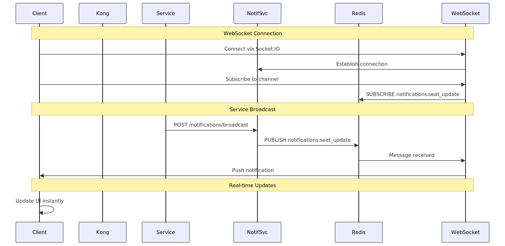
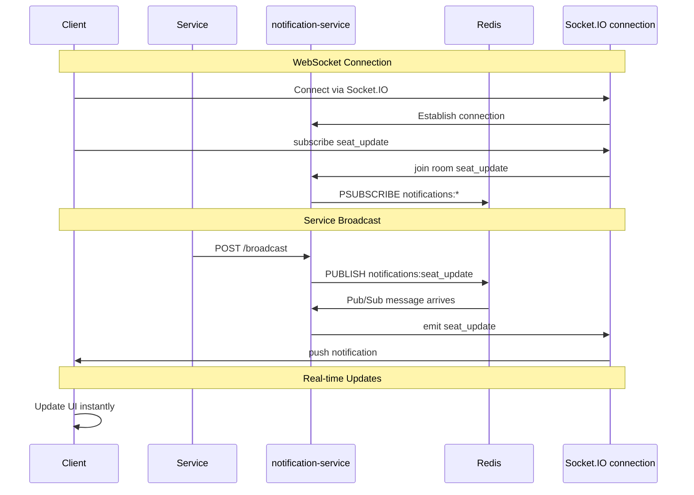
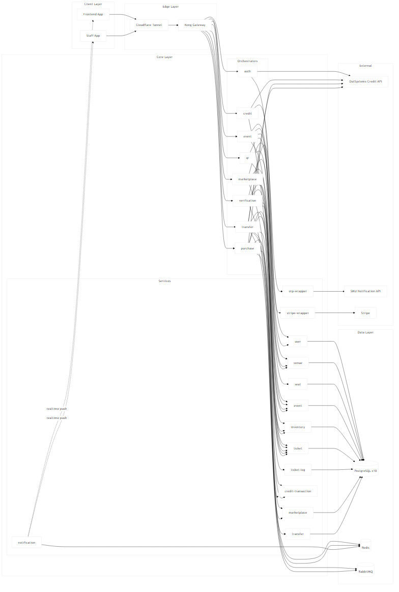
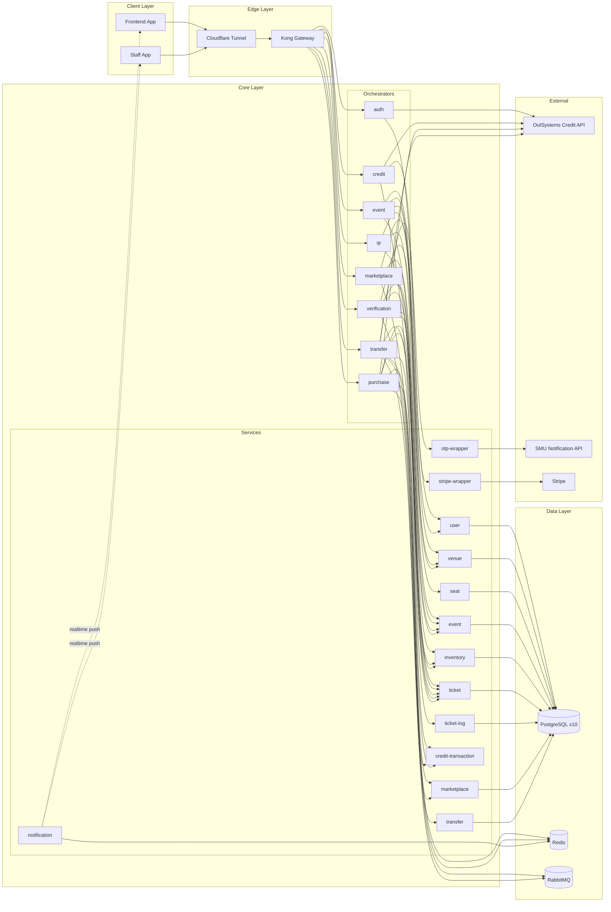

# TicketRemaster Diagram Gallery

This directory contains maintained diagrams for backend workflows and architecture.

## Source of truth

- numbered gallery diagrams use Mermaid `.mmd` files
- README-facing architecture diagrams also use Mermaid `.mmd` files
- legacy `.uml` files are only breadcrumbs for old references and are not the maintained source format

## Diagram Index

| # | Diagram | Mermaid source | Description |
|---|---------|----------------|-------------|
| 01 | [Ticket Purchase - Happy Path](01_ticket_purchase_happy_path.png) | [01_ticket_purchase_happy_path.mmd](01_ticket_purchase_happy_path.mmd) | Hold and confirm purchase through gRPC, RabbitMQ, OutSystems, and ticket issuance |
| 02 | [Purchase Reservation Expires](02_ticket_purchase_reservation_expires.png) | [02_ticket_purchase_reservation_expires.mmd](02_ticket_purchase_reservation_expires.mmd) | Seat hold expiry using TTL queue plus dead-letter routing |
| 03 | [P2P Transfer - Happy Path](03_p2p_transfer_happy_path.png) | [03_p2p_transfer_happy_path.mmd](03_p2p_transfer_happy_path.mmd) | Transfer flow with OTP, saga completion, and listing closeout |
| 04 | [QR Verification - Happy Path](04_qr_verification_happy_path.png) | [04_qr_verification_happy_path.mmd](04_qr_verification_happy_path.mmd) | Staff scan flow with lock, validation checks, and audit log |
| 05 | [Distributed Lock - Concurrent Scan](05_distributed_lock_concurrent_scan.png) | [05_distributed_lock_concurrent_scan.mmd](05_distributed_lock_concurrent_scan.mmd) | Redis lock preventing duplicate concurrent scans |
| 06 | [Rate Limiting - OTP Verification](06_rate_limiting_otp_verification.png) | [06_rate_limiting_otp_verification.mmd](06_rate_limiting_otp_verification.mmd) | OTP throttling and temporary lockout |
| 07 | [Idempotency Keys - Deduplication](07_idempotency_keys_deduplication.png) | [07_idempotency_keys_deduplication.mmd](07_idempotency_keys_deduplication.mmd) | Duplicate webhook protection using reference IDs |
| 08 | [Auto Cancel - Stuck Transfers](08_auto_cancel_stuck_transfers.png) | [08_auto_cancel_stuck_transfers.mmd](08_auto_cancel_stuck_transfers.mmd) | 24-hour transfer timeout cleanup |
| 09 | [Deadlock Retry Logic](09_deadlock_retry_logic.png) | [09_deadlock_retry_logic.mmd](09_deadlock_retry_logic.mmd) | Retry-with-backoff around seat-row deadlocks |
| 10 | [Cache Invalidation - Retry](10_cache_invalidation_retry.png) | [10_cache_invalidation_retry.mmd](10_cache_invalidation_retry.mmd) | Redis cache delete retries and DLQ logging |
| 11 | [Graceful Shutdown](11_graceful_shutdown_handling.png) | [11_graceful_shutdown_handling.mmd](11_graceful_shutdown_handling.mmd) | SIGTERM handling, draining, and cleanup |
| 12 | [System Architecture Overview](12_system_architecture_overview.png) | [12_system_architecture_overview.mmd](12_system_architecture_overview.mmd) | Updated high-level system architecture |

## New: Real-time Notification Flow



<details>
<summary>Mermaid source</summary>



</details>

### When Notifications Are Sent

| Event | Trigger | Recipients |
|-------|---------|------------|
| `seat_update` | Seat held, sold, or released | Users watching event availability |
| `ticket_update` | Ticket purchased or transferred | Ticket owner |
| `transfer_update` | Transfer status changes | Transfer participants |
| `purchase_update` | Purchase completion or failure | Purchaser |
| `user_update` | User-side state changes | Relevant user |
| `event_update` | Event lifecycle changes | Interested users |

### Integration Points

Services broadcast events after state changes:

```python
requests.post("http://notification-service:8109/broadcast", json={
    "type": "seat_update",
    "payload": {"eventId": event_id, "seatId": seat_id, "status": "sold"},
    "traceId": trace_id,
})
```

## System Architecture

The complete system architecture includes:



<details>
<summary>Mermaid source</summary>



</details>

## Documentation

For detailed information about each workflow, see:

- [README.md](../README.md) - system overview
- [API.md](../API.md) - API reference
- [INSTRUCTION.md](../INSTRUCTION.md) - backend design logic
- [services/notification-service/NOTIFICATIONS.md](../services/notification-service/NOTIFICATIONS.md) - WebSocket events
